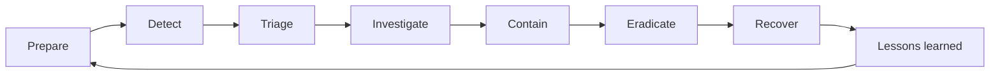

# AWS Incident Response Playbook

A GitHub-ready collection of practical AWS incident-response runbooks designed for study, tabletop exercises, authorized labs, and adaptation to organizational procedures. It is aligned to the AWS incident-response lifecycle and the service set emphasized by **AWS Incident Response Demonstrated**.

> [!IMPORTANT]
> This is an independent study and operational reference, not an official AWS exam guide. Never run containment or remediation commands without authorization, verified identifiers, evidence-preservation requirements, and a rollback plan.

## Guiding principles

1. **Prepare before the incident.** Centralize logs, pre-create quarantine controls, define responder roles, and test automation.
2. **Preserve evidence before destructive action.** Record resource state, export logs, and snapshot relevant storage.
3. **Contain precisely.** Prefer a targeted IAM, security-group, endpoint-policy, or resource-policy change over a broad outage.
4. **Eradicate the root cause.** Removing one visible resource is insufficient when credentials, roles, images, automation, or trust policies remain compromised.
5. **Recover from trusted sources.** Rebuild, harden, validate, and monitor before returning a workload to service.
6. **Document in UTC.** Record who performed each action, when, why, and with what result.

## Incident workflow



## Runbooks

| # | Scenario | Primary focus |
|---:|---|---|
| 1 | [EC2 Instance Compromise](docs/01-ec2-instance-compromise.md) | Detect and safely isolate a suspected compromised EC2 instance while preserving evidence. |
| 2 | [Automated EC2 Isolation](docs/02-automated-ec2-isolation.md) | Automate repeatable isolation of an EC2 instance when a trusted detection is raised. |
| 3 | [IAM Credential Compromise](docs/03-iam-credential-compromise.md) | Contain a compromised IAM user or role credential and determine its blast radius. |
| 4 | [Data Exfiltration](docs/04-data-exfiltration.md) | Stop suspected unauthorized data transfer while preserving logs and limiting business impact. |
| 5 | [Public S3 Bucket](docs/05-public-s3-bucket.md) | Remove unintended public access to an S3 bucket and determine whether data was accessed. |
| 6 | [Compliance Enforcement](docs/06-compliance-enforcement.md) | Continuously detect and remediate missing tags and disabled EC2 detailed monitoring. |
| 7 | [RDS Database Security](docs/07-rds-database-security.md) | Reduce exposure of an RDS database and establish secure network, authentication, logging, and recovery controls. |
| 8 | [Backdoor IAM User](docs/08-backdoor-iam-user.md) | Identify and remove unauthorized IAM identities and persistence mechanisms. |
| 9 | [Malicious Lambda or Scheduled Persistence](docs/09-malicious-lambda-scheduled-persistence.md) | Remove malicious serverless persistence while preserving code, configuration, and invocation evidence. |
| 10 | [Root Account Compromise](docs/10-root-account-compromise.md) | Contain suspected unauthorized use of the AWS account root user. |
| 11 | [Auto Scaling Recovery](docs/11-auto-scaling-recovery.md) | Replace compromised capacity with trusted instances while preventing accidental cloning of the compromise. |
| 12 | [Unauthorized API Calls](docs/12-unauthorized-api-calls.md) | Investigate suspicious AWS API activity and contain the responsible principal. |
| 13 | [Athena CloudTrail Investigation](docs/13-athena-cloudtrail-investigation.md) | Use Athena to search centralized CloudTrail logs at scale. |
| 14 | [Systems Manager Investigation](docs/14-systems-manager-investigation.md) | Investigate and remediate instances without opening inbound SSH or RDP. |
| 15 | [AWS Config Drift](docs/15-aws-config-drift.md) | Detect unauthorized or noncompliant configuration changes and restore an approved baseline. |
| 16 | [Security Group Open to the World](docs/16-security-group-open-to-world.md) | Remove unintended 0.0.0.0/0 or ::/0 exposure from sensitive ports. |
| 17 | [CloudTrail Audit and Tampering](docs/17-cloudtrail-audit-tampering.md) | Restore reliable audit logging and investigate attempts to disable or alter CloudTrail. |
| 18 | [CloudWatch Detection and Alerting](docs/18-cloudwatch-detection-alerting.md) | Turn reliable telemetry into actionable alerts and controlled response automation. |
| 19 | [EBS Snapshot and Forensic Preservation](docs/19-ebs-snapshot-forensic-preservation.md) | Preserve storage evidence before eradication and maintain a defensible chain of custody. |
| 20 | [Step Functions Incident Orchestration](docs/20-step-functions-incident-orchestration.md) | Coordinate multi-step incident response with checkpoints, retries, approvals, and auditability. |


## Core references

- [Service mapping](docs/service-mapping.md)
- [Incident severity matrix](docs/incident-severity-matrix.md)
- [Initial triage checklist](docs/initial-triage-checklist.md)
- [Evidence collection checklist](docs/evidence-collection-checklist.md)
- [IAM emergency lockdown](docs/iam-emergency-lockdown.md)
- [Ransomware response](docs/ransomware-response.md)
- [S3 data leak response](docs/s3-data-leak-response.md)
- [Decision trees](docs/decision-trees.md)
- [Athena CloudTrail queries](queries/cloudtrail-athena.sql)
- [AWS CLI quick reference](cheat-sheets/aws-cli-incident-response.md)
- [CloudTrail](cheat-sheets/cloudtrail.md), [IAM](cheat-sheets/iam.md), [AWS Config](cheat-sheets/config.md), [CloudWatch](cheat-sheets/cloudwatch.md), [Systems Manager](cheat-sheets/systems-manager.md), [Athena](cheat-sheets/athena.md)

## Repository structure

```text
aws-incident-response-playbook/
├── README.md
├── docs/          # 20 runbooks and supporting procedures
├── cheat-sheets/  # Service-focused exam and response notes
├── queries/       # Athena SQL investigation queries
├── diagrams/      # Mermaid source diagrams
├── templates/     # Incident record and evidence log templates
└── scripts/       # Safe starter scripts and validation helpers
```

## Safe use of CLI examples

- Run `aws sts get-caller-identity` first.
- Set or verify `AWS_PROFILE` and `AWS_REGION`.
- Prefer `describe`, `get`, `list`, and CloudTrail queries during triage.
- Replace all placeholders; never paste examples blindly.
- Capture command output and CloudTrail evidence before write actions.
- Use change approval for destructive or business-impacting operations.

## Exam strategy

Read the full lab objective, identify required end state, inspect existing resources, and perform only the requested changes. Re-open every modified resource and verify the setting. Tags, exact names, Region, security-group association, Config compliance state, and notification subscriptions can be part of automated grading.

## Authoritative references

- [AWS Security Incident Response Guide](https://docs.aws.amazon.com/whitepapers/latest/aws-security-incident-response-guide/welcome.html)
- [AWS Security Incident Response documentation](https://docs.aws.amazon.com/security-ir/)
- [AWS Well-Architected Security Pillar — Incident response](https://docs.aws.amazon.com/wellarchitected/latest/security-pillar/incident-response.html)
- [AWS Prescriptive Guidance — Incident response recommendations](https://docs.aws.amazon.com/prescriptive-guidance/latest/security-controls-by-caf-capability/incident-response-recommendations.html)

## License

Released under the [MIT License](LICENSE). AWS service names and trademarks belong to Amazon Web Services, Inc.
