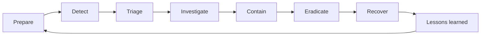

# AWS Incident Response Playbook
> **Production-inspired runbooks, cloud security operations guidance, investigation workflows, and automation patterns for Amazon Web Services.**

[](https://aws.amazon.com/security/incident-response/)
[](docs/index.md)
[](LICENSE)
[](CONTRIBUTING.md)
[](CHANGELOG.md)

Production-inspired AWS incident-response runbooks for study, tabletop exercises, authorized labs, and adaptation to organizational procedures. The repository emphasizes the services and objectives associated with **AWS Incident Response Demonstrated**, while applying broader security-engineering practices for evidence preservation, containment, eradication, and secure recovery.

> [!IMPORTANT]
> This is an independent educational and operational reference. It is not an official AWS exam guide and does not replace your organization’s incident-response plan, legal guidance, or AWS Support. Never run containment or remediation commands without authorization, verified identifiers, evidence-preservation requirements, and a rollback plan.

## Table of contents

- [Start here](#start-here)
- [Incident-response lifecycle](#incident-response-lifecycle)
- [Runbook catalog](#runbook-catalog)
- [Supporting procedures and references](#supporting-procedures-and-references)
- [Repository structure](#repository-structure)
- [Safe use of examples](#safe-use-of-examples)
- [AWS lab strategy](#aws-lab-strategy)
- [Project status](#project-status)
- [Authoritative references](#authoritative-references)

## Start here

| Need | Go to |
|---|---|
| Browse all documentation | [Documentation index](docs/index.md) |
| Browse by response domain | [Domain indexes](docs/domains/README.md) |
| Verify guidance sources | [Authoritative reference catalog](docs/references.md) |
| Review published versions | [Release history](releases/README.md) |
| Respond to a suspected incident | [Initial triage checklist](docs/initial-triage-checklist.md) |
| Classify incident severity | [Incident severity matrix](docs/incident-severity-matrix.md) |
| Preserve evidence | [Evidence collection checklist](docs/evidence-collection-checklist.md) |
| Match a problem to AWS services | [Service mapping](docs/service-mapping.md) |
| Map scenarios to ATT&CK, NIST, and AWS guidance | [Framework mapping guide](docs/framework-mapping.md) |
| Choose containment, evidence, escalation, and recovery paths | [Incident-response decision guide](docs/decision-trees.md) |
| Investigate CloudTrail at scale | [Athena query library](queries/cloudtrail-athena.sql) |
| Use AWS CLI during response | [AWS CLI incident-response reference](cheat-sheets/aws-cli-incident-response.md) |
| View planned enhancements | [Project roadmap](ROADMAP.md) |

## Incident-response lifecycle



### Guiding principles

1. **Prepare before the incident.** Centralize logs, pre-create quarantine controls, define responder roles, and test automation.
2. **Preserve evidence before destructive action.** Record resource state, export logs, and snapshot relevant storage.
3. **Contain precisely.** Prefer a targeted IAM, security-group, endpoint-policy, or resource-policy change over a broad outage.
4. **Eradicate the root cause.** Removing one visible resource is insufficient when credentials, roles, images, automation, or trust policies remain compromised.
5. **Recover from trusted sources.** Rebuild, harden, validate, and monitor before returning a workload to service.
6. **Document in UTC.** Record who performed each action, when, why, and with what result.

## Runbook catalog

| # | Domain | Scenario | Primary outcome |
|---:|---|---|---|
| 1 | EC2 | [EC2 instance compromise](docs/01-ec2-instance-compromise.md) | Isolate a suspected instance while preserving evidence. |
| 2 | Automation | [Automated EC2 isolation](docs/02-automated-ec2-isolation.md) | Automate controlled and repeatable quarantine. |
| 3 | IAM | [IAM credential compromise](docs/03-iam-credential-compromise.md) | Disable compromised credentials and determine blast radius. |
| 4 | Data protection | [Data exfiltration](docs/04-data-exfiltration.md) | Stop unauthorized transfer with minimal collateral impact. |
| 5 | S3 | [Public S3 bucket](docs/05-public-s3-bucket.md) | Remove unintended exposure and investigate object access. |
| 6 | Compliance | [Compliance enforcement](docs/06-compliance-enforcement.md) | Detect and remediate missing controls continuously. |
| 7 | RDS | [RDS database security](docs/07-rds-database-security.md) | Reduce database exposure and strengthen recovery controls. |
| 8 | IAM | [Backdoor IAM user](docs/08-backdoor-iam-user.md) | Remove unauthorized identities and persistence. |
| 9 | Serverless | [Malicious Lambda or scheduled persistence](docs/09-malicious-lambda-scheduled-persistence.md) | Eradicate serverless persistence while preserving evidence. |
| 10 | Account | [Root account compromise](docs/10-root-account-compromise.md) | Regain control of the AWS account root identity. |
| 11 | Recovery | [Auto Scaling recovery](docs/11-auto-scaling-recovery.md) | Replace affected capacity from trusted sources. |
| 12 | CloudTrail | [Unauthorized API calls](docs/12-unauthorized-api-calls.md) | Attribute suspicious API activity and contain the principal. |
| 13 | Athena | [Athena CloudTrail investigation](docs/13-athena-cloudtrail-investigation.md) | Search centralized logs efficiently at scale. |
| 14 | Systems Manager | [Systems Manager investigation](docs/14-systems-manager-investigation.md) | Investigate without opening SSH or RDP. |
| 15 | AWS Config | [AWS Config drift](docs/15-aws-config-drift.md) | Restore an approved configuration baseline. |
| 16 | VPC | [Security group open to the world](docs/16-security-group-open-to-world.md) | Remove unintended public exposure. |
| 17 | Audit | [CloudTrail audit and tampering](docs/17-cloudtrail-audit-tampering.md) | Restore trustworthy logging and examine tampering. |
| 18 | Monitoring | [CloudWatch detection and alerting](docs/18-cloudwatch-detection-alerting.md) | Convert telemetry into actionable response signals. |
| 19 | Forensics | [EBS snapshot and forensic preservation](docs/19-ebs-snapshot-forensic-preservation.md) | Preserve storage evidence and chain of custody. |
| 20 | Orchestration | [Step Functions incident orchestration](docs/20-step-functions-incident-orchestration.md) | Coordinate multi-step response with approvals and auditability. |

## Supporting procedures and references

| Category | Resources |
|---|---|
| Triage and governance | [Severity matrix](docs/incident-severity-matrix.md) · [Initial triage](docs/initial-triage-checklist.md) · [Evidence collection](docs/evidence-collection-checklist.md) |
| Emergency procedures | [IAM lockdown](docs/iam-emergency-lockdown.md) · [Ransomware response](docs/ransomware-response.md) · [S3 data-leak response](docs/s3-data-leak-response.md) |
| Decision support | [Decision trees](docs/decision-trees.md) · [Service mapping](docs/service-mapping.md) · [Framework mapping](docs/framework-mapping.md) · [Domain indexes](docs/domains/README.md) |
| Service cheat sheets | [CloudTrail](cheat-sheets/cloudtrail.md) · [IAM](cheat-sheets/iam.md) · [AWS Config](cheat-sheets/config.md) · [CloudWatch](cheat-sheets/cloudwatch.md) · [Systems Manager](cheat-sheets/systems-manager.md) · [Athena](cheat-sheets/athena.md) |
| Query and command references | [Athena SQL](queries/cloudtrail-athena.sql) · [AWS CLI](cheat-sheets/aws-cli-incident-response.md) · [Authoritative references](docs/references.md) |
| Templates | [Incident record](templates/incident-record.md) · [Evidence log](templates/evidence-log.csv) |

## Repository structure

```text
aws-incident-response-playbook/
├── README.md
├── CHANGELOG.md
├── CODE_OF_CONDUCT.md
├── CONTRIBUTING.md
├── ROADMAP.md
├── SECURITY.md
├── docs/          # Runbooks, domain indexes, mappings, references, and procedures
├── cheat-sheets/  # Service-focused response and study references
├── queries/       # Athena SQL investigation queries
├── diagrams/      # Reusable Mermaid architecture and response-flow sources
├── templates/     # Incident records and evidence-log templates
├── scripts/       # Documentation validation and responder helper scripts
├── releases/      # Versioned release notes and release-history index
├── .github/       # Pull-request and documentation-validation workflow
├── automation/    # Planned deployable response automation
└── labs/          # Planned isolated hands-on exercises
```

## Safe use of examples

- Run `aws sts get-caller-identity` before every response session.
- Verify `AWS_PROFILE`, `AWS_REGION`, account ID, and resource identifiers.
- Prefer read-only `describe`, `get`, `list`, and log-query operations during triage.
- Replace every placeholder; never paste examples blindly.
- Preserve command output and relevant CloudTrail records before write actions.
- Require change approval for destructive, irreversible, or business-impacting operations.
- Treat snapshots as storage evidence only; they do not preserve memory or every volatile artifact.

## AWS lab strategy

**Use a dedicated AWS lab account whenever possible; never practice these procedures against production resources.** Read the complete objective, identify the required end state, inspect existing resources, and perform only the requested changes. Re-open every modified resource and verify the final configuration. Automated grading may evaluate exact names, tags, Region, security-group associations, AWS Config compliance, monitoring state, and SNS subscriptions.

## Documentation validation

Run the repository checks before submitting documentation changes:

```bash
python3 scripts/check_markdown_links.py
```

GitHub Actions runs the same internal-link validation for pull requests and pushes to `main`. External references are reviewed manually because remote sites can rate-limit automated checks.

## Project status

- **Phase 1 — Foundation:** complete
- **Phase 2 — Documentation professionalization:** complete
- **Phase 3 — Response automation:** next
- **Phase 4 — Deployable labs:** planned

See [ROADMAP.md](ROADMAP.md) for milestones and scope. Release history is maintained in [CHANGELOG.md](CHANGELOG.md).

## Contributing and security

Contributions are welcome. Read [CONTRIBUTING.md](CONTRIBUTING.md) before proposing changes and follow the [Code of Conduct](CODE_OF_CONDUCT.md). Do not disclose credentials, customer data, account identifiers, or active incident details in public issues; see [SECURITY.md](SECURITY.md).

## Authoritative references

The complete, categorized source catalog is maintained in [docs/references.md](docs/references.md). Core references include:

- [AWS Security Incident Response Guide](https://docs.aws.amazon.com/whitepapers/latest/aws-security-incident-response-guide/welcome.html)
- [AWS Security Incident Response documentation](https://docs.aws.amazon.com/security-ir/)
- [AWS Well-Architected Security Pillar — Incident response](https://docs.aws.amazon.com/wellarchitected/latest/security-pillar/incident-response.html)
- [AWS Prescriptive Guidance — Incident response recommendations](https://docs.aws.amazon.com/prescriptive-guidance/latest/security-controls-by-caf-capability/incident-response-recommendations.html)

## License

Released under the [MIT License](LICENSE). AWS service names and trademarks belong to Amazon Web Services, Inc.
