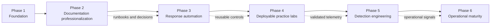
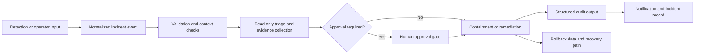

# AWS Incident Response Playbook — Complete Project Roadmap

> **Current milestone:** Phase 3 — Response automation  
> **Current release:** `v2.1.0 — Automation Framework`  
> **Roadmap status date:** 2026-07-24

This roadmap defines the planned evolution of the **AWS Incident Response Playbook** from a scenario-based documentation repository into a deployable, testable, and operationally mature AWS incident-response engineering project.

It is the authoritative planning document for phase scope, commit sequencing, release targets, engineering standards, validation gates, and completion criteria. Priorities may change when AWS services evolve, authorized lab testing reveals gaps, or project safety requires a different implementation order.

## Table of contents

- [Project vision](#project-vision)
- [Roadmap principles](#roadmap-principles)
- [Status and release map](#status-and-release-map)
- [Phase dependency map](#phase-dependency-map)
- [Phase 1 — Foundation](#phase-1--foundation)
- [Phase 2 — Documentation professionalization](#phase-2--documentation-professionalization)
- [Phase 3 — Response automation](#phase-3--response-automation)
- [Phase 4 — Deployable practice labs](#phase-4--deployable-practice-labs)
- [Phase 5 — Detection engineering](#phase-5--detection-engineering)
- [Phase 6 — Operational maturity](#phase-6--operational-maturity)
- [Cross-phase engineering standards](#cross-phase-engineering-standards)
- [Definition of done](#definition-of-done)
- [Release and Git workflow](#release-and-git-workflow)
- [Risk register](#risk-register)
- [Success measures](#success-measures)
- [Scope boundaries](#scope-boundaries)
- [Immediate next milestone](#immediate-next-milestone)

---

## Project vision

The project is designed to become a public, production-inspired AWS security engineering reference that combines:

1. **Incident-response runbooks** for common AWS security scenarios.
2. **Decision support** for triage, evidence preservation, containment, escalation, recovery, and closure.
3. **Framework alignment** with MITRE ATT&CK, NIST incident-response guidance, and the AWS Well-Architected Security Pillar.
4. **Safe response automation** built around dry-run behavior, explicit authorization, least privilege, structured evidence, and rollback.
5. **Deployable AWS labs** for controlled validation and professional portfolio demonstration.
6. **Detection engineering** that connects trustworthy signals to responder workflows.
7. **Operational maturity guidance** for multi-account environments, incident command, communications, evidence custody, exercises, and continuous improvement.

The project is not intended to replace an organization’s approved incident-response plan, legal requirements, AWS Support, or service-specific production testing.

## Roadmap principles

Every phase follows the same core principles:

- **Evidence before destructive action.** Preserve resource state, logs, configuration, and relevant storage before containment or remediation whenever the incident allows it.
- **Dry-run first.** Mutating automation starts in a non-destructive mode and requires explicit operator intent before execution.
- **Targeted containment.** Prefer the smallest effective change over broad account or workload disruption.
- **Rollback is part of the design.** Every reversible change should capture the original state and document restoration steps.
- **Least privilege.** Each automation component receives only the permissions needed for its defined action.
- **Human approval for high-impact actions.** Isolation, policy replacement, credential disabling, and similar actions require explicit safeguards.
- **Structured auditability.** Inputs, outputs, timestamps, decisions, errors, and affected resources must be recorded consistently.
- **Authorized labs only.** Destructive scenarios are validated only in dedicated test accounts or environments.
- **Documentation and code evolve together.** New automation must update the relevant runbooks, mappings, examples, tests, and release notes.

## Status and release map

| Phase | Focus | Status | Primary release milestone |
|---|---|---|---|
| Phase 1 | Foundation | Complete | `v1.0.0` |
| Phase 2 | Documentation professionalization | Complete | `v2.0.0 — Production Documentation` |
| Phase 3 | Response automation | In progress | Planned completion at `v3.0.0` |
| Phase 4 | Deployable practice labs | Planned | To be assigned after Phase 3 |
| Phase 5 | Detection engineering | Planned | To be assigned after Phase 4 |
| Phase 6 | Operational maturity | Planned | To be assigned after Phase 5 |

### Completed release sequence

| Release | Project milestone |
|---|---|
| `v1.0.0` | Initial foundation with twenty AWS incident-response scenarios and supporting references |
| `v1.1.0` | Repository professionalization and community documentation |
| `v1.2.0` | Visual documentation and Mermaid response flows |
| `v1.3.0` | MITRE, NIST, and AWS Well-Architected framework alignment |
| `v1.4.0` | Decision intelligence and responder decision checkpoints |
| `v2.0.0` | Phase 2 completion: production documentation, navigation, references, and link validation |
| `v2.1.0` | Phase 3 Commit 1: dry-run-first response automation framework |

Detailed release history is maintained in [CHANGELOG.md](CHANGELOG.md) and [releases/](releases/README.md).

## Phase dependency map



The phases are intentionally sequential:

- Phase 2 provides the decision logic and source-backed procedures that automation must implement.
- Phase 3 provides reusable automation components and orchestration.
- Phase 4 validates those components in authorized environments.
- Phase 5 builds detections from the telemetry and behaviors observed in the labs.
- Phase 6 turns the technical capabilities into a sustainable operating model.

---

# Phase 1 — Foundation

**Status:** Complete  
**Completion release:** `v1.0.0`

## Objective

Create a coherent AWS incident-response reference covering common scenarios, supporting procedures, responder commands, evidence collection, and foundational project governance.

## Delivered scope

- [x] Twenty scenario-based AWS incident-response runbooks.
- [x] AWS service and response-objective mapping.
- [x] Severity, triage, and evidence-preservation guidance.
- [x] Emergency IAM, ransomware, and S3 data-leak procedures.
- [x] AWS service cheat sheets and CLI references.
- [x] Athena queries for CloudTrail investigation.
- [x] Incident record and evidence-log templates.
- [x] Context-verification helper tooling.
- [x] Project license, contribution guidance, and security policy.

## Phase 1 exit criteria

- Every scenario has a defined response objective and primary AWS services.
- Responders can locate triage, evidence, containment, eradication, and recovery guidance.
- Repository governance and safety boundaries are documented.
- The repository is usable as a study and tabletop reference without automation.

---

# Phase 2 — Documentation professionalization

**Status:** Complete  
**Completion release:** `v2.0.0 — Production Documentation`

## Objective

Transform the foundation into a professionally structured, navigable, source-backed, framework-aligned incident-response documentation system.

## Commit 1 — Repository polish

**Release:** `v1.1.0`

- [x] Redesign the main README.
- [x] Add a task-oriented documentation index.
- [x] Add roadmap and changelog files.
- [x] Expand contribution and security guidance.
- [x] Add a community Code of Conduct.

## Commit 2 — Visual documentation

**Release:** `v1.2.0 — Visual Documentation`

- [x] Add an incident snapshot to every runbook.
- [x] Add Mermaid response flows to every runbook.
- [x] Add reusable diagram source files.
- [x] Add architecture-level response diagrams.
- [x] Add navigation among runbooks and diagram resources.

## Commit 3 — Framework alignment

**Release:** `v1.3.0 — Framework Alignment`

- [x] Map each scenario to relevant MITRE ATT&CK techniques.
- [x] Map each scenario to the NIST incident-response lifecycle.
- [x] Map each scenario to AWS Well-Architected Security Pillar guidance.
- [x] Separate direct mappings from contextual or inferred mappings.
- [x] Add a repository-wide pull-request validation template.

## Commit 4 — Decision intelligence

**Release:** `v1.4.0 — Decision Intelligence`

- [x] Add scenario-specific responder decision checkpoints.
- [x] Add escalation and approval checkpoints.
- [x] Add destructive-action safeguards.
- [x] Add rollback and trusted-recovery branches.
- [x] Add a central incident-response decision guide.

## Commit 5 — Documentation integration

**Release:** `v2.0.0 — Production Documentation`

- [x] Add domain-oriented documentation indexes.
- [x] Complete cross-references and previous/next navigation.
- [x] Add a central authoritative-reference catalog.
- [x] Add a release-history index.
- [x] Add a Markdown link validator.
- [x] Add GitHub Actions documentation validation.
- [x] Complete the Phase 2 handoff to response automation.

## Phase 2 exit criteria

- All twenty runbooks are visually documented and consistently structured.
- Every scenario includes decision support and framework context.
- Authoritative references are centralized and maintainable.
- Internal Markdown links are validated automatically.
- The repository has a stable documentation structure that automation can reference.

---

# Phase 3 — Response automation

**Status:** In progress  
**Current release:** `v2.1.0 — Automation Framework`  
**Planned completion release:** `v3.0.0`

## Objective

Convert documented response procedures into modular, deployable, testable, and auditable AWS automation while preserving human control over high-impact actions.

## Phase 3 architecture direction



## Commit 1 — Automation framework

**Status:** Complete  
**Release:** `v2.1.0 — Automation Framework`

### Delivered

- [x] Establish dry-run-first automation conventions.
- [x] Define a normalized Lambda event contract.
- [x] Add shared validation, logging, AWS context, tagging, and response helpers.
- [x] Add EC2 metadata collection.
- [x] Add EC2 security-group isolation.
- [x] Add EBS evidence snapshot creation.
- [x] Add IAM access-key disablement.
- [x] Add SNS incident notification.
- [x] Add least-privilege IAM policy examples and a permissions matrix.
- [x] Add Terraform deployment scaffolding.
- [x] Add dry-run sample events, packaging scripts, unit tests, and CI validation.

### Engineering outcome

Commit 1 establishes the common safety model and reusable structure that every later automation component must follow.

## Commit 2 — Expanded Lambda response actions

**Status:** Next  
**Target release:** `v2.2.0 — Response Actions`

### Planned scope

- [ ] Add S3 public-access remediation with pre-change configuration capture.
- [ ] Add S3 bucket-policy, ACL, and public-access-block inspection.
- [ ] Add a controlled S3 rollback action using captured state.
- [ ] Add quarantine security-group creation or reuse logic.
- [ ] Add EC2 security-group restoration using original associations captured during isolation.
- [ ] Add consistent incident-resource tagging.
- [ ] Add idempotency checks so repeated invocations do not create unsafe duplicate changes.
- [ ] Expand IAM policy examples for each new action.
- [ ] Add unit tests, sample events, deployment documentation, troubleshooting, cost, cleanup, and rollback guidance.
- [ ] Cross-reference the relevant S3, EC2, IAM, and containment runbooks.

### Safety requirements

- Mutating actions must default to `dry_run: true`.
- Policy and ACL changes must capture the original state before mutation.
- Restoration must require an explicit rollback manifest or validated original-state record.
- Cross-account or cross-Region identifiers must be rejected unless intentionally supported.

### Completion gate

Commit 2 is complete when every new Lambda action can be packaged, tested, deployed, invoked in dry-run mode, executed in an authorized lab, and rolled back using documented steps.

## Commit 3 — Step Functions incident orchestration

**Status:** Planned  
**Target release:** `v2.3.0 — Orchestrated Response`

### Planned scope

- [ ] Add a reference incident-response state machine.
- [ ] Orchestrate metadata collection, evidence snapshots, isolation, notification, and rollback preparation.
- [ ] Add explicit human approval gates for high-impact containment.
- [ ] Add timeout, retry, catch, and compensation paths.
- [ ] Add idempotency and duplicate-event handling.
- [ ] Add execution correlation using incident identifiers.
- [ ] Add structured success, failure, cancellation, and partial-completion outputs.
- [ ] Add a read-only triage path and a separately authorized containment path.
- [ ] Add Mermaid architecture and execution diagrams.
- [ ] Add Terraform resources, IAM permissions, sample executions, unit or schema tests, and operator guidance.

### Completion gate

The state machine must safely stop at approval boundaries, preserve completed evidence steps when later actions fail, and provide a clear operator-visible execution record.

## Commit 4 — Systems Manager evidence and investigation automation

**Status:** Planned  
**Target release:** `v2.4.0 — SSM Investigation`

### Planned scope

- [ ] Add Systems Manager Automation documents for supported EC2 investigation tasks.
- [ ] Collect process, network, service, package, user, scheduled-task, and selected log metadata.
- [ ] Support encrypted output storage and incident-specific prefixes.
- [ ] Add operating-system checks and documented support boundaries.
- [ ] Add execution-role and instance-role least-privilege policies.
- [ ] Add failure behavior for unmanaged, offline, or unsupported instances.
- [ ] Add evidence-integrity metadata and collection timestamps.
- [ ] Add authorized lab tests for Linux-first workflows and clearly document platform limitations.
- [ ] Add cleanup and retention guidance for collected artifacts.

### Safety requirements

- Collection documents should be read-only by default.
- Host-level containment or remediation must be separated from evidence collection.
- Commands must avoid modifying timestamps or deleting volatile evidence unless explicitly authorized.

### Completion gate

A responder must be able to invoke evidence collection without SSH, retrieve the encrypted outputs, identify partial failures, and map the results back to the incident record.

## Commit 5 — EventBridge and CloudWatch detection-to-response integration

**Status:** Planned  
**Target release:** `v2.5.0 — Detection-to-Response`

### Planned scope

- [ ] Add EventBridge patterns for selected CloudTrail, GuardDuty, Security Hub, and AWS Config events.
- [ ] Add CloudWatch alarm and log-derived event integration where appropriate.
- [ ] Normalize incoming findings into the automation event contract.
- [ ] Add routing by severity, account, Region, resource type, and response mode.
- [ ] Add dead-letter handling and replay guidance.
- [ ] Add suppression, deduplication, and loop-prevention controls.
- [ ] Keep default behavior in notify-only or approval-required mode.
- [ ] Allow automatic execution only for explicitly classified low-risk actions.
- [ ] Add sample findings, event tests, and troubleshooting guidance.
- [ ] Document false-positive and incomplete-context handling.

### Completion gate

Supported findings must reach the correct response path without triggering uncontrolled remediation, duplicate loops, or actions against unverified resources.

## Commit 6 — Terraform productionization and multi-account patterns

**Status:** Planned  
**Target release:** `v2.6.0 — Deployment Modules`

### Planned scope

- [ ] Convert the initial Terraform scaffold into reusable modules.
- [ ] Separate Lambda, IAM, logging, notification, orchestration, and event-routing modules.
- [ ] Add environment examples for lab, development, and controlled production adaptation.
- [ ] Add encrypted log, SNS, artifact, and evidence-storage options.
- [ ] Add configurable retention, naming, tagging, and Region settings.
- [ ] Add multi-account deployment patterns for AWS Organizations environments.
- [ ] Add delegated security-account and member-account role patterns.
- [ ] Add permission-boundary and cross-account trust examples.
- [ ] Add Terraform validation, plan checks, and security-oriented CI checks.
- [ ] Add upgrade, state-management, import, rollback, and teardown guidance.

### Completion gate

A user must be able to deploy the supported automation into an isolated AWS lab account from documented variables, validate the deployment, and destroy it without orphaning known resources.

## Commit 7 — Authorized end-to-end incident lab

**Status:** Planned  
**Target release:** `v3.0.0 — Automated Response Platform`

### Planned scope

- [ ] Add one complete reference lab that validates the Phase 3 automation stack.
- [ ] Create a controlled EC2 compromise or suspicious-activity scenario.
- [ ] Generate or inject a supported detection event.
- [ ] Normalize and route the incident event.
- [ ] Collect metadata and evidence.
- [ ] Pause for containment approval.
- [ ] Isolate the affected workload.
- [ ] Notify the responder and record structured results.
- [ ] Demonstrate rollback or trusted recovery.
- [ ] Add cost estimates, prerequisites, expected results, teardown, and troubleshooting.
- [ ] Add a validation checklist suitable for portfolio demonstration.
- [ ] Document known limitations and remaining manual steps.

### Relationship to Phase 4

This commit provides one capstone lab to prove the Phase 3 automation system. Phase 4 expands that model into a broader catalog of deployable practice labs across compute, identity, storage, databases, compliance, and orchestration.

## Phase 3 exit criteria

Phase 3 is complete when:

- All mutating actions default to dry-run and expose clear authorization controls.
- Every action has a documented event contract, IAM policy, test event, rollback path, and troubleshooting guide.
- Step Functions can orchestrate evidence, approval, containment, notification, and failure handling.
- Systems Manager can collect supported host evidence without SSH.
- EventBridge can route selected findings without unsafe automatic containment.
- Terraform can deploy the supported framework into an isolated account.
- One end-to-end authorized lab validates the complete workflow.
- Documentation, diagrams, tests, CI, changelog, and release notes are current.

---

# Phase 4 — Deployable practice labs

**Status:** Planned

## Objective

Build repeatable, isolated, cost-conscious labs that let users practice the runbooks and automation without touching production environments.

## Planned lab catalog

- [ ] EC2 compromise and quarantine lab.
- [ ] Public S3 exposure and remediation lab.
- [ ] IAM credential compromise investigation lab.
- [ ] Backdoor IAM identity and persistence lab.
- [ ] Publicly accessible RDS remediation lab.
- [ ] CloudTrail and Athena investigation lab.
- [ ] AWS Config compliance-remediation lab.
- [ ] Security-group exposure and rollback lab.
- [ ] Systems Manager evidence-collection lab.
- [ ] Step Functions orchestration lab.
- [ ] Detection-to-response integration lab.
- [ ] Full incident-response capstone exercise.

## Required structure for every lab

Each lab must include:

- Purpose and learning objectives.
- Architecture diagram.
- Prerequisites and account-safety requirements.
- Estimated cost and expected duration.
- Deployment instructions.
- Scenario generation or simulation steps.
- Detection and validation steps.
- Investigation and containment procedure.
- Expected evidence and outputs.
- Rollback and teardown instructions.
- Troubleshooting guidance.
- Explicit production-use warnings.

## Phase 4 exit criteria

- Labs are deployable into a dedicated AWS account.
- Costs, cleanup, and destructive effects are clearly documented.
- Expected outputs are deterministic enough for validation.
- Every lab maps to one or more repository runbooks and automation components.
- The capstone demonstrates a complete incident lifecycle.

---

# Phase 5 — Detection engineering

**Status:** Planned

## Objective

Create a tested detection library that turns AWS telemetry into actionable, explainable, and safely routed incident signals.

## Planned scope

- [ ] CloudWatch Logs metric-filter library.
- [ ] EventBridge detection-pattern library.
- [ ] CloudTrail and CloudTrail Lake query examples.
- [ ] Athena detection and hunting queries.
- [ ] GuardDuty finding response patterns.
- [ ] Security Hub finding normalization and routing patterns.
- [ ] AWS Config noncompliance detection patterns.
- [ ] Identity and access anomaly detections.
- [ ] S3 exposure and policy-change detections.
- [ ] CloudTrail stop, delete, or tampering detections.
- [ ] Network exposure and security-group change detections.
- [ ] Detection validation with authorized lab events.
- [ ] False-positive, tuning, suppression, and coverage guidance.
- [ ] Detection-to-runbook and detection-to-automation mappings.

## Detection content standard

Every detection should document:

- Data source and prerequisites.
- Detection logic.
- Expected event shape.
- Severity and confidence.
- Likely benign causes.
- Triage questions.
- Mapped ATT&CK techniques where appropriate.
- Related runbooks and automation.
- Test or simulation procedure.
- Tuning and suppression guidance.
- Known blind spots.

## Phase 5 exit criteria

- Detection rules are mapped to validated lab behaviors.
- Findings route to the correct runbook and response path.
- False-positive and duplicate-event behavior is documented.
- Detection coverage and known gaps are explicit.
- High-risk actions remain approval-controlled.

---

# Phase 6 — Operational maturity

**Status:** Planned

## Objective

Turn the technical playbooks, automation, labs, and detections into a sustainable AWS cloud-security operations model.

## Planned scope

- [ ] Incident commander and responder role cards.
- [ ] On-call activation and escalation guidance.
- [ ] Stakeholder, management, legal, and customer communications templates.
- [ ] Incident timeline and decision-log standards.
- [ ] Evidence retention and chain-of-custody procedures.
- [ ] Recovery validation and business-owner signoff guidance.
- [ ] Post-incident review and corrective-action templates.
- [ ] Tabletop-exercise facilitator guides.
- [ ] Technical simulation and purple-team exercise guides.
- [ ] Multi-account and AWS Organizations response patterns.
- [ ] Central security-account and delegated-administrator patterns.
- [ ] Cross-Region response and evidence considerations.
- [ ] Metrics for time to detect, triage, contain, recover, and close.
- [ ] Automation reliability and failure-review procedures.
- [ ] Runbook ownership, review cadence, and deprecation policy.

## Phase 6 exit criteria

- Technical response integrates with incident command and stakeholder processes.
- Evidence handling and retention are documented end to end.
- Exercises can measure both technical and organizational performance.
- Multi-account operating patterns are documented.
- Runbooks, detections, and automation have owners and maintenance expectations.
- Lessons learned feed back into backlog, detection tuning, and control improvements.

---

# Cross-phase engineering standards

These requirements apply to all new automation, labs, detections, and operational procedures.

## Safety and authorization

- Default to read-only or dry-run behavior.
- Require explicit identifiers and reject unresolved placeholders.
- Confirm account and Region context before mutating actions.
- Separate investigation permissions from containment permissions.
- Document business-impacting and irreversible actions.
- Include approval gates where action scope or confidence is uncertain.

## Event and interface design

- Use a versioned event contract.
- Include an incident identifier and correlation data.
- Validate required fields and accepted values.
- Return structured success, dry-run, partial, skipped, and failure states.
- Avoid silent fallback to broad resource discovery.
- Preserve source finding and operator context when available.

## Idempotency and rollback

- Detect repeated invocations.
- Avoid duplicate snapshots, notifications, tags, or policy changes where possible.
- Capture original state before changing reversible configuration.
- Return rollback data in structured output.
- Document actions that cannot be fully reversed.

## IAM and encryption

- Provide least-privilege policy examples per component.
- Separate execution roles by responsibility where practical.
- Encrypt logs, notifications, artifacts, evidence, and state where supported.
- Document trust relationships and cross-account assumptions.
- Avoid wildcard permissions unless justified and clearly bounded.

## Logging and evidence

- Use structured logs.
- Record UTC timestamps, incident identifiers, account, Region, resource, requested action, result, and error context.
- Avoid logging secrets, session tokens, or sensitive object content.
- Preserve evidence metadata and storage location.
- Document retention and cleanup behavior.

## Testing and validation

- Unit-test validation, dry-run behavior, service-call construction, and response formatting.
- Mock AWS APIs for local tests.
- Validate JSON, YAML, ASL, IAM, and Terraform syntax as applicable.
- Run authorized integration tests in an isolated account.
- Test failure, timeout, partial-completion, retry, and rollback paths.
- Keep CI checks deterministic and free of production credentials.

## Documentation

Every automation or lab package should include:

- README and purpose.
- Architecture and data flow.
- Event or input contract.
- IAM requirements.
- Deployment instructions.
- Test procedure.
- Rollback and recovery.
- Troubleshooting.
- Cost considerations.
- Cleanup instructions.
- Security limitations.
- Related runbooks and references.

---

# Definition of done

## Commit-level definition of done

A roadmap commit is complete only when:

- [ ] Planned files are present and linked from the appropriate index.
- [ ] Code, configuration, and documentation use consistent naming.
- [ ] Dry-run and safety controls are implemented where applicable.
- [ ] IAM permissions are documented and reviewed.
- [ ] Unit and static validation checks pass.
- [ ] Authorized integration behavior is documented or tested when required.
- [ ] Rollback, cleanup, cost, and troubleshooting guidance is present.
- [ ] Relevant runbooks and diagrams are updated.
- [ ] `README.md`, `ROADMAP.md`, and `CHANGELOG.md` reflect the change.
- [ ] A versioned release note exists when the commit introduces a release.
- [ ] `git diff --check` and repository validation workflows pass.
- [ ] The pull request records safety, testing, and documentation checks.

## Phase-level definition of done

A phase is complete only when:

- All planned commits are merged.
- Phase exit criteria are satisfied.
- Internal links and validation workflows pass.
- Known limitations are documented.
- The phase completion release is tagged and published.
- The next phase has a documented entry point and dependency handoff.

---

# Release and Git workflow

## Versioning approach

- Patch releases (`x.y.z`) fix errors, broken links, minor documentation issues, or low-risk defects.
- Minor releases (`x.y.0`) add backward-compatible runbooks, automation actions, modules, labs, or detections.
- Major releases (`x.0.0`) mark a significant project milestone, structural change, or phase completion.

Future target versions in this roadmap are planning markers and may change if scope is split or consolidated.

## Standard branch workflow

```bash
git checkout main
git pull origin main

git checkout -b feature/<scope>

# Apply the commit overlay or make the planned changes.

git status
git diff --stat
git diff --check

python3 scripts/check_markdown_links.py

# Run the tests and validators required by the commit.

git add <files>
git commit -m "<type>: <summary>"
git push -u origin feature/<scope>
```

After pull-request approval and merge:

```bash
git checkout main
git pull origin main

git tag -a <version> -m "<release title>"
git push origin <version>
```

Create the matching GitHub Release from the appropriate file under [releases/](releases/README.md).

---

# Risk register

| Risk | Impact | Roadmap response |
|---|---|---|
| Automation runs against the wrong account or Region | Unintended production impact | Mandatory context validation, explicit identifiers, dry-run defaults, and lab-first testing |
| Broad IAM policies are copied into production | Excessive privileges | Per-action policies, permissions matrix, documented boundaries, and review gates |
| Containment destroys or alters evidence | Reduced investigative value | Evidence-before-action workflows and separation of collection from remediation |
| Repeated events cause duplicate actions | Resource sprawl or repeated disruption | Idempotency, deduplication, correlation IDs, and loop prevention |
| Rollback data is incomplete | Extended outage or unsafe recovery | Capture original state before mutation and return structured rollback manifests |
| Event-driven automation overreacts to false positives | Business disruption | Notify-only defaults, confidence checks, approval gates, and tuning guidance |
| Labs create unexpected cost | Unplanned spend | Cost estimates, budgets where appropriate, bounded resources, and teardown validation |
| AWS service behavior changes | Outdated guidance or broken automation | Versioned releases, source review, CI validation, lab retesting, and deprecation notes |
| Public repository receives sensitive data | Credential or customer-data exposure | Security policy, sanitized samples, secret scanning, and contribution checks |
| Documentation and automation diverge | Incorrect operator expectations | Cross-reference requirements and documentation updates in the definition of done |

---

# Success measures

The project will measure progress through repository and operational outcomes rather than file count alone.

## Documentation measures

- All scenarios remain linked and discoverable.
- Internal Markdown validation passes.
- References and framework mappings remain traceable.
- Runbooks reflect the actual behavior and limits of automation.

## Automation measures

- Percentage of actions supporting dry-run.
- Percentage of mutating actions with tested rollback.
- Unit-test and validation pass rate.
- Number of supported incident scenarios.
- Number of actions with least-privilege IAM examples.
- Frequency and quality of authorized integration tests.

## Lab measures

- Successful clean deployment rate.
- Successful teardown rate.
- Difference between estimated and actual lab cost.
- Reproducibility of expected evidence and findings.
- Time required to complete detection, triage, containment, and recovery steps.

## Operational measures

- Time to detect.
- Time to triage.
- Time to contain.
- Time to recover.
- Percentage of incidents with complete evidence and decision records.
- Automation success, partial-success, and failure rates.
- Number of lessons learned converted into tracked improvements.

---

# Scope boundaries

The roadmap intentionally does not promise:

- Fully autonomous remediation for high-impact incidents.
- Universal support for every AWS service, operating system, Region, or partition.
- Memory forensics or complete volatile-artifact preservation from EBS snapshots alone.
- Replacement of commercial security orchestration, case management, SIEM, or forensic platforms.
- Production readiness without organization-specific testing, approvals, legal review, and change control.
- A guarantee that sample IAM policies are sufficient for every account structure or security model.

The project prioritizes transparent, modular, production-inspired patterns that users can evaluate and adapt responsibly.

---

# Immediate next milestone

## Phase 3 — Commit 2: Expanded Lambda response actions

The next planned package will extend the automation framework with reversible S3 public-access remediation and improved EC2 quarantine and restoration actions.

Planned release target:

```text
v2.2.0 — Response Actions
```

The package should include code, IAM policies, sample events, tests, Terraform updates, runbook cross-references, rollback guidance, release notes, and complete integration instructions.
