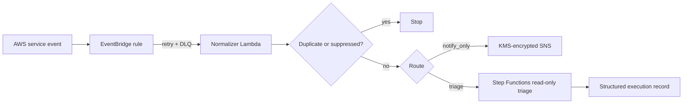

# Detection-to-response integration

Phase 3 Commit 5 connects selected AWS-native events to the response automation layer without enabling uncontrolled remediation.

## Event sources

Patterns under [`event-patterns/`](event-patterns/) cover GuardDuty, Security Hub CSPM, AWS Config, CloudWatch alarm state changes, and selected CloudTrail control-plane events. They are intentionally narrower than “all security events.”

## Default behavior

The deployed router defaults to `notify_only`. Setting `detection_default_route = "triage"` permits automatic **read-only EC2 triage** when a supported event contains a validated EC2 instance identifier. Live containment remains approval-gated and is never started automatically by this commit.

## Failure handling

Each EventBridge target uses a bounded retry policy and an encrypted SQS dead-letter queue. Optional EventBridge archiving can preserve matched source events for later replay. See [DLQ and replay](../docs/replay-and-dlq.md).

## Operator validation

Use [`scripts/test_detection_normalizer.py`](../scripts/test_detection_normalizer.py) to invoke the deployed normalizer with repository samples without requiring real findings.
