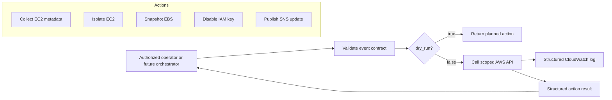

# Automation Architecture

The functions are deliberately independent. Step Functions orchestration, approval gates, EventBridge rules, and automated rollback are reserved for later Phase 3 commits.
