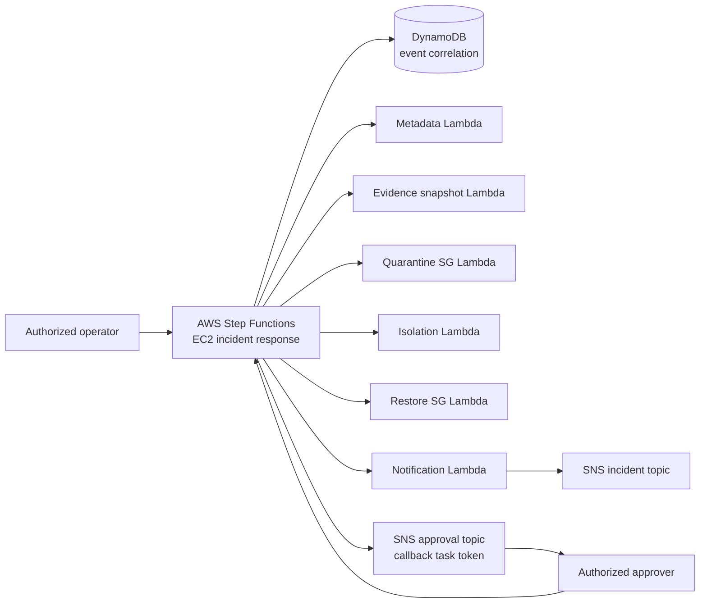

# Automation Architecture

Phase 3 Commit 3 adds orchestration without turning the project into autonomous remediation.


```mermaid
flowchart LR
    O[Authorized operator] --> SF[AWS Step Functions\nEC2 incident response]
    SF --> DDB[(DynamoDB\nevent correlation)]
    SF --> M[Metadata Lambda]
    SF --> E[Evidence snapshot Lambda]
    SF --> Q[Quarantine SG Lambda]
    SF --> I[Isolation Lambda]
    SF --> R[Restore SG Lambda]
    SF --> N[Notification Lambda]
    SF --> A[SNS approval topic\ncallback task token]
    A --> H[Authorized approver]
    H --> SF
    N --> S[SNS incident topic]
```

## Boundaries

- **Action layer:** small Lambda functions retain single-action responsibilities.
- **Orchestration layer:** Step Functions controls sequence, retries, approval, timeout, duplicate-event behavior, and terminal outcomes.
- **Correlation layer:** DynamoDB stores one record per `event_id`; the same `incident_id` may span multiple response events.
- **Approval layer:** a dedicated KMS-encrypted SNS topic carries callback requests. It is intentionally separate from routine notifications.
- **Deployment layer:** Terraform provisions action and orchestration infrastructure but does not attach the approver policy to a human identity automatically.
- **Detection layer:** no EventBridge, GuardDuty, Security Hub, or Config finding automatically starts containment in Commit 3.

## Evidence and containment order

Live containment follows:

```text
validate → correlate → metadata → EBS evidence snapshot → approval → quarantine SG → EC2 isolation → notify
```

This preserves disk evidence before network containment. If a later action fails, the workflow stops and records the failure; it does not automatically delete snapshots or restore network state.

## Rollback order

Rollback follows:

```text
validate manifest → dry-run restore plan → approval (live only) → restore original SGs → notify
```

The restoration Lambda revalidates incident, account, Region, resource, checksum, and `confirm_restore: true`.

## Logging

Lambda functions write structured CloudWatch Logs. The state machine has a dedicated `/aws/vendedlogs/states/` log group. `step_functions_include_execution_data` defaults to `false` so approval task tokens and detailed incident inputs are not copied into CloudWatch execution logs by default.
