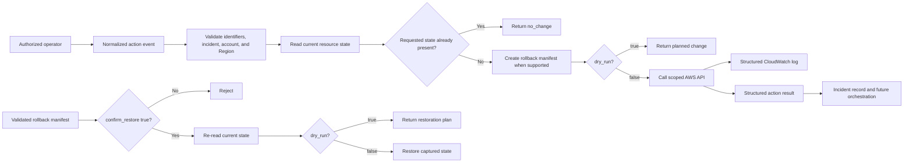
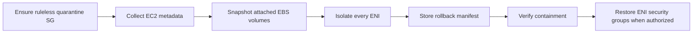
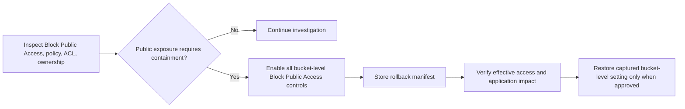

# Automation Architecture

```mermaid
flowchart LR
    O[Authorized operator] --> E[Normalized action event]
    E --> V[Validate identifiers, incident, account, and Region]
    V --> R[Read current resource state]
    R --> I{Requested state already present?}
    I -->|Yes| N[Return no_change]
    I -->|No| M[Create rollback manifest when supported]
    M --> D{dry_run?}
    D -->|true| P[Return planned change]
    D -->|false| A[Call scoped AWS API]
    A --> L[Structured CloudWatch log]
    A --> S[Structured action result]
    S --> C[Incident record and future orchestration]

    RM[Validated rollback manifest] --> CV{confirm_restore true?}
    CV -->|No| X[Reject]
    CV -->|Yes| RV[Re-read current state]
    RV --> RD{dry_run?}
    RD -->|true| RP[Return restoration plan]
    RD -->|false| RA[Restore captured state]
```

## Current boundaries

- Actions are invoked directly by an authorized operator or deployment test.
- No EventBridge, GuardDuty, Security Hub, or AWS Config finding triggers are connected yet.
- No Step Functions approval gate exists yet; human authorization is procedural and represented by explicit invocation fields.
- Rollback manifests are returned in Lambda output and must be stored by the operator. Durable manifest storage is planned for orchestration and deployment-productionization commits.
- S3 containment modifies only bucket-level Block Public Access. Bucket policy and ACL data are captured but deliberately not changed.

## Action flow examples

### EC2

```mermaid
flowchart LR
    Q[Ensure ruleless quarantine SG] --> E[Collect EC2 metadata]
    E --> S[Snapshot attached EBS volumes]
    S --> I[Isolate every ENI]
    I --> M[Store rollback manifest]
    M --> V[Verify containment]
    V --> R[Restore ENI security groups when authorized]
```

### S3

```mermaid
flowchart LR
    I[Inspect Block Public Access, policy, ACL, ownership] --> D{Public exposure requires containment?}
    D -->|No| C[Continue investigation]
    D -->|Yes| B[Enable all bucket-level Block Public Access controls]
    B --> M[Store rollback manifest]
    M --> V[Verify effective access and application impact]
    V --> R[Restore captured bucket-level setting only when approved]
```
