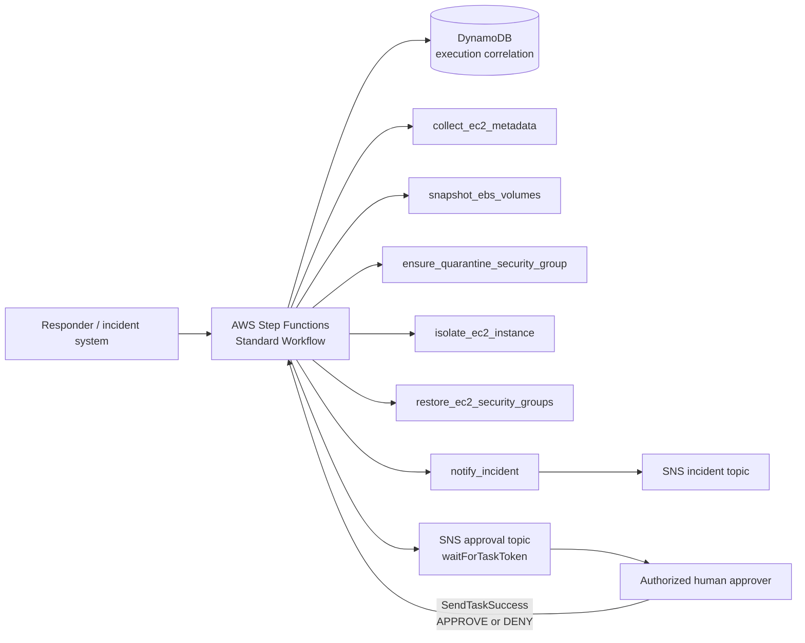

# Step Functions Incident Orchestration

Phase 3 Commit 3 connects the independent response actions from `v2.2.0` into a controlled **AWS Step Functions Standard Workflow** for an EC2 incident.

> [!WARNING]
> The workflow is a production-inspired reference for authorized labs and adaptation. `dry_run` defaults to `true` when omitted. Setting `dry_run` to `false` can create EBS snapshots and, after explicit callback approval, change EC2 network reachability. Review the target account, Region, instance, evidence requirements, and rollback path first.

## What the reference workflow supports

| Mode | Path | High-impact approval |
|---|---|---|
| `triage` | Collect EC2 metadata → notify | No |
| `containment` + dry-run | Collect metadata → plan snapshots → plan/reuse quarantine SG → plan isolation when a reusable SG ID exists → notification | No writes |
| `containment` + live | Collect metadata → create/reuse evidence snapshots → **approval callback** → create/reuse ruleless quarantine SG → isolate interfaces → notify | Required before network containment |
| `rollback` + dry-run | Validate checksummed rollback manifest → plan restoration → notify | No writes |
| `rollback` + live | Validate/plan restoration → **approval callback** → restore original security groups → notify | Required before restoration |

The workflow deliberately does **not** auto-reverse a partial containment failure. Evidence may already exist and containment may already have changed network state. A responder must inspect current state and the returned rollback manifest before starting a new rollback execution.

## Safety boundaries

1. **Dry-run first.** Missing `dry_run` becomes `true` at the state-machine boundary.
2. **Evidence before containment.** Live containment takes EBS evidence snapshots before the network-isolation approval gate.
3. **Separate approval channel.** Task tokens go only to the dedicated approval SNS topic, never to the general incident-notification topic.
4. **Human callback.** Live containment and live rollback pause at `sns:publish.waitForTaskToken` states.
5. **Duplicate suppression.** A DynamoDB conditional write rejects a repeated `event_id`. Use a new event ID only after reviewing the previous execution.
6. **Account and Region validation.** Existing Lambda actions fail closed when supplied context does not match the caller.
7. **Validated rollback.** Restore actions require `confirm_restore: true` and a checksum-valid manifest matching the incident and resource.
8. **No automatic detection trigger.** EventBridge/GuardDuty/Security Hub routing remains reserved for Phase 3 Commit 5.

## Architecture



Reusable diagram sources are in [`diagrams/`](diagrams/).

## Input contract

Core fields:

```json
{
  "event_id": "evt-2026-0001-containment-001",
  "incident_id": "INC-2026-0001",
  "mode": "containment",
  "expected_account_id": "111122223333",
  "region": "us-east-1",
  "instance_id": "i-0123456789abcdef0",
  "requested_by": "security-analyst@example.com",
  "reason": "Authorized containment planning exercise",
  "severity": "HIGH",
  "dry_run": true
}
```

`mode` must be `triage`, `containment`, or `rollback`. Rollback additionally requires:

- `confirm_restore: true`
- `rollback_manifest` from a prior `isolate_ec2_instance` result

`event_id` is the duplicate-suppression key. `incident_id` is the case correlation identifier and may be reused across multiple distinct execution events.

## Deploy

See [`../terraform/README.md`](../terraform/README.md). Terraform deploys:

- the existing eleven action Lambdas;
- a Step Functions Standard state machine;
- a dedicated KMS-encrypted approval SNS topic;
- a DynamoDB execution-correlation table;
- a state-machine execution role;
- a standalone approver callback IAM policy; and
- a CloudWatch Logs group for Step Functions.

The approver callback policy is **not attached automatically** to a human identity.

## Start a dry-run execution

From the repository root:

```bash
STATE_MACHINE_ARN="$(terraform -chdir=automation/terraform output -raw state_machine_arn)"

automation/scripts/start_orchestration.sh \
  "$STATE_MACHINE_ARN" \
  automation/step-functions/samples/containment-dry-run.json
```

Inspect the execution:

```bash
aws stepfunctions list-executions \
  --state-machine-arn "$STATE_MACHINE_ARN" \
  --max-results 10
```

## Human approval workflow

For live containment or live rollback, Step Functions publishes a message containing a **task token** to the dedicated approval topic and waits. Treat that token as a short-lived secret: anyone with the token plus callback permission can resolve the waiting task.

After an authorized responder reviews the incident and the approval request, run:

```bash
automation/scripts/respond_to_approval.sh APPROVE
```

or:

```bash
automation/scripts/respond_to_approval.sh DENY
```

The helper reads the token without echoing it and sends a success callback with a structured decision. The same-account callback requirement applies to Step Functions task tokens.

A typical callback result is:

```json
{
  "decision": "APPROVE",
  "approved_by": "security-lead@example.com",
  "comment": "Authorized after evidence review"
}
```

Do not paste task tokens into Git issues, chat systems, shell history, or repository files.

## Duplicate events and retries

The workflow writes `event_id` to DynamoDB with `attribute_not_exists(event_id)`. A duplicate event ends as `DUPLICATE_SKIPPED` before response actions run.

Transient Lambda service errors use bounded exponential retries. Terminal action errors are caught and recorded. A partial failure after evidence or containment is **not** automatically compensated because automatic reversal could destroy desired containment or obscure the actual response state.

To retry after investigation, create a **new** `event_id` while keeping the same `incident_id`.

## Operator-visible outcomes

Successful and non-error terminal paths return structured results such as:

- `SUCCEEDED`
- `PLANNED`
- `DENIED`
- `APPROVAL_TIMED_OUT`
- `APPROVAL_INVALID`
- `DUPLICATE_SKIPPED`

Failures update the DynamoDB execution record where possible and end with a Step Functions `Fail` state. Use the Step Functions execution history, DynamoDB record, Lambda logs, CloudTrail, and resource state together during review.

## Validation

```bash
python3 automation/scripts/validate_state_machines.py
python3 -m unittest discover -s automation/tests -p 'test_*.py'

cd automation/terraform
terraform fmt -check -recursive
terraform init -backend=false
terraform validate
```

The repository CI performs the same structural ASL and Terraform validation.

## Cost and cleanup

Step Functions Standard Workflow state transitions, DynamoDB requests/storage, SNS delivery, CloudWatch Logs, and any EBS snapshots can incur charges. Approval waits also keep an execution open. See [cost and cleanup](../docs/cost-and-cleanup.md) and destroy lab infrastructure when finished.

## Authoritative AWS references

- [AWS Step Functions — Task state](https://docs.aws.amazon.com/step-functions/latest/dg/state-task.html)
- [AWS Step Functions — Lambda integration](https://docs.aws.amazon.com/step-functions/latest/dg/connect-lambda.html)
- [AWS Step Functions — callback with task token](https://docs.aws.amazon.com/step-functions/latest/dg/connect-to-resource.html#connect-wait-token)
- [AWS Step Functions — error handling](https://docs.aws.amazon.com/step-functions/latest/dg/concepts-error-handling.html)
- [AWS Step Functions — SNS integration](https://docs.aws.amazon.com/step-functions/latest/dg/connect-sns.html)
