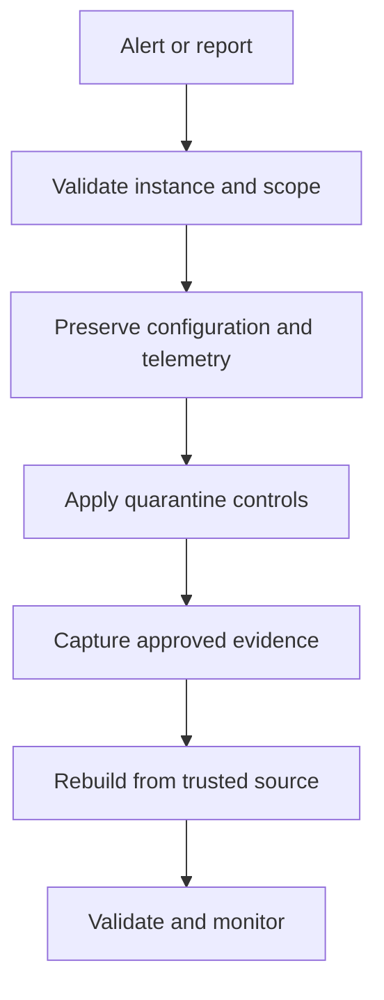

# Scenario 1: EC2 Instance Compromise

> **Objective:** Detect and safely isolate a suspected compromised EC2 instance while preserving evidence.

## Scope and safety

Use this runbook only with authorized access and an assigned incident identifier. Preserve evidence before destructive changes. Commands are examples: verify the account, Region, resource identifiers, dependencies, and rollback path before execution.


## Incident snapshot

| Item | Value |
|---|---|
| Default severity | **High** — adjust using the [severity matrix](incident-severity-matrix.md) |
| Primary impact | EC2 workload |
| Response objective | Containment and evidence preservation |
| AWS services | Amazon EC2, Amazon VPC, AWS CloudTrail, Amazon CloudWatch, AWS Systems Manager |
| Automation role | Optional |
| Typical execution window | 15–30 minutes; actual duration depends on scope and approvals |

> [!NOTE]
> Severity and timing are planning defaults, not substitutes for business-impact assessment, legal guidance, or the incident commander’s decision.

## Framework alignment

| Framework | Alignment |
|---|---|
| MITRE ATT&CK | `T1190` — Exploit Public-Facing Application<br>`T1059` — Command and Scripting Interpreter<br>`T1078.004` — Valid Accounts: Cloud Accounts |
| NIST CSF 2.0 / SP 800-61r3 | **Detect**, **Respond**, **Recover** |
| AWS Well-Architected Security Pillar | `SEC10-BP03` — Prepare forensic capabilities<br>`SEC10-BP04` — Develop and test security incident response playbooks<br>`SEC10-BP05` — Pre-provision access<br>`SEC10-BP06` — Pre-deploy tools |

> [!NOTE]
> ATT&CK entries describe plausible adversary behavior relevant to this scenario; they do not assert that every technique occurred. Confirm mappings from evidence. NIST and AWS entries describe response-program alignment, not compliance certification. See the [framework mapping guide](framework-mapping.md).

## Response flow



## Severity guidance

- **Critical:** confirmed active compromise, root/administrator takeover, or ongoing sensitive-data loss.
- **High:** strong evidence of compromise with material exposure but no confirmed continuing impact.
- **Medium:** suspicious or noncompliant configuration requiring investigation.

## Required evidence

- Incident ID, UTC timeline, responder identity, account and Region
- Relevant CloudTrail events and configuration state
- Resource identifiers, tags, owners, dependencies, and screenshots/exports required by policy
- Every containment/remediation action and its result

## Runbook

1. Confirm the instance ID, account, Region, business owner, severity, and whether the instance is managed by Auto Scaling.
2. Record current security groups, IAM instance profile, subnet, private/public IPs, EBS volumes, tags, AMI, and launch time.
3. Review CloudTrail, CloudWatch logs/metrics, VPC Flow Logs if available, and Systems Manager inventory/session history.
4. Create or select a quarantine security group with no broad inbound access and only explicitly approved egress.
5. Attach quarantine controls without destroying the original evidence; remove the instance from load balancing if required.
6. Create EBS snapshots and capture volatile data through an approved forensic method before stopping the instance.
7. Rebuild from a trusted image, rotate exposed credentials, patch the root cause, and validate monitoring before service restoration.

## AWS CLI starting points

```bash
aws ec2 describe-instances --instance-ids i-EXAMPLE --region REGION
aws ec2 describe-network-interfaces --filters Name=attachment.instance-id,Values=i-EXAMPLE --region REGION
aws ec2 create-snapshot --volume-id vol-EXAMPLE --description "IR-CASE-ID evidence" --tag-specifications 'ResourceType=snapshot,Tags=[{Key=IncidentId,Value=IR-CASE-ID}]'
# Confirm the isolation SG is correct before changing the instance.
aws ec2 modify-instance-attribute --instance-id i-EXAMPLE --groups sg-ISOLATION
```


## Console starting points

- **CloudTrail → Event history** for recent management activity
- **CloudWatch → Logs / Metrics / Alarms** for telemetry
- Relevant service console for current configuration and dependencies
- **Systems Manager** for controlled instance access and automation where supported

## Validation and closure

- The threat is no longer active and unauthorized access has been removed.
- Required evidence is preserved and accessible only to approved responders.
- Business functionality, logging, alarms, backups, and compliance checks pass.
- Root cause, blast radius, timeline, owner, corrective actions, and follow-up dates are recorded.

## Services used

Amazon EC2, Amazon VPC, AWS CloudTrail, Amazon CloudWatch, AWS Systems Manager

## Exam cues

Look for explicit task verbs: **identify**, **enable**, **disable**, **isolate**, **restrict**, **snapshot**, **query**, **notify**, **remediate**, and **validate**. Complete exactly what the lab requests; avoid unrelated improvements that could consume time or break grading dependencies.

## Authoritative references

- [AWS Security Incident Response Guide](https://docs.aws.amazon.com/whitepapers/latest/aws-security-incident-response-guide/welcome.html)
- [AWS Security Incident Response documentation](https://docs.aws.amazon.com/security-ir/)
- [AWS Well-Architected Security Pillar — Incident response](https://docs.aws.amazon.com/wellarchitected/latest/security-pillar/incident-response.html)
- [AWS Prescriptive Guidance — Incident response recommendations](https://docs.aws.amazon.com/prescriptive-guidance/latest/security-controls-by-caf-capability/incident-response-recommendations.html)


---

[Documentation index](index.md) · [Next scenario](02-automated-ec2-isolation.md)
