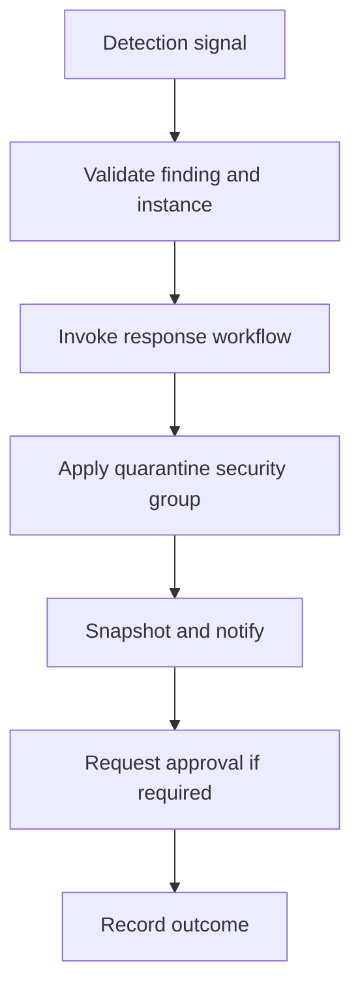

# Scenario 2: Automated EC2 Isolation

> **Objective:** Automate repeatable isolation of an EC2 instance when a trusted detection is raised.

## Scope and safety

Use this runbook only with authorized access and an assigned incident identifier. Preserve evidence before destructive changes. Commands are examples: verify the account, Region, resource identifiers, dependencies, and rollback path before execution.


## Incident snapshot

| Item | Value |
|---|---|
| Default severity | **High** — adjust using the [severity matrix](incident-severity-matrix.md) |
| Primary impact | EC2 response automation |
| Response objective | Controlled automated quarantine |
| AWS services | Amazon CloudWatch, Amazon SNS, AWS Lambda, AWS Step Functions, Amazon EC2 |
| Automation role | Primary |
| Typical execution window | 20–45 minutes; actual duration depends on scope and approvals |

> [!NOTE]
> Severity and timing are planning defaults, not substitutes for business-impact assessment, legal guidance, or the incident commander’s decision.

## Framework alignment

| Framework | Alignment |
|---|---|
| MITRE ATT&CK | `T1190` — Exploit Public-Facing Application<br>`T1078.004` — Valid Accounts: Cloud Accounts<br>`T1496` — Resource Hijacking |
| NIST CSF 2.0 / SP 800-61r3 | **Govern**, **Detect**, **Respond** |
| AWS Well-Architected Security Pillar | `SEC10-BP04` — Develop and test security incident response playbooks<br>`SEC10-BP06` — Pre-deploy tools<br>`SEC10-BP07` — Run simulations |

> [!NOTE]
> ATT&CK entries describe plausible adversary behavior relevant to this scenario; they do not assert that every technique occurred. Confirm mappings from evidence. NIST and AWS entries describe response-program alignment, not compliance certification. See the [framework mapping guide](framework-mapping.md).

## Response flow



## Severity guidance

- **Critical:** confirmed active compromise, root/administrator takeover, or ongoing sensitive-data loss.
- **High:** strong evidence of compromise with material exposure but no confirmed continuing impact.
- **Medium:** suspicious or noncompliant configuration requiring investigation.

## Required evidence

- Incident ID, UTC timeline, responder identity, account and Region
- Relevant CloudTrail events and configuration state
- Resource identifiers, tags, owners, dependencies, and screenshots/exports required by policy
- Every containment/remediation action and its result

## Decision checkpoints

> [!IMPORTANT]
> Use these checkpoints to choose the safest next action. When evidence is incomplete, prefer preservation, narrow containment, and explicit approval over destructive remediation.

| Question | If yes | If no |
|---|---|---|
| Is the signal high-confidence and uniquely identifies the resource? | Permit automated quarantine within the approved guardrails. | Require analyst validation before any write action. |
| Could isolation break critical dependencies? | Route to approval or a reduced-impact containment branch. | Continue with the standard isolation path. |
| Did the automation verify account, Region, tags, and allowlists? | Continue and record every state transition. | Fail closed and notify responders. |

## Runbook

1. Define the triggering event and required identifiers such as instance ID, finding ID, account, and Region.
2. Use an event/alarm to invoke Lambda directly or start a Step Functions workflow; use SNS for human notification.
3. Have automation tag the instance as quarantined, capture its existing network state, and attach a pre-created isolation security group.
4. Optionally deregister the instance from a target group, suspend replacement actions, and initiate snapshots.
5. Use a dedicated execution role with only required describe, tagging, security-group, snapshot, and notification permissions.
6. Make every action idempotent and log the incident ID, actions, timestamps, failures, and rollback data.
7. Test in a non-production account and require approval before destructive eradication steps.

## AWS CLI starting points

```bash
# Start with read-only discovery. Substitute verified identifiers and Region.
aws sts get-caller-identity
aws cloudtrail lookup-events --max-results 50
```


## Console starting points

- **CloudTrail → Event history** for recent management activity
- **CloudWatch → Logs / Metrics / Alarms** for telemetry
- Relevant service console for current configuration and dependencies
- **Systems Manager** for controlled instance access and automation where supported

## Validation and closure

- The threat is no longer active and unauthorized access has been removed.
- Required evidence is preserved and accessible only to approved responders.
- Business functionality, logging, alarms, backups, and compliance checks pass.
- Root cause, blast radius, timeline, owner, corrective actions, and follow-up dates are recorded.

## Services used

Amazon CloudWatch, Amazon SNS, AWS Lambda, AWS Step Functions, Amazon EC2, Amazon VPC

## Exam cues

Look for explicit task verbs: **identify**, **enable**, **disable**, **isolate**, **restrict**, **snapshot**, **query**, **notify**, **remediate**, and **validate**. Complete exactly what the lab requests; avoid unrelated improvements that could consume time or break grading dependencies.

## Decision support

Use the [incident-response decision guide](decision-trees.md) for cross-scenario escalation, containment, evidence, and recovery choices.

## Authoritative references

- [AWS Security Incident Response Guide](https://docs.aws.amazon.com/whitepapers/latest/aws-security-incident-response-guide/welcome.html)
- [AWS Security Incident Response documentation](https://docs.aws.amazon.com/security-ir/)
- [AWS Well-Architected Security Pillar — Incident response](https://docs.aws.amazon.com/wellarchitected/latest/security-pillar/incident-response.html)
- [AWS Prescriptive Guidance — Incident response recommendations](https://docs.aws.amazon.com/prescriptive-guidance/latest/security-controls-by-caf-capability/incident-response-recommendations.html)


---

[Documentation index](index.md) · [Previous scenario](01-ec2-instance-compromise.md) · [Next scenario](03-iam-credential-compromise.md)
