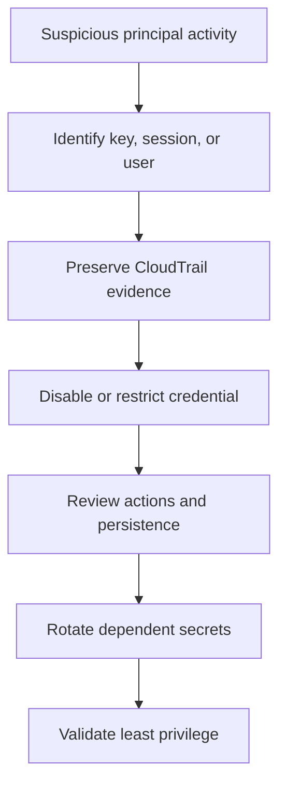

# Scenario 3: IAM Credential Compromise

> **Objective:** Contain a compromised IAM user or role credential and determine its blast radius.

## Scope and safety

Use this runbook only with authorized access and an assigned incident identifier. Preserve evidence before destructive changes. Commands are examples: verify the account, Region, resource identifiers, dependencies, and rollback path before execution.


## Incident snapshot

| Item | Value |
|---|---|
| Default severity | **Critical** — adjust using the [severity matrix](incident-severity-matrix.md) |
| Primary impact | AWS identity |
| Response objective | Disable credentials and determine blast radius |
| AWS services | AWS IAM, AWS CloudTrail, Amazon Athena, Amazon CloudWatch |
| Automation role | Optional |
| Typical execution window | 15–45 minutes; actual duration depends on scope and approvals |

> [!NOTE]
> Severity and timing are planning defaults, not substitutes for business-impact assessment, legal guidance, or the incident commander’s decision.

## Framework alignment

| Framework | Alignment |
|---|---|
| MITRE ATT&CK | `T1078.004` — Valid Accounts: Cloud Accounts<br>`T1552.001` — Unsecured Credentials: Credentials In Files<br>`T1528` — Steal Application Access Token |
| NIST CSF 2.0 / SP 800-61r3 | **Protect**, **Detect**, **Respond** |
| AWS Well-Architected Security Pillar | `SEC10-BP02` — Develop incident management plans<br>`SEC10-BP04` — Develop and test security incident response playbooks<br>`SEC10-BP05` — Pre-provision access |

> [!NOTE]
> ATT&CK entries describe plausible adversary behavior relevant to this scenario; they do not assert that every technique occurred. Confirm mappings from evidence. NIST and AWS entries describe response-program alignment, not compliance certification. See the [framework mapping guide](framework-mapping.md).

## Response flow



## Severity guidance

- **Critical:** confirmed active compromise, root/administrator takeover, or ongoing sensitive-data loss.
- **High:** strong evidence of compromise with material exposure but no confirmed continuing impact.
- **Medium:** suspicious or noncompliant configuration requiring investigation.

## Required evidence

- Incident ID, UTC timeline, responder identity, account and Region
- Relevant CloudTrail events and configuration state
- Resource identifiers, tags, owners, dependencies, and screenshots/exports required by policy
- Every containment/remediation action and its result

## Runbook

1. Identify the principal, access key ID or role session, first/last observed activity, source IPs, user agents, and affected Regions.
2. Deactivate the exposed access key or revoke active role sessions; do not delete evidence before recording metadata.
3. Apply a temporary deny policy or remove high-risk permissions when immediate containment is required.
4. Query CloudTrail event history or Athena for all activity by the principal, access key, session issuer, and source IP.
5. Inspect persistence actions including CreateUser, CreateAccessKey, CreateLoginProfile, Attach*Policy, Put*Policy, UpdateAssumeRolePolicy, and PassRole.
6. Rotate dependent secrets, remove unauthorized resources and permissions, and correct the credential exposure path.
7. Validate least privilege, MFA, short-lived credentials, and alerting for future anomalous authentication activity.

## AWS CLI starting points

```bash
aws iam list-access-keys --user-name SUSPICIOUS_USER
aws iam update-access-key --user-name SUSPICIOUS_USER --access-key-id AKIAEXAMPLE --status Inactive
aws cloudtrail lookup-events --lookup-attributes AttributeKey=AccessKeyId,AttributeValue=AKIAEXAMPLE --max-results 50
```


## Console starting points

- **CloudTrail → Event history** for recent management activity
- **CloudWatch → Logs / Metrics / Alarms** for telemetry
- Relevant service console for current configuration and dependencies
- **Systems Manager** for controlled instance access and automation where supported

## Validation and closure

- The threat is no longer active and unauthorized access has been removed.
- Required evidence is preserved and accessible only to approved responders.
- Business functionality, logging, alarms, backups, and compliance checks pass.
- Root cause, blast radius, timeline, owner, corrective actions, and follow-up dates are recorded.

## Services used

AWS Identity and Access Management, AWS CloudTrail, Amazon Athena, Amazon SNS

## Exam cues

Look for explicit task verbs: **identify**, **enable**, **disable**, **isolate**, **restrict**, **snapshot**, **query**, **notify**, **remediate**, and **validate**. Complete exactly what the lab requests; avoid unrelated improvements that could consume time or break grading dependencies.

## Authoritative references

- [AWS Security Incident Response Guide](https://docs.aws.amazon.com/whitepapers/latest/aws-security-incident-response-guide/welcome.html)
- [AWS Security Incident Response documentation](https://docs.aws.amazon.com/security-ir/)
- [AWS Well-Architected Security Pillar — Incident response](https://docs.aws.amazon.com/wellarchitected/latest/security-pillar/incident-response.html)
- [AWS Prescriptive Guidance — Incident response recommendations](https://docs.aws.amazon.com/prescriptive-guidance/latest/security-controls-by-caf-capability/incident-response-recommendations.html)


---

[Documentation index](index.md) · [Previous scenario](02-automated-ec2-isolation.md) · [Next scenario](04-data-exfiltration.md)
