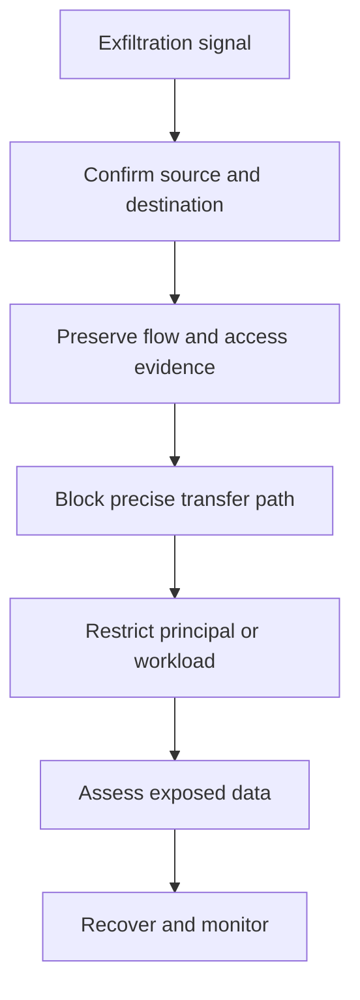

# Scenario 4: Data Exfiltration

> **Objective:** Stop suspected unauthorized data transfer while preserving logs and limiting business impact.

## Scope and safety

Use this runbook only with authorized access and an assigned incident identifier. Preserve evidence before destructive changes. Commands are examples: verify the account, Region, resource identifiers, dependencies, and rollback path before execution.


## Incident snapshot

| Item | Value |
|---|---|
| Default severity | **Critical** — adjust using the [severity matrix](incident-severity-matrix.md) |
| Primary impact | Data and network paths |
| Response objective | Stop unauthorized transfer |
| AWS services | Amazon VPC, Amazon EC2, Amazon S3, AWS IAM, AWS CloudTrail, Amazon CloudWatch |
| Automation role | Optional |
| Typical execution window | 15–60 minutes; actual duration depends on scope and approvals |

> [!NOTE]
> Severity and timing are planning defaults, not substitutes for business-impact assessment, legal guidance, or the incident commander’s decision.

## Response flow



## Severity guidance

- **Critical:** confirmed active compromise, root/administrator takeover, or ongoing sensitive-data loss.
- **High:** strong evidence of compromise with material exposure but no confirmed continuing impact.
- **Medium:** suspicious or noncompliant configuration requiring investigation.

## Required evidence

- Incident ID, UTC timeline, responder identity, account and Region
- Relevant CloudTrail events and configuration state
- Resource identifiers, tags, owners, dependencies, and screenshots/exports required by policy
- Every containment/remediation action and its result

## Runbook

1. Determine the data source, destination, protocol, principal, volume, time window, and whether exfiltration is ongoing.
2. Preserve CloudTrail, S3 data events, access logs, application logs, VPC Flow Logs, and relevant CloudWatch metrics.
3. Contain the principal by revoking credentials or sessions and contain the workload by applying targeted egress restrictions.
4. For S3, block unintended public access and correct bucket policy, access points, ACLs, and cross-account grants.
5. Avoid indiscriminate NACL changes that may affect unrelated systems; prefer precise security-group, route, endpoint-policy, or IAM controls.
6. Identify copied, altered, or deleted data and determine reporting, legal, privacy, and customer notification obligations.
7. Recover with least-privilege access, approved egress paths, enhanced logging, and tested detections.

## AWS CLI starting points

```bash
# Start with read-only discovery. Substitute verified identifiers and Region.
aws sts get-caller-identity
aws cloudtrail lookup-events --max-results 50
```


## Console starting points

- **CloudTrail → Event history** for recent management activity
- **CloudWatch → Logs / Metrics / Alarms** for telemetry
- Relevant service console for current configuration and dependencies
- **Systems Manager** for controlled instance access and automation where supported

## Validation and closure

- The threat is no longer active and unauthorized access has been removed.
- Required evidence is preserved and accessible only to approved responders.
- Business functionality, logging, alarms, backups, and compliance checks pass.
- Root cause, blast radius, timeline, owner, corrective actions, and follow-up dates are recorded.

## Services used

Amazon VPC, Amazon EC2, Amazon S3, AWS Identity and Access Management, AWS CloudTrail, Amazon Athena

## Exam cues

Look for explicit task verbs: **identify**, **enable**, **disable**, **isolate**, **restrict**, **snapshot**, **query**, **notify**, **remediate**, and **validate**. Complete exactly what the lab requests; avoid unrelated improvements that could consume time or break grading dependencies.

## Authoritative references

- [AWS Security Incident Response Guide](https://docs.aws.amazon.com/whitepapers/latest/aws-security-incident-response-guide/welcome.html)
- [AWS Security Incident Response documentation](https://docs.aws.amazon.com/security-ir/)
- [AWS Well-Architected Security Pillar — Incident response](https://docs.aws.amazon.com/wellarchitected/latest/security-pillar/incident-response.html)
- [AWS Prescriptive Guidance — Incident response recommendations](https://docs.aws.amazon.com/prescriptive-guidance/latest/security-controls-by-caf-capability/incident-response-recommendations.html)


---

[Documentation index](index.md) · [Previous scenario](03-iam-credential-compromise.md) · [Next scenario](05-public-s3-bucket.md)
