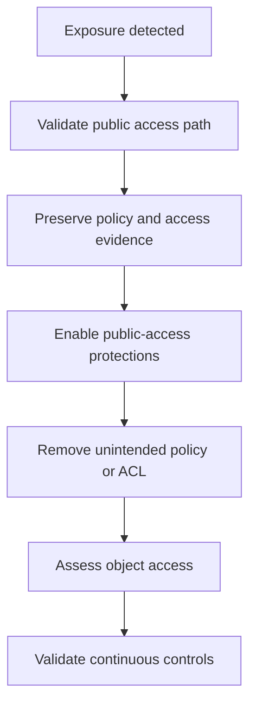

# Scenario 5: Public S3 Bucket

> **Objective:** Remove unintended public access to an S3 bucket and determine whether data was accessed.

## Scope and safety

Use this runbook only with authorized access and an assigned incident identifier. Preserve evidence before destructive changes. Commands are examples: verify the account, Region, resource identifiers, dependencies, and rollback path before execution.


## Incident snapshot

| Item | Value |
|---|---|
| Default severity | **High** — adjust using the [severity matrix](incident-severity-matrix.md) |
| Primary impact | Amazon S3 data |
| Response objective | Remove exposure and investigate access |
| AWS services | Amazon S3, AWS CloudTrail, Amazon Athena, AWS Config, Amazon SNS |
| Automation role | Optional |
| Typical execution window | 10–30 minutes; actual duration depends on scope and approvals |

> [!NOTE]
> Severity and timing are planning defaults, not substitutes for business-impact assessment, legal guidance, or the incident commander’s decision.

## Response flow



## Severity guidance

- **Critical:** confirmed active compromise, root/administrator takeover, or ongoing sensitive-data loss.
- **High:** strong evidence of compromise with material exposure but no confirmed continuing impact.
- **Medium:** suspicious or noncompliant configuration requiring investigation.

## Required evidence

- Incident ID, UTC timeline, responder identity, account and Region
- Relevant CloudTrail events and configuration state
- Resource identifiers, tags, owners, dependencies, and screenshots/exports required by policy
- Every containment/remediation action and its result

## Runbook

1. Capture the bucket policy, Block Public Access settings, ACLs, access-point policies, object ownership, encryption, logging, and versioning state.
2. Enable or enforce appropriate S3 Block Public Access settings after confirming intended public website requirements.
3. Remove unintended Allow statements, wildcard principals, public ACLs, or broad cross-account access.
4. Use CloudTrail management events to identify who changed policy and S3 data events/access logs to investigate object access where enabled.
5. Assess exposed object sensitivity, duration, downloads, anonymous access, and downstream disclosure obligations.
6. Restore objects from versioning or backups if modified or deleted and rotate any secrets stored in exposed objects.
7. Add AWS Config controls and notifications to detect recurrence.

## AWS CLI starting points

```bash
aws s3api get-public-access-block --bucket BUCKET
aws s3api get-bucket-policy --bucket BUCKET
aws s3api get-bucket-acl --bucket BUCKET
aws s3api put-public-access-block --bucket BUCKET --public-access-block-configuration   BlockPublicAcls=true,IgnorePublicAcls=true,BlockPublicPolicy=true,RestrictPublicBuckets=true
```


## Console starting points

- **CloudTrail → Event history** for recent management activity
- **CloudWatch → Logs / Metrics / Alarms** for telemetry
- Relevant service console for current configuration and dependencies
- **Systems Manager** for controlled instance access and automation where supported

## Validation and closure

- The threat is no longer active and unauthorized access has been removed.
- Required evidence is preserved and accessible only to approved responders.
- Business functionality, logging, alarms, backups, and compliance checks pass.
- Root cause, blast radius, timeline, owner, corrective actions, and follow-up dates are recorded.

## Services used

Amazon S3, AWS CloudTrail, Amazon Athena, AWS Config, Amazon SNS

## Exam cues

Look for explicit task verbs: **identify**, **enable**, **disable**, **isolate**, **restrict**, **snapshot**, **query**, **notify**, **remediate**, and **validate**. Complete exactly what the lab requests; avoid unrelated improvements that could consume time or break grading dependencies.

## Authoritative references

- [AWS Security Incident Response Guide](https://docs.aws.amazon.com/whitepapers/latest/aws-security-incident-response-guide/welcome.html)
- [AWS Security Incident Response documentation](https://docs.aws.amazon.com/security-ir/)
- [AWS Well-Architected Security Pillar — Incident response](https://docs.aws.amazon.com/wellarchitected/latest/security-pillar/incident-response.html)
- [AWS Prescriptive Guidance — Incident response recommendations](https://docs.aws.amazon.com/prescriptive-guidance/latest/security-controls-by-caf-capability/incident-response-recommendations.html)


---

[Documentation index](index.md) · [Previous scenario](04-data-exfiltration.md) · [Next scenario](06-compliance-enforcement.md)
