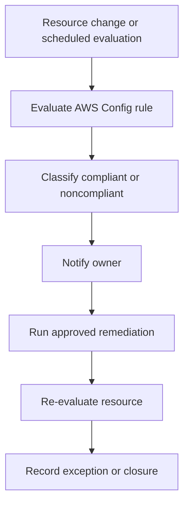

# Scenario 6: Compliance Enforcement

> **Objective:** Continuously detect and remediate missing tags and disabled EC2 detailed monitoring.

## Scope and safety

Use this runbook only with authorized access and an assigned incident identifier. Preserve evidence before destructive changes. Commands are examples: verify the account, Region, resource identifiers, dependencies, and rollback path before execution.


## Incident snapshot

| Item | Value |
|---|---|
| Default severity | **Medium** — adjust using the [severity matrix](incident-severity-matrix.md) |
| Primary impact | Governed AWS resources |
| Response objective | Detect and remediate control gaps |
| AWS services | AWS Config, Amazon CloudWatch, Amazon SNS, AWS Lambda, Amazon EC2 |
| Automation role | Primary |
| Typical execution window | 20–45 minutes; actual duration depends on scope and approvals |

> [!NOTE]
> Severity and timing are planning defaults, not substitutes for business-impact assessment, legal guidance, or the incident commander’s decision.

## Framework alignment

| Framework | Alignment |
|---|---|
| MITRE ATT&CK | `T1562.001` — Impair Defenses: Disable or Modify Tools<br>`T1578.005` — Modify Cloud Compute Configurations |
| NIST CSF 2.0 / SP 800-61r3 | **Govern**, **Identify**, **Protect**, **Detect**, **Respond** |
| AWS Well-Architected Security Pillar | `SEC10-BP04` — Develop and test security incident response playbooks<br>`SEC10-BP06` — Pre-deploy tools<br>`SEC10-BP07` — Run simulations<br>`SEC10-BP08` — Establish a framework for learning from incidents |

> [!NOTE]
> ATT&CK entries describe plausible adversary behavior relevant to this scenario; they do not assert that every technique occurred. Confirm mappings from evidence. NIST and AWS entries describe response-program alignment, not compliance certification. See the [framework mapping guide](framework-mapping.md).

## Response flow



## Severity guidance

- **Critical:** confirmed active compromise, root/administrator takeover, or ongoing sensitive-data loss.
- **High:** strong evidence of compromise with material exposure but no confirmed continuing impact.
- **Medium:** suspicious or noncompliant configuration requiring investigation.

## Required evidence

- Incident ID, UTC timeline, responder identity, account and Region
- Relevant CloudTrail events and configuration state
- Resource identifiers, tags, owners, dependencies, and screenshots/exports required by policy
- Every containment/remediation action and its result

## Decision checkpoints

> [!IMPORTANT]
> Use these checkpoints to choose the safest next action. When evidence is incomplete, prefer preservation, narrow containment, and explicit approval over destructive remediation.

| Question | If yes | If no |
|---|---|---|
| Is the noncompliance a true violation or an approved exception? | Remediate or route through the exception process. | Record evidence and close the finding. |
| Is automatic remediation deterministic and reversible? | Allow controlled automation with logging. | Require human approval. |
| Could remediation affect production availability? | Schedule or approve the change with the owner. | Proceed within the standard response window. |

## Runbook

1. Define required tags such as CostCenter, Department, Application, Owner, Environment, and DataClassification.
2. Enable AWS Config recording for the required resource types and configure managed rules such as required-tags.
3. Use the managed rule ec2-instance-detailed-monitoring-enabled for detailed-monitoring compliance where available.
4. Identify noncompliant resources and confirm remediation ownership and exception handling.
5. Enable detailed monitoring on approved EC2 instances and apply missing tags from authoritative data—not guessed values.
6. Use SNS for notification and Systems Manager Automation or Lambda for controlled remediation.
7. Validate cost-allocation tag activation separately in Billing and Cost Management, because resource tags alone do not automatically provide billing breakdowns.

## AWS CLI starting points

```bash
# Start with read-only discovery. Substitute verified identifiers and Region.
aws sts get-caller-identity
aws cloudtrail lookup-events --max-results 50
```


## Console starting points

- **CloudTrail → Event history** for recent management activity
- **CloudWatch → Logs / Metrics / Alarms** for telemetry
- Relevant service console for current configuration and dependencies
- **Systems Manager** for controlled instance access and automation where supported

## Validation and closure

- The threat is no longer active and unauthorized access has been removed.
- Required evidence is preserved and accessible only to approved responders.
- Business functionality, logging, alarms, backups, and compliance checks pass.
- Root cause, blast radius, timeline, owner, corrective actions, and follow-up dates are recorded.

## Services used

AWS Config, Amazon CloudWatch, Amazon SNS, AWS Lambda, Amazon EC2

## Exam cues

Look for explicit task verbs: **identify**, **enable**, **disable**, **isolate**, **restrict**, **snapshot**, **query**, **notify**, **remediate**, and **validate**. Complete exactly what the lab requests; avoid unrelated improvements that could consume time or break grading dependencies.

## Decision support

Use the [incident-response decision guide](decision-trees.md) for cross-scenario escalation, containment, evidence, and recovery choices.

## Authoritative references

- [AWS Security Incident Response Guide](https://docs.aws.amazon.com/whitepapers/latest/aws-security-incident-response-guide/welcome.html)
- [AWS Security Incident Response documentation](https://docs.aws.amazon.com/security-ir/)
- [AWS Well-Architected Security Pillar — Incident response](https://docs.aws.amazon.com/wellarchitected/latest/security-pillar/incident-response.html)
- [AWS Prescriptive Guidance — Incident response recommendations](https://docs.aws.amazon.com/prescriptive-guidance/latest/security-controls-by-caf-capability/incident-response-recommendations.html)


---

[Documentation index](index.md) · [Previous scenario](05-public-s3-bucket.md) · [Next scenario](07-rds-database-security.md)
