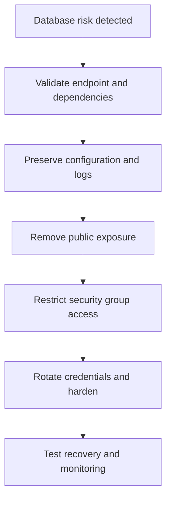

# Scenario 7: RDS Database Security

> **Objective:** Reduce exposure of an RDS database and establish secure network, authentication, logging, and recovery controls.

## Scope and safety

Use this runbook only with authorized access and an assigned incident identifier. Preserve evidence before destructive changes. Commands are examples: verify the account, Region, resource identifiers, dependencies, and rollback path before execution.


## Incident snapshot

| Item | Value |
|---|---|
| Default severity | **High** — adjust using the [severity matrix](incident-severity-matrix.md) |
| Primary impact | Relational database |
| Response objective | Reduce exposure and strengthen recovery |
| AWS services | Amazon RDS, Amazon VPC, AWS IAM, AWS CloudTrail, Amazon CloudWatch |
| Automation role | Optional |
| Typical execution window | 20–60 minutes; actual duration depends on scope and approvals |

> [!NOTE]
> Severity and timing are planning defaults, not substitutes for business-impact assessment, legal guidance, or the incident commander’s decision.

## Framework alignment

| Framework | Alignment |
|---|---|
| MITRE ATT&CK | `T1190` — Exploit Public-Facing Application<br>`T1078.004` — Valid Accounts: Cloud Accounts<br>`T1530` — Data from Cloud Storage Object |
| NIST CSF 2.0 / SP 800-61r3 | **Identify**, **Protect**, **Detect**, **Respond**, **Recover** |
| AWS Well-Architected Security Pillar | `SEC10-BP03` — Prepare forensic capabilities<br>`SEC10-BP04` — Develop and test security incident response playbooks<br>`SEC10-BP05` — Pre-provision access |

> [!NOTE]
> ATT&CK entries describe plausible adversary behavior relevant to this scenario; they do not assert that every technique occurred. Confirm mappings from evidence. NIST and AWS entries describe response-program alignment, not compliance certification. See the [framework mapping guide](framework-mapping.md).

## Response flow



## Severity guidance

- **Critical:** confirmed active compromise, root/administrator takeover, or ongoing sensitive-data loss.
- **High:** strong evidence of compromise with material exposure but no confirmed continuing impact.
- **Medium:** suspicious or noncompliant configuration requiring investigation.

## Required evidence

- Incident ID, UTC timeline, responder identity, account and Region
- Relevant CloudTrail events and configuration state
- Resource identifiers, tags, owners, dependencies, and screenshots/exports required by policy
- Every containment/remediation action and its result

## Decision checkpoints

> [!IMPORTANT]
> Use these checkpoints to choose the safest next action. When evidence is incomplete, prefer preservation, narrow containment, and explicit approval over destructive remediation.

| Question | If yes | If no |
|---|---|---|
| Is the database publicly reachable or broadly trusted? | Restrict access immediately while preserving application connectivity. | Continue with encryption, logging, backup, and identity review. |
| Is active compromise suspected? | Treat as an incident, preserve logs/snapshots, and rotate exposed secrets. | Treat as hardening or compliance remediation. |
| Can the database be rebuilt or restored from a trusted point? | Plan validated recovery and cutover. | Use in-place remediation with additional monitoring. |

## Runbook

1. Record engine, endpoint, subnet group, public accessibility, security groups, parameter groups, encryption, backups, logs, and deletion protection.
2. Make the database non-public when public access is not a documented requirement and place it in appropriate private subnets.
3. Allow database ports only from approved application security groups or tightly controlled administration paths.
4. Remove broad CIDRs and verify route tables, NACLs, peering, Transit Gateway, and VPN paths do not create unintended access.
5. Enable supported audit/error/slow-query log exports, encryption, backups, and deletion protection as required.
6. Rotate database credentials or secrets and review IAM database authentication where supported.
7. Validate application connectivity, backup restoration, monitoring, and change records before closure.

## AWS CLI starting points

```bash
# Start with read-only discovery. Substitute verified identifiers and Region.
aws sts get-caller-identity
aws cloudtrail lookup-events --max-results 50
```


## Console starting points

- **CloudTrail → Event history** for recent management activity
- **CloudWatch → Logs / Metrics / Alarms** for telemetry
- Relevant service console for current configuration and dependencies
- **Systems Manager** for controlled instance access and automation where supported

## Validation and closure

- The threat is no longer active and unauthorized access has been removed.
- Required evidence is preserved and accessible only to approved responders.
- Business functionality, logging, alarms, backups, and compliance checks pass.
- Root cause, blast radius, timeline, owner, corrective actions, and follow-up dates are recorded.

## Services used

Amazon RDS, Amazon VPC, AWS Identity and Access Management, Amazon CloudWatch, AWS CloudTrail

## Exam cues

Look for explicit task verbs: **identify**, **enable**, **disable**, **isolate**, **restrict**, **snapshot**, **query**, **notify**, **remediate**, and **validate**. Complete exactly what the lab requests; avoid unrelated improvements that could consume time or break grading dependencies.

## Decision support

Use the [incident-response decision guide](decision-trees.md) for cross-scenario escalation, containment, evidence, and recovery choices.

## Authoritative references

- [AWS Security Incident Response Guide](https://docs.aws.amazon.com/whitepapers/latest/aws-security-incident-response-guide/welcome.html)
- [AWS Security Incident Response documentation](https://docs.aws.amazon.com/security-ir/)
- [AWS Well-Architected Security Pillar — Incident response](https://docs.aws.amazon.com/wellarchitected/latest/security-pillar/incident-response.html)
- [AWS Prescriptive Guidance — Incident response recommendations](https://docs.aws.amazon.com/prescriptive-guidance/latest/security-controls-by-caf-capability/incident-response-recommendations.html)


---

[Documentation index](index.md) · [Previous scenario](06-compliance-enforcement.md) · [Next scenario](08-backdoor-iam-user.md)
