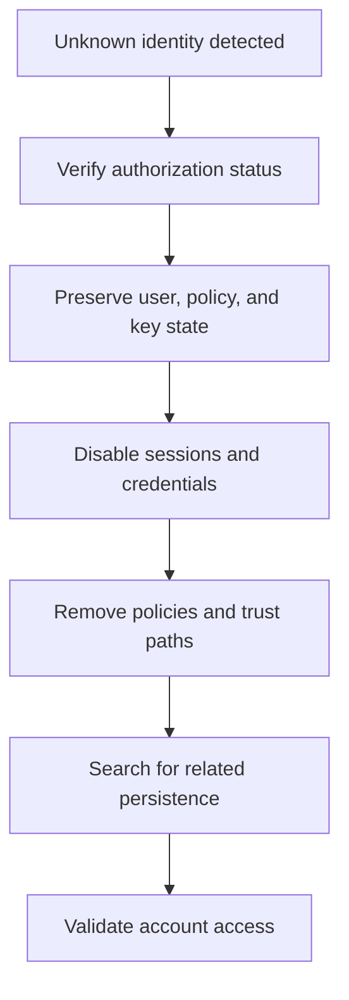

# Scenario 8: Backdoor IAM User

> **Objective:** Identify and remove unauthorized IAM identities and persistence mechanisms.

## Scope and safety

Use this runbook only with authorized access and an assigned incident identifier. Preserve evidence before destructive changes. Commands are examples: verify the account, Region, resource identifiers, dependencies, and rollback path before execution.


## Incident snapshot

| Item | Value |
|---|---|
| Default severity | **Critical** — adjust using the [severity matrix](incident-severity-matrix.md) |
| Primary impact | AWS identity and persistence |
| Response objective | Remove unauthorized identity |
| AWS services | AWS IAM, AWS CloudTrail, Amazon Athena, Amazon SNS |
| Automation role | Optional |
| Typical execution window | 15–45 minutes; actual duration depends on scope and approvals |

> [!NOTE]
> Severity and timing are planning defaults, not substitutes for business-impact assessment, legal guidance, or the incident commander’s decision.

## Framework alignment

| Framework | Alignment |
|---|---|
| MITRE ATT&CK | `T1136.003` — Create Account: Cloud Account<br>`T1098.001` — Account Manipulation: Additional Cloud Credentials<br>`T1078.004` — Valid Accounts: Cloud Accounts |
| NIST CSF 2.0 / SP 800-61r3 | **Protect**, **Detect**, **Respond** |
| AWS Well-Architected Security Pillar | `SEC10-BP02` — Develop incident management plans<br>`SEC10-BP04` — Develop and test security incident response playbooks<br>`SEC10-BP05` — Pre-provision access |

> [!NOTE]
> ATT&CK entries describe plausible adversary behavior relevant to this scenario; they do not assert that every technique occurred. Confirm mappings from evidence. NIST and AWS entries describe response-program alignment, not compliance certification. See the [framework mapping guide](framework-mapping.md).

## Response flow



## Severity guidance

- **Critical:** confirmed active compromise, root/administrator takeover, or ongoing sensitive-data loss.
- **High:** strong evidence of compromise with material exposure but no confirmed continuing impact.
- **Medium:** suspicious or noncompliant configuration requiring investigation.

## Required evidence

- Incident ID, UTC timeline, responder identity, account and Region
- Relevant CloudTrail events and configuration state
- Resource identifiers, tags, owners, dependencies, and screenshots/exports required by policy
- Every containment/remediation action and its result

## Runbook

1. Use CloudTrail to establish who created or modified the suspicious user, group, role, policy, login profile, MFA device, or access key.
2. Deactivate credentials, revoke sessions where applicable, and attach a temporary explicit deny if containment must be immediate.
3. Inventory group memberships, inline/managed policies, permission boundaries, tags, access keys, signing certificates, and service-specific credentials.
4. Inspect related actions such as CreateRole, UpdateAssumeRolePolicy, PassRole, PutUserPolicy, AttachUserPolicy, and CreateAccessKey.
5. Remove unauthorized identity objects and policies only after preserving the evidence and dependency information.
6. Rotate credentials of any legitimate identities used to create the backdoor and review federation/SSO sources.
7. Validate no equivalent persistence remains and improve alerts for IAM privilege and credential changes.

## AWS CLI starting points

```bash
# Start with read-only discovery. Substitute verified identifiers and Region.
aws sts get-caller-identity
aws cloudtrail lookup-events --max-results 50
```


## Console starting points

- **CloudTrail → Event history** for recent management activity
- **CloudWatch → Logs / Metrics / Alarms** for telemetry
- Relevant service console for current configuration and dependencies
- **Systems Manager** for controlled instance access and automation where supported

## Validation and closure

- The threat is no longer active and unauthorized access has been removed.
- Required evidence is preserved and accessible only to approved responders.
- Business functionality, logging, alarms, backups, and compliance checks pass.
- Root cause, blast radius, timeline, owner, corrective actions, and follow-up dates are recorded.

## Services used

AWS Identity and Access Management, AWS CloudTrail, Amazon Athena

## Exam cues

Look for explicit task verbs: **identify**, **enable**, **disable**, **isolate**, **restrict**, **snapshot**, **query**, **notify**, **remediate**, and **validate**. Complete exactly what the lab requests; avoid unrelated improvements that could consume time or break grading dependencies.

## Authoritative references

- [AWS Security Incident Response Guide](https://docs.aws.amazon.com/whitepapers/latest/aws-security-incident-response-guide/welcome.html)
- [AWS Security Incident Response documentation](https://docs.aws.amazon.com/security-ir/)
- [AWS Well-Architected Security Pillar — Incident response](https://docs.aws.amazon.com/wellarchitected/latest/security-pillar/incident-response.html)
- [AWS Prescriptive Guidance — Incident response recommendations](https://docs.aws.amazon.com/prescriptive-guidance/latest/security-controls-by-caf-capability/incident-response-recommendations.html)


---

[Documentation index](index.md) · [Previous scenario](07-rds-database-security.md) · [Next scenario](09-malicious-lambda-scheduled-persistence.md)
