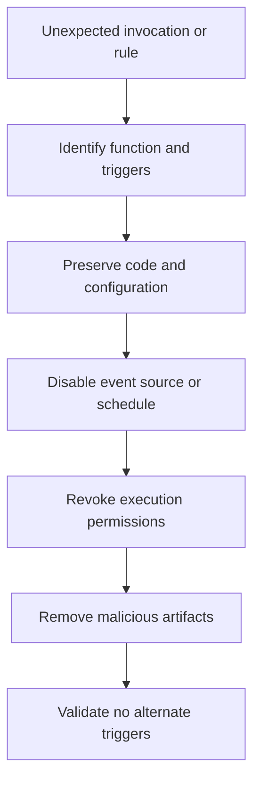

# Scenario 9: Malicious Lambda or Scheduled Persistence

> **Objective:** Remove malicious serverless persistence while preserving code, configuration, and invocation evidence.

## Scope and safety

Use this runbook only with authorized access and an assigned incident identifier. Preserve evidence before destructive changes. Commands are examples: verify the account, Region, resource identifiers, dependencies, and rollback path before execution.


## Incident snapshot

| Item | Value |
|---|---|
| Default severity | **Critical** — adjust using the [severity matrix](incident-severity-matrix.md) |
| Primary impact | Serverless control plane |
| Response objective | Eradicate serverless persistence |
| AWS services | AWS Lambda, Amazon EventBridge, AWS CloudTrail, AWS IAM, Amazon S3 |
| Automation role | Optional |
| Typical execution window | 20–60 minutes; actual duration depends on scope and approvals |

> [!NOTE]
> Severity and timing are planning defaults, not substitutes for business-impact assessment, legal guidance, or the incident commander’s decision.

## Response flow



## Severity guidance

- **Critical:** confirmed active compromise, root/administrator takeover, or ongoing sensitive-data loss.
- **High:** strong evidence of compromise with material exposure but no confirmed continuing impact.
- **Medium:** suspicious or noncompliant configuration requiring investigation.

## Required evidence

- Incident ID, UTC timeline, responder identity, account and Region
- Relevant CloudTrail events and configuration state
- Resource identifiers, tags, owners, dependencies, and screenshots/exports required by policy
- Every containment/remediation action and its result

## Runbook

1. Capture the Lambda code package, versions, aliases, environment variables, layers, execution role, resource policy, triggers, destinations, and tags.
2. Identify invocation sources such as EventBridge schedules, SNS, S3, API Gateway, Step Functions, or other services.
3. Disable the trigger or remove invoke permission to contain executions before deleting the function.
4. Review CloudTrail for CreateFunction, UpdateFunctionCode, UpdateFunctionConfiguration, AddPermission, PutRule, and PutTargets.
5. Inspect the execution role for privilege escalation, secret access, resource creation, or lateral movement.
6. Remove malicious resources, rotate exposed secrets, and restore legitimate functions from trusted source control and deployment artifacts.
7. Add code signing, least-privilege roles, change controls, and monitoring for serverless configuration changes.

## AWS CLI starting points

```bash
# Start with read-only discovery. Substitute verified identifiers and Region.
aws sts get-caller-identity
aws cloudtrail lookup-events --max-results 50
```


## Console starting points

- **CloudTrail → Event history** for recent management activity
- **CloudWatch → Logs / Metrics / Alarms** for telemetry
- Relevant service console for current configuration and dependencies
- **Systems Manager** for controlled instance access and automation where supported

## Validation and closure

- The threat is no longer active and unauthorized access has been removed.
- Required evidence is preserved and accessible only to approved responders.
- Business functionality, logging, alarms, backups, and compliance checks pass.
- Root cause, blast radius, timeline, owner, corrective actions, and follow-up dates are recorded.

## Services used

AWS Lambda, Amazon CloudWatch, AWS CloudTrail, AWS Identity and Access Management, AWS Step Functions

## Exam cues

Look for explicit task verbs: **identify**, **enable**, **disable**, **isolate**, **restrict**, **snapshot**, **query**, **notify**, **remediate**, and **validate**. Complete exactly what the lab requests; avoid unrelated improvements that could consume time or break grading dependencies.

## Authoritative references

- [AWS Security Incident Response Guide](https://docs.aws.amazon.com/whitepapers/latest/aws-security-incident-response-guide/welcome.html)
- [AWS Security Incident Response documentation](https://docs.aws.amazon.com/security-ir/)
- [AWS Well-Architected Security Pillar — Incident response](https://docs.aws.amazon.com/wellarchitected/latest/security-pillar/incident-response.html)
- [AWS Prescriptive Guidance — Incident response recommendations](https://docs.aws.amazon.com/prescriptive-guidance/latest/security-controls-by-caf-capability/incident-response-recommendations.html)


---

[Documentation index](index.md) · [Previous scenario](08-backdoor-iam-user.md) · [Next scenario](10-root-account-compromise.md)
