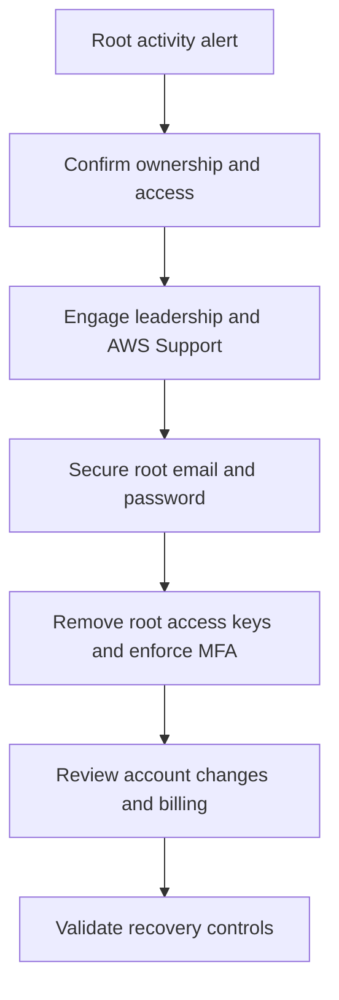

# Scenario 10: Root Account Compromise

> **Objective:** Contain suspected unauthorized use of the AWS account root user.

## Scope and safety

Use this runbook only with authorized access and an assigned incident identifier. Preserve evidence before destructive changes. Commands are examples: verify the account, Region, resource identifiers, dependencies, and rollback path before execution.


## Incident snapshot

| Item | Value |
|---|---|
| Default severity | **Critical** — adjust using the [severity matrix](incident-severity-matrix.md) |
| Primary impact | AWS account |
| Response objective | Regain control of root identity |
| AWS services | AWS IAM, AWS CloudTrail, Amazon SNS, AWS Support |
| Automation role | Manual |
| Typical execution window | 30–120 minutes; actual duration depends on scope and approvals |

> [!NOTE]
> Severity and timing are planning defaults, not substitutes for business-impact assessment, legal guidance, or the incident commander’s decision.

## Framework alignment

| Framework | Alignment |
|---|---|
| MITRE ATT&CK | `T1078.004` — Valid Accounts: Cloud Accounts<br>`T1098.001` — Account Manipulation: Additional Cloud Credentials<br>`T1136.003` — Create Account: Cloud Account |
| NIST CSF 2.0 / SP 800-61r3 | **Govern**, **Protect**, **Detect**, **Respond**, **Recover** |
| AWS Well-Architected Security Pillar | `SEC10-BP01` — Identify key personnel and external resources<br>`SEC10-BP02` — Develop incident management plans<br>`SEC10-BP04` — Develop and test security incident response playbooks<br>`SEC10-BP05` — Pre-provision access |

> [!NOTE]
> ATT&CK entries describe plausible adversary behavior relevant to this scenario; they do not assert that every technique occurred. Confirm mappings from evidence. NIST and AWS entries describe response-program alignment, not compliance certification. See the [framework mapping guide](framework-mapping.md).

## Response flow



## Severity guidance

- **Critical:** confirmed active compromise, root/administrator takeover, or ongoing sensitive-data loss.
- **High:** strong evidence of compromise with material exposure but no confirmed continuing impact.
- **Medium:** suspicious or noncompliant configuration requiring investigation.

## Required evidence

- Incident ID, UTC timeline, responder identity, account and Region
- Relevant CloudTrail events and configuration state
- Resource identifiers, tags, owners, dependencies, and screenshots/exports required by policy
- Every containment/remediation action and its result

## Decision checkpoints

> [!IMPORTANT]
> Use these checkpoints to choose the safest next action. When evidence is incomplete, prefer preservation, narrow containment, and explicit approval over destructive remediation.

| Question | If yes | If no |
|---|---|---|
| Can the account owner still authenticate securely? | Secure root credentials, MFA, contacts, and payment settings immediately. | Escalate to AWS Support and organizational leadership. |
| Are root access keys present or recently used? | Delete or disable them after preserving evidence. | Continue reviewing root events and account changes. |
| Were support plans, contacts, domains, or billing details changed? | Restore validated ownership information and monitor for recurrence. | Proceed with normal recovery validation. |

## Runbook

1. Use a known-clean device and trusted network to change the root password and verify the registered email and contact information.
2. Deactivate/delete root access keys if they exist and secure root MFA; follow the account recovery process if access is lost.
3. Review CloudTrail for ConsoleLogin and all root user API activity across Regions and inspect billing/payment changes.
4. Contact AWS Support through the appropriate support channel for active account compromise or ownership concerns.
5. Identify and remove unauthorized IAM identities, policies, resources, support cases, marketplace subscriptions, and logging changes.
6. Rotate credentials and secrets that root activity may have exposed and restore deleted security controls.
7. Validate root is reserved for documented root-only tasks and establish alerts for any future root usage.

## AWS CLI starting points

```bash
# Start with read-only discovery. Substitute verified identifiers and Region.
aws sts get-caller-identity
aws cloudtrail lookup-events --max-results 50
```


## Console starting points

- **CloudTrail → Event history** for recent management activity
- **CloudWatch → Logs / Metrics / Alarms** for telemetry
- Relevant service console for current configuration and dependencies
- **Systems Manager** for controlled instance access and automation where supported

## Validation and closure

- The threat is no longer active and unauthorized access has been removed.
- Required evidence is preserved and accessible only to approved responders.
- Business functionality, logging, alarms, backups, and compliance checks pass.
- Root cause, blast radius, timeline, owner, corrective actions, and follow-up dates are recorded.

## Services used

AWS Identity and Access Management, AWS CloudTrail, Amazon SNS

## Exam cues

Look for explicit task verbs: **identify**, **enable**, **disable**, **isolate**, **restrict**, **snapshot**, **query**, **notify**, **remediate**, and **validate**. Complete exactly what the lab requests; avoid unrelated improvements that could consume time or break grading dependencies.

## Decision support

Use the [incident-response decision guide](decision-trees.md) for cross-scenario escalation, containment, evidence, and recovery choices.

## Authoritative references

- [AWS Security Incident Response Guide](https://docs.aws.amazon.com/whitepapers/latest/aws-security-incident-response-guide/welcome.html)
- [AWS Security Incident Response documentation](https://docs.aws.amazon.com/security-ir/)
- [AWS Well-Architected Security Pillar — Incident response](https://docs.aws.amazon.com/wellarchitected/latest/security-pillar/incident-response.html)
- [AWS Prescriptive Guidance — Incident response recommendations](https://docs.aws.amazon.com/prescriptive-guidance/latest/security-controls-by-caf-capability/incident-response-recommendations.html)


---

[Documentation index](index.md) · [Previous scenario](09-malicious-lambda-scheduled-persistence.md) · [Next scenario](11-auto-scaling-recovery.md)
