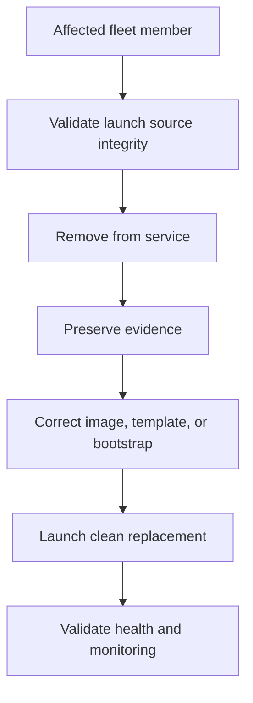

# Scenario 11: Auto Scaling Recovery

> **Objective:** Replace compromised capacity with trusted instances while preventing accidental cloning of the compromise.

## Scope and safety

Use this runbook only with authorized access and an assigned incident identifier. Preserve evidence before destructive changes. Commands are examples: verify the account, Region, resource identifiers, dependencies, and rollback path before execution.


## Incident snapshot

| Item | Value |
|---|---|
| Default severity | **High** — adjust using the [severity matrix](incident-severity-matrix.md) |
| Primary impact | Elastic compute capacity |
| Response objective | Replace affected capacity safely |
| AWS services | Amazon EC2 Auto Scaling, Amazon EC2, Elastic Load Balancing, AWS Systems Manager, Amazon CloudWatch |
| Automation role | Optional |
| Typical execution window | 30–90 minutes; actual duration depends on scope and approvals |

> [!NOTE]
> Severity and timing are planning defaults, not substitutes for business-impact assessment, legal guidance, or the incident commander’s decision.

## Framework alignment

| Framework | Alignment |
|---|---|
| MITRE ATT&CK | `T1578.002` — Create Cloud Instance<br>`T1578.005` — Modify Cloud Compute Configurations<br>`T1496` — Resource Hijacking |
| NIST CSF 2.0 / SP 800-61r3 | **Respond**, **Recover** |
| AWS Well-Architected Security Pillar | `SEC10-BP04` — Develop and test security incident response playbooks<br>`SEC10-BP06` — Pre-deploy tools<br>`SEC10-BP07` — Run simulations |

> [!NOTE]
> ATT&CK entries describe plausible adversary behavior relevant to this scenario; they do not assert that every technique occurred. Confirm mappings from evidence. NIST and AWS entries describe response-program alignment, not compliance certification. See the [framework mapping guide](framework-mapping.md).

## Response flow



## Severity guidance

- **Critical:** confirmed active compromise, root/administrator takeover, or ongoing sensitive-data loss.
- **High:** strong evidence of compromise with material exposure but no confirmed continuing impact.
- **Medium:** suspicious or noncompliant configuration requiring investigation.

## Required evidence

- Incident ID, UTC timeline, responder identity, account and Region
- Relevant CloudTrail events and configuration state
- Resource identifiers, tags, owners, dependencies, and screenshots/exports required by policy
- Every containment/remediation action and its result

## Runbook

1. Identify the Auto Scaling group, launch template/configuration version, AMI, user data, instance profile, target groups, and scaling policies.
2. Quarantine the affected instance and preserve snapshots/logs before termination when evidence is required.
3. Confirm the launch template, AMI, bootstrap artifacts, package sources, and secrets are trusted; update them before allowing replacement.
4. Use instance refresh or controlled replacement rather than relying on an unchanged compromised golden image.
5. Apply hardened security groups, private subnet placement, Systems Manager access, IMDSv2, patching, and monitoring.
6. Validate load balancer health checks, application function, log delivery, and compliance before terminating evidence copies.
7. Document the clean launch-template version and prevent rollback to vulnerable versions.

## AWS CLI starting points

```bash
# Start with read-only discovery. Substitute verified identifiers and Region.
aws sts get-caller-identity
aws cloudtrail lookup-events --max-results 50
```


## Console starting points

- **CloudTrail → Event history** for recent management activity
- **CloudWatch → Logs / Metrics / Alarms** for telemetry
- Relevant service console for current configuration and dependencies
- **Systems Manager** for controlled instance access and automation where supported

## Validation and closure

- The threat is no longer active and unauthorized access has been removed.
- Required evidence is preserved and accessible only to approved responders.
- Business functionality, logging, alarms, backups, and compliance checks pass.
- Root cause, blast radius, timeline, owner, corrective actions, and follow-up dates are recorded.

## Services used

Amazon EC2 Auto Scaling, Amazon EC2, Amazon VPC, Amazon CloudWatch

## Exam cues

Look for explicit task verbs: **identify**, **enable**, **disable**, **isolate**, **restrict**, **snapshot**, **query**, **notify**, **remediate**, and **validate**. Complete exactly what the lab requests; avoid unrelated improvements that could consume time or break grading dependencies.

## Authoritative references

- [AWS Security Incident Response Guide](https://docs.aws.amazon.com/whitepapers/latest/aws-security-incident-response-guide/welcome.html)
- [AWS Security Incident Response documentation](https://docs.aws.amazon.com/security-ir/)
- [AWS Well-Architected Security Pillar — Incident response](https://docs.aws.amazon.com/wellarchitected/latest/security-pillar/incident-response.html)
- [AWS Prescriptive Guidance — Incident response recommendations](https://docs.aws.amazon.com/prescriptive-guidance/latest/security-controls-by-caf-capability/incident-response-recommendations.html)


---

[Documentation index](index.md) · [Previous scenario](10-root-account-compromise.md) · [Next scenario](12-unauthorized-api-calls.md)
