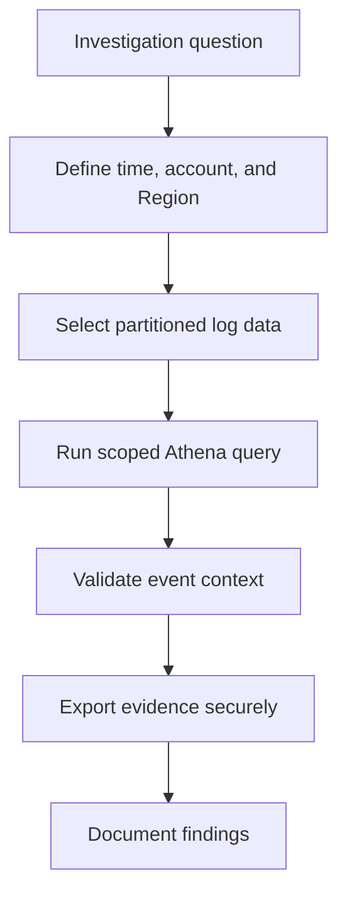

# Scenario 13: Athena CloudTrail Investigation

> **Objective:** Use Athena to search centralized CloudTrail logs at scale.

## Scope and safety

Use this runbook only with authorized access and an assigned incident identifier. Preserve evidence before destructive changes. Commands are examples: verify the account, Region, resource identifiers, dependencies, and rollback path before execution.


## Incident snapshot

| Item | Value |
|---|---|
| Default severity | **Medium** — adjust using the [severity matrix](incident-severity-matrix.md) |
| Primary impact | Centralized audit logs |
| Response objective | Search CloudTrail efficiently |
| AWS services | Amazon Athena, Amazon S3, AWS Glue Data Catalog, AWS CloudTrail |
| Automation role | Manual |
| Typical execution window | 20–45 minutes; actual duration depends on scope and approvals |

> [!NOTE]
> Severity and timing are planning defaults, not substitutes for business-impact assessment, legal guidance, or the incident commander’s decision.

## Framework alignment

| Framework | Alignment |
|---|---|
| MITRE ATT&CK | `T1078.004` — Valid Accounts: Cloud Accounts<br>`T1136.003` — Create Account: Cloud Account<br>`T1562.008` — Impair Defenses: Disable or Modify Cloud Logs |
| NIST CSF 2.0 / SP 800-61r3 | **Identify**, **Detect**, **Respond** |
| AWS Well-Architected Security Pillar | `SEC10-BP03` — Prepare forensic capabilities<br>`SEC10-BP05` — Pre-provision access<br>`SEC10-BP06` — Pre-deploy tools |

> [!NOTE]
> ATT&CK entries describe plausible adversary behavior relevant to this scenario; they do not assert that every technique occurred. Confirm mappings from evidence. NIST and AWS entries describe response-program alignment, not compliance certification. See the [framework mapping guide](framework-mapping.md).

## Response flow



## Severity guidance

- **Critical:** confirmed active compromise, root/administrator takeover, or ongoing sensitive-data loss.
- **High:** strong evidence of compromise with material exposure but no confirmed continuing impact.
- **Medium:** suspicious or noncompliant configuration requiring investigation.

## Required evidence

- Incident ID, UTC timeline, responder identity, account and Region
- Relevant CloudTrail events and configuration state
- Resource identifiers, tags, owners, dependencies, and screenshots/exports required by policy
- Every containment/remediation action and its result

## Decision checkpoints

> [!IMPORTANT]
> Use these checkpoints to choose the safest next action. When evidence is incomplete, prefer preservation, narrow containment, and explicit approval over destructive remediation.

| Question | If yes | If no |
|---|---|---|
| Is the query scope constrained by time, account, and Region? | Run and preserve results. | Narrow the query before execution. |
| Are the required CloudTrail event types present in S3? | Proceed with analysis. | Identify missing trails, data events, partitions, or delivery gaps. |
| Do results indicate additional identities or resources? | Pivot and expand the investigation iteratively. | Document negative findings and confidence limits. |

## Runbook

1. Confirm CloudTrail logs are delivered to the correct S3 prefix and determine account, Region, and date partitions.
2. Create an Athena table using CloudTrail table creation or partition projection and use a dedicated encrypted query-results location.
3. Limit queries by event date, account, Region, event source, event name, and principal to reduce cost and noise.
4. Parse nested userIdentity, requestParameters, responseElements, and resources fields carefully; handle JSON strings where needed.
5. Export investigation results with an incident ID and preserve query text, execution ID, and result location.
6. Correlate suspicious activity across identity, network, storage, compute, and logging events.
7. Drop temporary tables or revoke access after the investigation while retaining required evidence under policy.

## AWS CLI starting points

```bash
# Start with read-only discovery. Substitute verified identifiers and Region.
aws sts get-caller-identity
aws cloudtrail lookup-events --max-results 50
```


## Console starting points

- **CloudTrail → Event history** for recent management activity
- **CloudWatch → Logs / Metrics / Alarms** for telemetry
- Relevant service console for current configuration and dependencies
- **Systems Manager** for controlled instance access and automation where supported

## Validation and closure

- The threat is no longer active and unauthorized access has been removed.
- Required evidence is preserved and accessible only to approved responders.
- Business functionality, logging, alarms, backups, and compliance checks pass.
- Root cause, blast radius, timeline, owner, corrective actions, and follow-up dates are recorded.

## Services used

Amazon Athena, AWS CloudTrail, Amazon S3

## Exam cues

Look for explicit task verbs: **identify**, **enable**, **disable**, **isolate**, **restrict**, **snapshot**, **query**, **notify**, **remediate**, and **validate**. Complete exactly what the lab requests; avoid unrelated improvements that could consume time or break grading dependencies.

## Decision support

Use the [incident-response decision guide](decision-trees.md) for cross-scenario escalation, containment, evidence, and recovery choices.

## Authoritative references

- [AWS Security Incident Response Guide](https://docs.aws.amazon.com/whitepapers/latest/aws-security-incident-response-guide/welcome.html)
- [AWS Security Incident Response documentation](https://docs.aws.amazon.com/security-ir/)
- [AWS Well-Architected Security Pillar — Incident response](https://docs.aws.amazon.com/wellarchitected/latest/security-pillar/incident-response.html)
- [AWS Prescriptive Guidance — Incident response recommendations](https://docs.aws.amazon.com/prescriptive-guidance/latest/security-controls-by-caf-capability/incident-response-recommendations.html)


---

[Documentation index](index.md) · [Previous scenario](12-unauthorized-api-calls.md) · [Next scenario](14-systems-manager-investigation.md)
