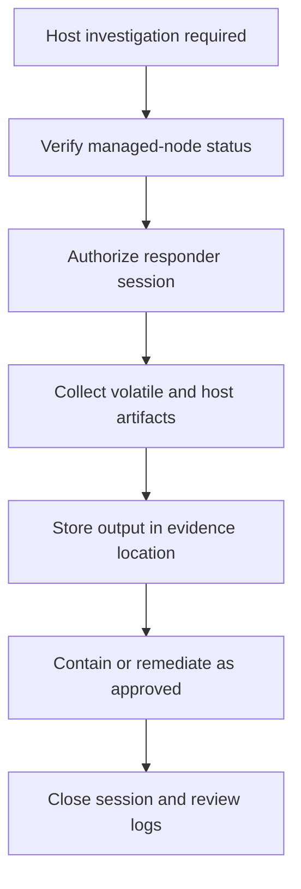

# Scenario 14: Systems Manager Investigation

> **Objective:** Investigate and remediate instances without opening inbound SSH or RDP.

## Scope and safety

Use this runbook only with authorized access and an assigned incident identifier. Preserve evidence before destructive changes. Commands are examples: verify the account, Region, resource identifiers, dependencies, and rollback path before execution.


## Incident snapshot

| Item | Value |
|---|---|
| Default severity | **High** — adjust using the [severity matrix](incident-severity-matrix.md) |
| Primary impact | Managed compute |
| Response objective | Investigate without opening SSH or RDP |
| AWS services | AWS Systems Manager, Amazon EC2, AWS IAM, Amazon CloudWatch Logs, Amazon S3 |
| Automation role | Optional |
| Typical execution window | 20–60 minutes; actual duration depends on scope and approvals |

> [!NOTE]
> Severity and timing are planning defaults, not substitutes for business-impact assessment, legal guidance, or the incident commander’s decision.

## Framework alignment

| Framework | Alignment |
|---|---|
| MITRE ATT&CK | `T1021` — Remote Services<br>`T1059` — Command and Scripting Interpreter<br>`T1078` — Valid Accounts |
| NIST CSF 2.0 / SP 800-61r3 | **Detect**, **Respond** |
| AWS Well-Architected Security Pillar | `SEC10-BP03` — Prepare forensic capabilities<br>`SEC10-BP05` — Pre-provision access<br>`SEC10-BP06` — Pre-deploy tools |

> [!NOTE]
> ATT&CK entries describe plausible adversary behavior relevant to this scenario; they do not assert that every technique occurred. Confirm mappings from evidence. NIST and AWS entries describe response-program alignment, not compliance certification. See the [framework mapping guide](framework-mapping.md).

## Response flow



## Severity guidance

- **Critical:** confirmed active compromise, root/administrator takeover, or ongoing sensitive-data loss.
- **High:** strong evidence of compromise with material exposure but no confirmed continuing impact.
- **Medium:** suspicious or noncompliant configuration requiring investigation.

## Required evidence

- Incident ID, UTC timeline, responder identity, account and Region
- Relevant CloudTrail events and configuration state
- Resource identifiers, tags, owners, dependencies, and screenshots/exports required by policy
- Every containment/remediation action and its result

## Decision checkpoints

> [!IMPORTANT]
> Use these checkpoints to choose the safest next action. When evidence is incomplete, prefer preservation, narrow containment, and explicit approval over destructive remediation.

| Question | If yes | If no |
|---|---|---|
| Is Systems Manager access authorized and logged? | Use Session Manager or Run Command with evidence capture. | Do not open alternate access solely for convenience. |
| Could a command alter evidence? | Use read-only collection or an approved forensic workflow. | Execute the documented command and save output. |
| Is the SSM agent or instance profile potentially compromised? | Validate control-plane trust before relying on results. | Continue with controlled investigation. |

## Runbook

1. Confirm the instance is managed by Systems Manager and record the agent status, instance profile, platform, and connectivity path.
2. Use Session Manager or Run Command only under an approved forensic procedure because commands may alter system state.
3. Collect process lists, listening connections, logged-in users, persistence locations, relevant logs, package history, and file hashes.
4. Send command/session logs to protected CloudWatch Logs or S3 where configured.
5. Use Inventory, Patch Manager, State Manager, or Automation for approved remediation and baseline restoration.
6. Avoid storing secrets in command parameters or shell history and restrict session access through IAM.
7. Validate the instance baseline, agent health, logging, and application operation after remediation.

## AWS CLI starting points

```bash
# Start with read-only discovery. Substitute verified identifiers and Region.
aws sts get-caller-identity
aws cloudtrail lookup-events --max-results 50
```


## Console starting points

- **CloudTrail → Event history** for recent management activity
- **CloudWatch → Logs / Metrics / Alarms** for telemetry
- Relevant service console for current configuration and dependencies
- **Systems Manager** for controlled instance access and automation where supported

## Validation and closure

- The threat is no longer active and unauthorized access has been removed.
- Required evidence is preserved and accessible only to approved responders.
- Business functionality, logging, alarms, backups, and compliance checks pass.
- Root cause, blast radius, timeline, owner, corrective actions, and follow-up dates are recorded.

## Services used

AWS Systems Manager, Amazon EC2, Amazon CloudWatch, AWS Identity and Access Management

## Exam cues

Look for explicit task verbs: **identify**, **enable**, **disable**, **isolate**, **restrict**, **snapshot**, **query**, **notify**, **remediate**, and **validate**. Complete exactly what the lab requests; avoid unrelated improvements that could consume time or break grading dependencies.

## Decision support

Use the [incident-response decision guide](decision-trees.md) for cross-scenario escalation, containment, evidence, and recovery choices.

## Authoritative references

- [AWS Security Incident Response Guide](https://docs.aws.amazon.com/whitepapers/latest/aws-security-incident-response-guide/welcome.html)
- [AWS Security Incident Response documentation](https://docs.aws.amazon.com/security-ir/)
- [AWS Well-Architected Security Pillar — Incident response](https://docs.aws.amazon.com/wellarchitected/latest/security-pillar/incident-response.html)
- [AWS Prescriptive Guidance — Incident response recommendations](https://docs.aws.amazon.com/prescriptive-guidance/latest/security-controls-by-caf-capability/incident-response-recommendations.html)


---

[Documentation index](index.md) · [Previous scenario](13-athena-cloudtrail-investigation.md) · [Next scenario](15-aws-config-drift.md)
