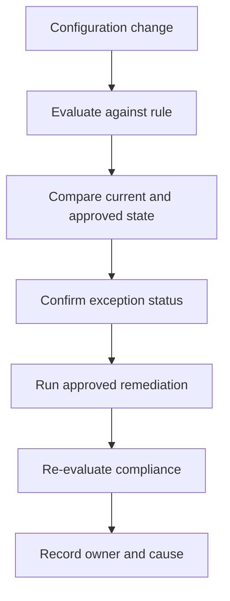

# Scenario 15: AWS Config Drift

> **Objective:** Detect unauthorized or noncompliant configuration changes and restore an approved baseline.

## Scope and safety

Use this runbook only with authorized access and an assigned incident identifier. Preserve evidence before destructive changes. Commands are examples: verify the account, Region, resource identifiers, dependencies, and rollback path before execution.


## Incident snapshot

| Item | Value |
|---|---|
| Default severity | **Medium** — adjust using the [severity matrix](incident-severity-matrix.md) |
| Primary impact | AWS resource configuration |
| Response objective | Restore approved baseline |
| AWS services | AWS Config, Amazon SNS, AWS Lambda, AWS Systems Manager |
| Automation role | Primary |
| Typical execution window | 15–45 minutes; actual duration depends on scope and approvals |

> [!NOTE]
> Severity and timing are planning defaults, not substitutes for business-impact assessment, legal guidance, or the incident commander’s decision.

## Response flow



## Severity guidance

- **Critical:** confirmed active compromise, root/administrator takeover, or ongoing sensitive-data loss.
- **High:** strong evidence of compromise with material exposure but no confirmed continuing impact.
- **Medium:** suspicious or noncompliant configuration requiring investigation.

## Required evidence

- Incident ID, UTC timeline, responder identity, account and Region
- Relevant CloudTrail events and configuration state
- Resource identifiers, tags, owners, dependencies, and screenshots/exports required by policy
- Every containment/remediation action and its result

## Runbook

1. Identify the noncompliant resource, rule, configuration item, change timestamp, and related CloudTrail event.
2. Compare the current configuration with the last known compliant configuration and the infrastructure-as-code source of truth.
3. Determine whether the drift is malicious, accidental, emergency-authorized, or an expected deployment.
4. Contain risk with a narrowly scoped manual change when necessary, then remediate through the approved deployment path.
5. Use Systems Manager Automation or Lambda only for well-tested, idempotent remediations with exception handling.
6. Re-evaluate the AWS Config rule and validate application behavior.
7. Improve preventive controls, code review, permissions, and notifications to reduce recurrence.

## AWS CLI starting points

```bash
# Start with read-only discovery. Substitute verified identifiers and Region.
aws sts get-caller-identity
aws cloudtrail lookup-events --max-results 50
```


## Console starting points

- **CloudTrail → Event history** for recent management activity
- **CloudWatch → Logs / Metrics / Alarms** for telemetry
- Relevant service console for current configuration and dependencies
- **Systems Manager** for controlled instance access and automation where supported

## Validation and closure

- The threat is no longer active and unauthorized access has been removed.
- Required evidence is preserved and accessible only to approved responders.
- Business functionality, logging, alarms, backups, and compliance checks pass.
- Root cause, blast radius, timeline, owner, corrective actions, and follow-up dates are recorded.

## Services used

AWS Config, Amazon SNS, AWS Lambda, AWS Systems Manager

## Exam cues

Look for explicit task verbs: **identify**, **enable**, **disable**, **isolate**, **restrict**, **snapshot**, **query**, **notify**, **remediate**, and **validate**. Complete exactly what the lab requests; avoid unrelated improvements that could consume time or break grading dependencies.

## Authoritative references

- [AWS Security Incident Response Guide](https://docs.aws.amazon.com/whitepapers/latest/aws-security-incident-response-guide/welcome.html)
- [AWS Security Incident Response documentation](https://docs.aws.amazon.com/security-ir/)
- [AWS Well-Architected Security Pillar — Incident response](https://docs.aws.amazon.com/wellarchitected/latest/security-pillar/incident-response.html)
- [AWS Prescriptive Guidance — Incident response recommendations](https://docs.aws.amazon.com/prescriptive-guidance/latest/security-controls-by-caf-capability/incident-response-recommendations.html)


---

[Documentation index](index.md) · [Previous scenario](14-systems-manager-investigation.md) · [Next scenario](16-security-group-open-to-world.md)
