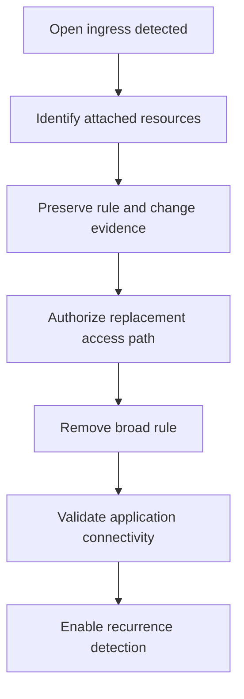

# Scenario 16: Security Group Open to the World

> **Objective:** Remove unintended 0.0.0.0/0 or ::/0 exposure from sensitive ports.

## Scope and safety

Use this runbook only with authorized access and an assigned incident identifier. Preserve evidence before destructive changes. Commands are examples: verify the account, Region, resource identifiers, dependencies, and rollback path before execution.


## Incident snapshot

| Item | Value |
|---|---|
| Default severity | **High** — adjust using the [severity matrix](incident-severity-matrix.md) |
| Primary impact | VPC network access |
| Response objective | Remove unintended exposure |
| AWS services | Amazon VPC, Amazon EC2, AWS Config, AWS CloudTrail, Amazon SNS |
| Automation role | Optional |
| Typical execution window | 10–30 minutes; actual duration depends on scope and approvals |

> [!NOTE]
> Severity and timing are planning defaults, not substitutes for business-impact assessment, legal guidance, or the incident commander’s decision.

## Framework alignment

| Framework | Alignment |
|---|---|
| MITRE ATT&CK | `T1578.005` — Modify Cloud Compute Configurations<br>`T1190` — Exploit Public-Facing Application |
| NIST CSF 2.0 / SP 800-61r3 | **Identify**, **Protect**, **Detect**, **Respond** |
| AWS Well-Architected Security Pillar | `SEC10-BP04` — Develop and test security incident response playbooks<br>`SEC10-BP06` — Pre-deploy tools<br>`SEC10-BP07` — Run simulations |

> [!NOTE]
> ATT&CK entries describe plausible adversary behavior relevant to this scenario; they do not assert that every technique occurred. Confirm mappings from evidence. NIST and AWS entries describe response-program alignment, not compliance certification. See the [framework mapping guide](framework-mapping.md).

## Response flow



## Severity guidance

- **Critical:** confirmed active compromise, root/administrator takeover, or ongoing sensitive-data loss.
- **High:** strong evidence of compromise with material exposure but no confirmed continuing impact.
- **Medium:** suspicious or noncompliant configuration requiring investigation.

## Required evidence

- Incident ID, UTC timeline, responder identity, account and Region
- Relevant CloudTrail events and configuration state
- Resource identifiers, tags, owners, dependencies, and screenshots/exports required by policy
- Every containment/remediation action and its result

## Decision checkpoints

> [!IMPORTANT]
> Use these checkpoints to choose the safest next action. When evidence is incomplete, prefer preservation, narrow containment, and explicit approval over destructive remediation.

| Question | If yes | If no |
|---|---|---|
| Does the rule expose a sensitive port or service to 0.0.0.0/0 or ::/0? | Restrict immediately to approved sources or security groups. | Evaluate business intent and effective reachability. |
| Is the rule shared by multiple workloads? | Assess dependencies before editing or replace associations safely. | Apply the targeted rule change. |
| Is there evidence of exploitation? | Escalate to compromise investigation and preserve logs. | Treat as exposure remediation and monitor. |

## Runbook

1. Identify every attached ENI and resource using the security group before changing it.
2. Record inbound and outbound rules, referenced security groups, prefix lists, descriptions, and change history.
3. Remove broad access to administrative and database ports and replace it with approved source security groups, VPN, bastion, or Systems Manager access.
4. Check both IPv4 and IPv6 rules and confirm that another security group does not preserve the exposure.
5. Review CloudTrail AuthorizeSecurityGroupIngress/Egress and Revoke* events to identify the actor and change path.
6. Use AWS Config managed rules such as restricted-ssh or restricted-common-ports where suitable.
7. Validate legitimate connectivity and document approved exceptions with expiry and ownership.

## AWS CLI starting points

```bash
aws ec2 describe-security-groups --group-ids sg-EXAMPLE
aws ec2 describe-network-interfaces --filters Name=group-id,Values=sg-EXAMPLE
# Use the exact rule parameters or security-group-rule ID verified during triage.
aws ec2 revoke-security-group-ingress --group-id sg-EXAMPLE --protocol tcp --port 22 --cidr 0.0.0.0/0
```


## Console starting points

- **CloudTrail → Event history** for recent management activity
- **CloudWatch → Logs / Metrics / Alarms** for telemetry
- Relevant service console for current configuration and dependencies
- **Systems Manager** for controlled instance access and automation where supported

## Validation and closure

- The threat is no longer active and unauthorized access has been removed.
- Required evidence is preserved and accessible only to approved responders.
- Business functionality, logging, alarms, backups, and compliance checks pass.
- Root cause, blast radius, timeline, owner, corrective actions, and follow-up dates are recorded.

## Services used

Amazon VPC, Amazon EC2, AWS Config, AWS CloudTrail

## Exam cues

Look for explicit task verbs: **identify**, **enable**, **disable**, **isolate**, **restrict**, **snapshot**, **query**, **notify**, **remediate**, and **validate**. Complete exactly what the lab requests; avoid unrelated improvements that could consume time or break grading dependencies.

## Decision support

Use the [incident-response decision guide](decision-trees.md) for cross-scenario escalation, containment, evidence, and recovery choices.

## Authoritative references

- [AWS Security Incident Response Guide](https://docs.aws.amazon.com/whitepapers/latest/aws-security-incident-response-guide/welcome.html)
- [AWS Security Incident Response documentation](https://docs.aws.amazon.com/security-ir/)
- [AWS Well-Architected Security Pillar — Incident response](https://docs.aws.amazon.com/wellarchitected/latest/security-pillar/incident-response.html)
- [AWS Prescriptive Guidance — Incident response recommendations](https://docs.aws.amazon.com/prescriptive-guidance/latest/security-controls-by-caf-capability/incident-response-recommendations.html)


---

[Documentation index](index.md) · [Previous scenario](15-aws-config-drift.md) · [Next scenario](17-cloudtrail-audit-tampering.md)
