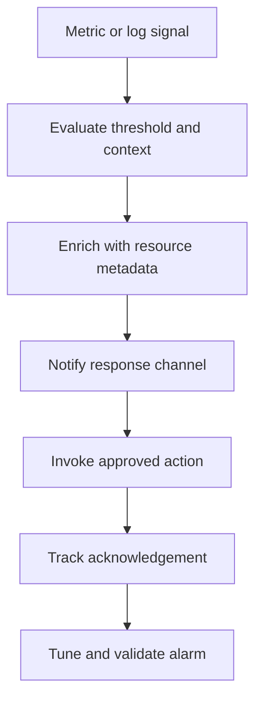

# Scenario 18: CloudWatch Detection and Alerting

> **Objective:** Turn reliable telemetry into actionable alerts and controlled response automation.

## Scope and safety

Use this runbook only with authorized access and an assigned incident identifier. Preserve evidence before destructive changes. Commands are examples: verify the account, Region, resource identifiers, dependencies, and rollback path before execution.


## Incident snapshot

| Item | Value |
|---|---|
| Default severity | **Medium** — adjust using the [severity matrix](incident-severity-matrix.md) |
| Primary impact | Monitoring and detection |
| Response objective | Turn telemetry into actionable signals |
| AWS services | Amazon CloudWatch, Amazon SNS, AWS Lambda, AWS Systems Manager |
| Automation role | Primary |
| Typical execution window | 20–45 minutes; actual duration depends on scope and approvals |

> [!NOTE]
> Severity and timing are planning defaults, not substitutes for business-impact assessment, legal guidance, or the incident commander’s decision.

## Framework alignment

| Framework | Alignment |
|---|---|
| MITRE ATT&CK | `T1496` — Resource Hijacking<br>`T1078.004` — Valid Accounts: Cloud Accounts<br>`T1562.001` — Impair Defenses: Disable or Modify Tools |
| NIST CSF 2.0 / SP 800-61r3 | **Detect**, **Respond** |
| AWS Well-Architected Security Pillar | `SEC10-BP04` — Develop and test security incident response playbooks<br>`SEC10-BP06` — Pre-deploy tools<br>`SEC10-BP07` — Run simulations |

> [!NOTE]
> ATT&CK entries describe plausible adversary behavior relevant to this scenario; they do not assert that every technique occurred. Confirm mappings from evidence. NIST and AWS entries describe response-program alignment, not compliance certification. See the [framework mapping guide](framework-mapping.md).

## Response flow



## Severity guidance

- **Critical:** confirmed active compromise, root/administrator takeover, or ongoing sensitive-data loss.
- **High:** strong evidence of compromise with material exposure but no confirmed continuing impact.
- **Medium:** suspicious or noncompliant configuration requiring investigation.

## Required evidence

- Incident ID, UTC timeline, responder identity, account and Region
- Relevant CloudTrail events and configuration state
- Resource identifiers, tags, owners, dependencies, and screenshots/exports required by policy
- Every containment/remediation action and its result

## Decision checkpoints

> [!IMPORTANT]
> Use these checkpoints to choose the safest next action. When evidence is incomplete, prefer preservation, narrow containment, and explicit approval over destructive remediation.

| Question | If yes | If no |
|---|---|---|
| Is the alarm actionable and mapped to an owner/runbook? | Triage and execute the linked response. | Tune the signal before enabling automation. |
| Is the alert a symptom or direct indicator of compromise? | Correlate with CloudTrail, logs, and network evidence. | Handle as reliability or compliance telemetry. |
| Would automatic response be safe and reversible? | Use guarded automation with notification. | Require analyst approval. |

## Runbook

1. Define the signal, threshold, evaluation period, missing-data behavior, dimensions, and expected baseline.
2. Confirm the metric or log filter accurately represents malicious or high-risk activity and is not simply normal load.
3. Create an alarm or event-driven rule that notifies an SNS topic and optionally invokes approved automation.
4. Include account, Region, resource, timestamp, severity, runbook, and investigation links in notifications.
5. Prevent alert loops and duplicate actions by using incident IDs, tags, conditional checks, and idempotency.
6. Test OK, ALARM, INSUFFICIENT_DATA, failure, and rollback paths.
7. Review false positives, missed detections, cost, and ownership after exercises and incidents.

## AWS CLI starting points

```bash
# Start with read-only discovery. Substitute verified identifiers and Region.
aws sts get-caller-identity
aws cloudtrail lookup-events --max-results 50
```


## Console starting points

- **CloudTrail → Event history** for recent management activity
- **CloudWatch → Logs / Metrics / Alarms** for telemetry
- Relevant service console for current configuration and dependencies
- **Systems Manager** for controlled instance access and automation where supported

## Validation and closure

- The threat is no longer active and unauthorized access has been removed.
- Required evidence is preserved and accessible only to approved responders.
- Business functionality, logging, alarms, backups, and compliance checks pass.
- Root cause, blast radius, timeline, owner, corrective actions, and follow-up dates are recorded.

## Services used

Amazon CloudWatch, Amazon SNS, AWS Lambda, AWS Step Functions

## Exam cues

Look for explicit task verbs: **identify**, **enable**, **disable**, **isolate**, **restrict**, **snapshot**, **query**, **notify**, **remediate**, and **validate**. Complete exactly what the lab requests; avoid unrelated improvements that could consume time or break grading dependencies.

## Decision support

Use the [incident-response decision guide](decision-trees.md) for cross-scenario escalation, containment, evidence, and recovery choices.

## Authoritative references

- [AWS Security Incident Response Guide](https://docs.aws.amazon.com/whitepapers/latest/aws-security-incident-response-guide/welcome.html)
- [AWS Security Incident Response documentation](https://docs.aws.amazon.com/security-ir/)
- [AWS Well-Architected Security Pillar — Incident response](https://docs.aws.amazon.com/wellarchitected/latest/security-pillar/incident-response.html)
- [AWS Prescriptive Guidance — Incident response recommendations](https://docs.aws.amazon.com/prescriptive-guidance/latest/security-controls-by-caf-capability/incident-response-recommendations.html)


---

[Documentation index](index.md) · [Previous scenario](17-cloudtrail-audit-tampering.md) · [Next scenario](19-ebs-snapshot-forensic-preservation.md)
