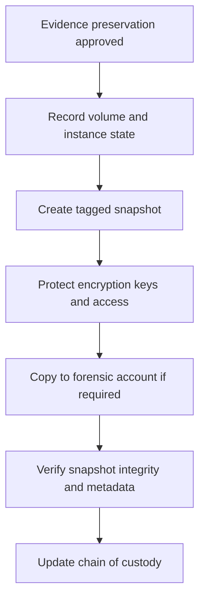

# Scenario 19: EBS Snapshot and Forensic Preservation

> **Objective:** Preserve storage evidence before eradication and maintain a defensible chain of custody.

## Scope and safety

Use this runbook only with authorized access and an assigned incident identifier. Preserve evidence before destructive changes. Commands are examples: verify the account, Region, resource identifiers, dependencies, and rollback path before execution.


## Incident snapshot

| Item | Value |
|---|---|
| Default severity | **High** — adjust using the [severity matrix](incident-severity-matrix.md) |
| Primary impact | Block storage evidence |
| Response objective | Preserve disk evidence and custody |
| AWS services | Amazon EBS, Amazon EC2, AWS KMS, AWS CloudTrail, Amazon S3 |
| Automation role | Manual |
| Typical execution window | 20–60 minutes; actual duration depends on scope and approvals |

> [!NOTE]
> Severity and timing are planning defaults, not substitutes for business-impact assessment, legal guidance, or the incident commander’s decision.

## Framework alignment

| Framework | Alignment |
|---|---|
| MITRE ATT&CK | `T1486` — Data Encrypted for Impact<br>`T1490` — Inhibit System Recovery<br>`T1070.004` — Indicator Removal: File Deletion |
| NIST CSF 2.0 / SP 800-61r3 | **Identify**, **Respond**, **Recover** |
| AWS Well-Architected Security Pillar | `SEC10-BP03` — Prepare forensic capabilities<br>`SEC10-BP04` — Develop and test security incident response playbooks<br>`SEC10-BP05` — Pre-provision access |

> [!NOTE]
> ATT&CK entries describe plausible adversary behavior relevant to this scenario; they do not assert that every technique occurred. Confirm mappings from evidence. NIST and AWS entries describe response-program alignment, not compliance certification. See the [framework mapping guide](framework-mapping.md).

## Response flow



## Severity guidance

- **Critical:** confirmed active compromise, root/administrator takeover, or ongoing sensitive-data loss.
- **High:** strong evidence of compromise with material exposure but no confirmed continuing impact.
- **Medium:** suspicious or noncompliant configuration requiring investigation.

## Required evidence

- Incident ID, UTC timeline, responder identity, account and Region
- Relevant CloudTrail events and configuration state
- Resource identifiers, tags, owners, dependencies, and screenshots/exports required by policy
- Every containment/remediation action and its result

## Decision checkpoints

> [!IMPORTANT]
> Use these checkpoints to choose the safest next action. When evidence is incomplete, prefer preservation, narrow containment, and explicit approval over destructive remediation.

| Question | If yes | If no |
|---|---|---|
| Is a snapshot sufficient for the evidence objective? | Create, tag, encrypt, restrict, and document it. | Use approved memory or live-response collection as well. |
| Can the source volume change during capture? | Quiesce or stop it if authorized and operationally safe. | Record consistency limitations. |
| Has custody and access control been established? | Transfer to the forensic account or vault as approved. | Do not proceed without an evidence-handling owner. |

## Runbook

1. Record instance and volume metadata, attachment mappings, encryption keys, timestamps, tags, and incident ID.
2. Collect volatile evidence first when required because snapshots do not capture memory or all transient state.
3. Create snapshots of all relevant EBS volumes; consider filesystem/application consistency and document whether the instance was running or stopped.
4. Copy snapshots to a dedicated forensic account/Region where policy requires, re-encrypting with an approved key.
5. Restrict snapshot and KMS access, enable logging, and tag evidence as immutable under organizational process.
6. Analyze copies rather than originals and attach them read-only where tooling permits.
7. Retain or dispose of evidence according to legal, regulatory, and incident-retention requirements.

## AWS CLI starting points

```bash
aws ec2 describe-volumes --filters Name=attachment.instance-id,Values=i-EXAMPLE
aws ec2 create-snapshot --volume-id vol-EXAMPLE --description "IR-CASE-ID forensic snapshot"   --tag-specifications 'ResourceType=snapshot,Tags=[{Key=IncidentId,Value=IR-CASE-ID},{Key=Evidence,Value=true}]'
aws ec2 wait snapshot-completed --snapshot-ids snap-EXAMPLE
```


## Console starting points

- **CloudTrail → Event history** for recent management activity
- **CloudWatch → Logs / Metrics / Alarms** for telemetry
- Relevant service console for current configuration and dependencies
- **Systems Manager** for controlled instance access and automation where supported

## Validation and closure

- The threat is no longer active and unauthorized access has been removed.
- Required evidence is preserved and accessible only to approved responders.
- Business functionality, logging, alarms, backups, and compliance checks pass.
- Root cause, blast radius, timeline, owner, corrective actions, and follow-up dates are recorded.

## Services used

Amazon EC2, Amazon EBS, AWS Identity and Access Management, AWS CloudTrail

## Exam cues

Look for explicit task verbs: **identify**, **enable**, **disable**, **isolate**, **restrict**, **snapshot**, **query**, **notify**, **remediate**, and **validate**. Complete exactly what the lab requests; avoid unrelated improvements that could consume time or break grading dependencies.

## Decision support

Use the [incident-response decision guide](decision-trees.md) for cross-scenario escalation, containment, evidence, and recovery choices.

## Authoritative references

- [AWS Security Incident Response Guide](https://docs.aws.amazon.com/whitepapers/latest/aws-security-incident-response-guide/welcome.html)
- [AWS Security Incident Response documentation](https://docs.aws.amazon.com/security-ir/)
- [AWS Well-Architected Security Pillar — Incident response](https://docs.aws.amazon.com/wellarchitected/latest/security-pillar/incident-response.html)
- [AWS Prescriptive Guidance — Incident response recommendations](https://docs.aws.amazon.com/prescriptive-guidance/latest/security-controls-by-caf-capability/incident-response-recommendations.html)


---

[Documentation index](index.md) · [Previous scenario](18-cloudwatch-detection-alerting.md) · [Next scenario](20-step-functions-incident-orchestration.md)
