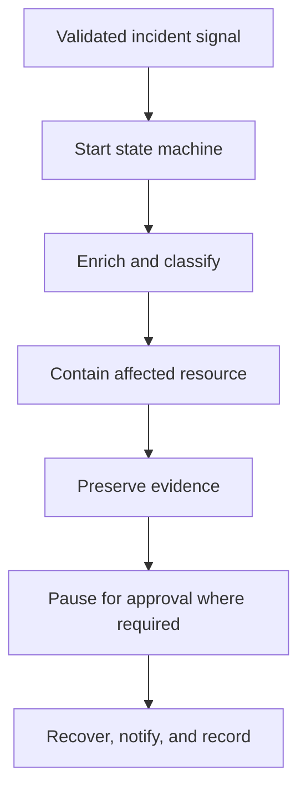

# Scenario 20: Step Functions Incident Orchestration

> **Objective:** Coordinate multi-step incident response with checkpoints, retries, approvals, and auditability.

## Scope and safety

Use this runbook only with authorized access and an assigned incident identifier. Preserve evidence before destructive changes. Commands are examples: verify the account, Region, resource identifiers, dependencies, and rollback path before execution.


## Incident snapshot

| Item | Value |
|---|---|
| Default severity | **High** — adjust using the [severity matrix](incident-severity-matrix.md) |
| Primary impact | Multi-step response workflow |
| Response objective | Coordinate auditable response |
| AWS services | AWS Step Functions, AWS Lambda, Amazon SNS, Amazon EC2, AWS Systems Manager, AWS CloudTrail |
| Automation role | Primary |
| Typical execution window | 30–90 minutes; actual duration depends on scope and approvals |

> [!NOTE]
> Severity and timing are planning defaults, not substitutes for business-impact assessment, legal guidance, or the incident commander’s decision.

## Framework alignment

| Framework | Alignment |
|---|---|
| MITRE ATT&CK | `T1078.004` — Valid Accounts: Cloud Accounts<br>`T1562.008` — Impair Defenses: Disable or Modify Cloud Logs<br>`T1496` — Resource Hijacking |
| NIST CSF 2.0 / SP 800-61r3 | **Govern**, **Detect**, **Respond**, **Recover** |
| AWS Well-Architected Security Pillar | `SEC10-BP02` — Develop incident management plans<br>`SEC10-BP04` — Develop and test security incident response playbooks<br>`SEC10-BP06` — Pre-deploy tools<br>`SEC10-BP07` — Run simulations<br>`SEC10-BP08` — Establish a framework for learning from incidents |

> [!NOTE]
> ATT&CK entries describe plausible adversary behavior relevant to this scenario; they do not assert that every technique occurred. Confirm mappings from evidence. NIST and AWS entries describe response-program alignment, not compliance certification. See the [framework mapping guide](framework-mapping.md).

## Response flow



## Severity guidance

- **Critical:** confirmed active compromise, root/administrator takeover, or ongoing sensitive-data loss.
- **High:** strong evidence of compromise with material exposure but no confirmed continuing impact.
- **Medium:** suspicious or noncompliant configuration requiring investigation.

## Required evidence

- Incident ID, UTC timeline, responder identity, account and Region
- Relevant CloudTrail events and configuration state
- Resource identifiers, tags, owners, dependencies, and screenshots/exports required by policy
- Every containment/remediation action and its result

## Decision checkpoints

> [!IMPORTANT]
> Use these checkpoints to choose the safest next action. When evidence is incomplete, prefer preservation, narrow containment, and explicit approval over destructive remediation.

| Question | If yes | If no |
|---|---|---|
| Are all automated actions bounded, idempotent, and auditable? | Enable the workflow with explicit failure handling. | Keep the step manual until controls exist. |
| Does the workflow contain destructive or high-impact steps? | Insert human approval and rollback branches. | Continue automated execution. |
| Did every step verify postconditions? | Close or advance the state machine. | Stop, notify, and route to manual recovery. |

## Runbook

1. Define the workflow input contract, incident ID, resource identifiers, account, Region, severity, and requested actions.
2. Use discrete states for validation, evidence capture, containment, notification, approval, remediation, recovery, and verification.
3. Use service integrations or small Lambda functions, each with narrowly scoped roles and clear failure behavior.
4. Add retries only for transient errors, catches for terminal failures, timeouts, and compensating/rollback states.
5. Require human approval before destructive steps such as termination or credential deletion when appropriate.
6. Make executions idempotent and prevent concurrent workflows from applying conflicting changes.
7. Preserve execution history and validate the workflow through tabletop and technical exercises.

## AWS CLI starting points

```bash
# Start with read-only discovery. Substitute verified identifiers and Region.
aws sts get-caller-identity
aws cloudtrail lookup-events --max-results 50
```


## Console starting points

- **CloudTrail → Event history** for recent management activity
- **CloudWatch → Logs / Metrics / Alarms** for telemetry
- Relevant service console for current configuration and dependencies
- **Systems Manager** for controlled instance access and automation where supported

## Validation and closure

- The threat is no longer active and unauthorized access has been removed.
- Required evidence is preserved and accessible only to approved responders.
- Business functionality, logging, alarms, backups, and compliance checks pass.
- Root cause, blast radius, timeline, owner, corrective actions, and follow-up dates are recorded.

## Services used

AWS Step Functions, AWS Lambda, Amazon SNS, Amazon EC2, AWS Systems Manager

## Exam cues

Look for explicit task verbs: **identify**, **enable**, **disable**, **isolate**, **restrict**, **snapshot**, **query**, **notify**, **remediate**, and **validate**. Complete exactly what the lab requests; avoid unrelated improvements that could consume time or break grading dependencies.

## Decision support

Use the [incident-response decision guide](decision-trees.md) for cross-scenario escalation, containment, evidence, and recovery choices.

## Authoritative references

- [AWS Security Incident Response Guide](https://docs.aws.amazon.com/whitepapers/latest/aws-security-incident-response-guide/welcome.html)
- [AWS Security Incident Response documentation](https://docs.aws.amazon.com/security-ir/)
- [AWS Well-Architected Security Pillar — Incident response](https://docs.aws.amazon.com/wellarchitected/latest/security-pillar/incident-response.html)
- [AWS Prescriptive Guidance — Incident response recommendations](https://docs.aws.amazon.com/prescriptive-guidance/latest/security-controls-by-caf-capability/incident-response-recommendations.html)


---

[Documentation index](index.md) · [Previous scenario](19-ebs-snapshot-forensic-preservation.md)
