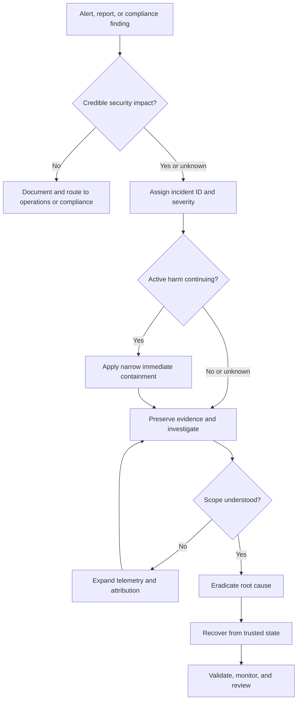
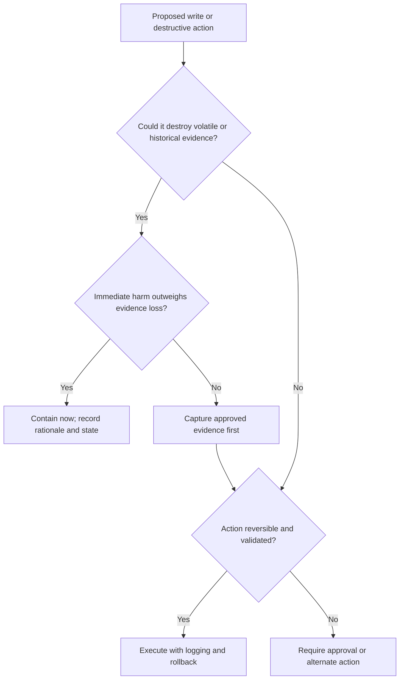
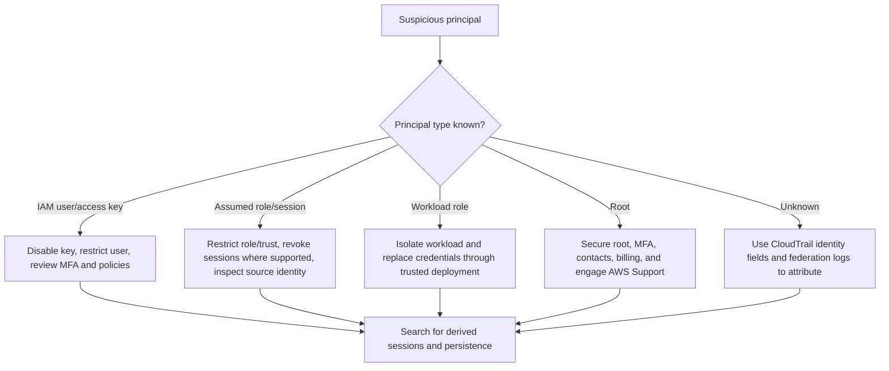
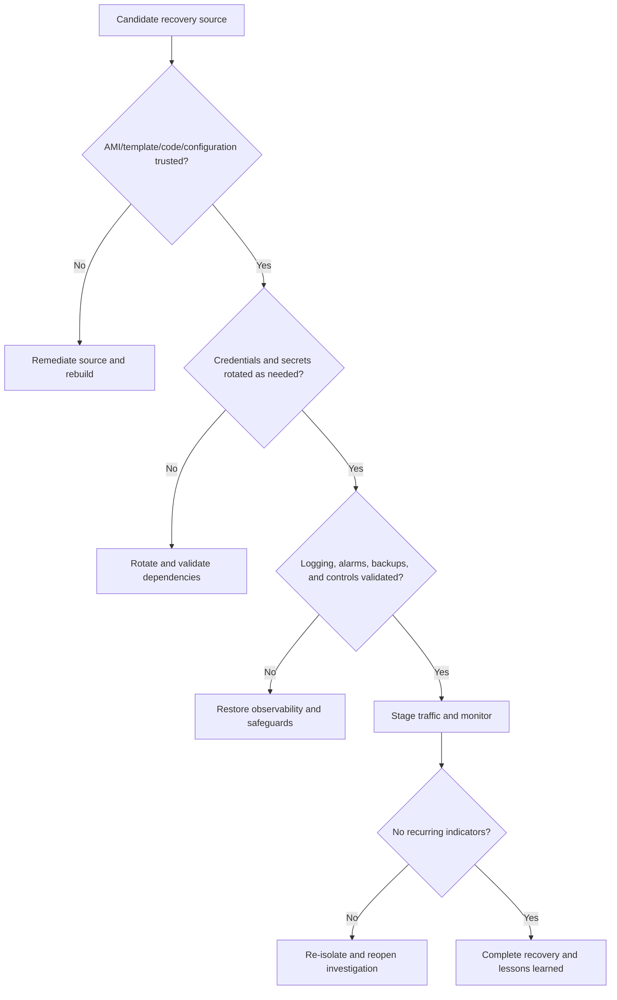

# Incident-Response Decision Guide

This guide provides reusable decision paths for AWS incident triage, evidence preservation, containment, eradication, and recovery. It complements the scenario runbooks; it does not override the incident commander, legal requirements, organizational policy, or AWS Support guidance.

> [!IMPORTANT]
> When facts are incomplete, preserve evidence, constrain scope, and choose reversible actions. Do not terminate, delete, rotate, revoke, or overwrite resources until the responder has confirmed authorization, business impact, dependencies, and rollback requirements.

## Entry decision

## Severity and escalation

| Condition | Default action |
|---|---|
| Root account compromise, organization-wide impact, confirmed sensitive-data loss, or safety-critical disruption | Declare **Critical**, engage leadership and legal/privacy stakeholders, and contact AWS Support as required. |
| Confirmed compromise of a production workload or privileged identity | Declare at least **High**, assign an incident commander, and begin containment and evidence preservation. |
| Suspicious activity with incomplete evidence | Maintain **Medium/High** based on potential impact; investigate before destructive action. |
| Configuration drift without evidence of exploitation | Handle through compliance remediation unless indicators require incident escalation. |

See the [incident severity matrix](incident-severity-matrix.md).

## Evidence-before-action gate

Minimum evidence usually includes the incident ID, UTC timeline, caller identity, account and Region, resource configuration, relevant CloudTrail events, telemetry exports, affected identities, and every response action with its result.

## Containment selector

| Primary risk | Prefer first | Avoid by default |
|---|---|---|
| Compromised EC2 workload | Quarantine security group, load-balancer deregistration, scoped IAM restriction | Immediate termination before evidence and launch-source validation |
| Compromised IAM credentials | Disable/revoke the specific credential or session; restrict the principal | Deleting identities before mapping dependencies and persistence |
| S3 exposure | Block unintended public/effective access and preserve data events | Deleting objects or policies without recording prior state |
| Data exfiltration | Narrow egress, endpoint, identity, or resource-policy containment | Broad network outage unless necessary to stop active harm |
| RDS exposure | Restrict reachability and rotate exposed secrets after preservation | Unplanned deletion or restore that loses evidence |
| Logging tampering | Restore a protected logging path and preserve alternate telemetry | Overwriting the only remaining evidence source |
| Malicious serverless persistence | Disable trigger/concurrency, export code/configuration, then remove persistence | Deleting functions before code and invocation evidence is captured |

## Identity decision path

## Recovery trust gate

A resource is not ready to return to service merely because the visible symptom is gone.

## Human-approval gate for automation

Require approval when an automated step can:

- terminate, delete, encrypt, overwrite, or restore resources;
- revoke broad access or affect multiple accounts;
- interrupt production, safety-critical, or regulated workloads;
- alter evidence, logging, retention, or encryption keys;
- act on low-confidence or ambiguous findings.

Safe automation should verify account, Region, resource tags, allowlists, severity, incident ID, and postconditions; record inputs and outputs; be idempotent; and expose a rollback or manual recovery path.

## Closure gate

Do not close the incident until:

- active threat and unauthorized access are removed;
- blast radius and root cause are documented with confidence limits;
- evidence is preserved under approved access controls;
- recovery uses trusted sources and passes functional/security validation;
- logging, alarms, backups, compliance checks, and ownership are confirmed;
- corrective actions have owners and due dates;
- required legal, privacy, customer, and regulatory notifications are complete.

## Related material

- [Initial triage checklist](initial-triage-checklist.md)
- [Evidence collection checklist](evidence-collection-checklist.md)
- [Incident severity matrix](incident-severity-matrix.md)
- [Service mapping](service-mapping.md)
- [Framework mapping](framework-mapping.md)
- [Documentation index](index.md)
