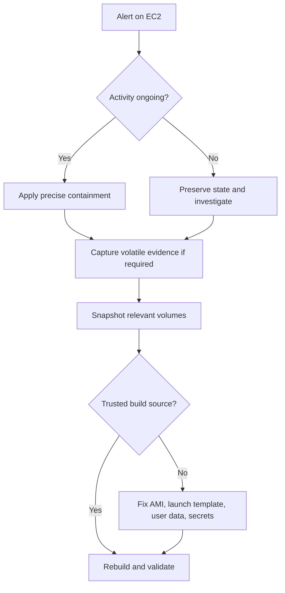
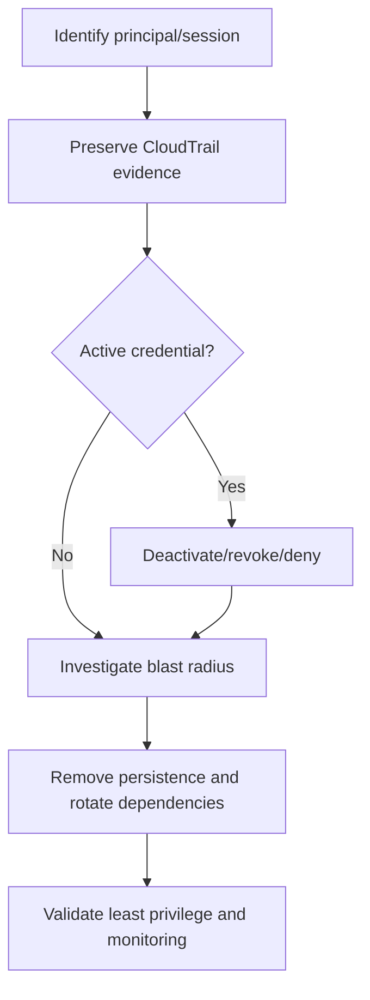

# Incident Response Decision Trees

## Suspicious EC2

```mermaid
flowchart TD
 A[Alert on EC2] --> B{Activity ongoing?}
 B -- Yes --> C[Apply precise containment]
 B -- No --> D[Preserve state and investigate]
 C --> E[Capture volatile evidence if required]
 D --> E
 E --> F[Snapshot relevant volumes]
 F --> G{Trusted build source?}
 G -- No --> H[Fix AMI, launch template, user data, secrets]
 G -- Yes --> I[Rebuild and validate]
 H --> I
```

## Suspicious IAM activity

```mermaid
flowchart TD
 A[Identify principal/session] --> B[Preserve CloudTrail evidence]
 B --> C{Active credential?}
 C -- Yes --> D[Deactivate/revoke/deny]
 C -- No --> E[Investigate blast radius]
 D --> E
 E --> F[Remove persistence and rotate dependencies]
 F --> G[Validate least privilege and monitoring]
```
