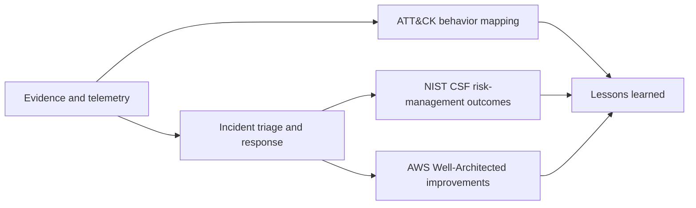

# Framework Mapping Guide

This guide cross-references the repository runbooks with **MITRE ATT&CK Enterprise**, **NIST Cybersecurity Framework (CSF) 2.0 as profiled by NIST SP 800-61 Revision 3**, and the **AWS Well-Architected Security Pillar**.

> [!IMPORTANT]
> These mappings are educational and operational aids. They are not proof of compromise, a substitute for evidence-based analysis, or a certification of compliance with any framework. ATT&CK mappings identify plausible adversary behaviors; responders must confirm techniques from telemetry and case evidence.

## How to use the mappings

- Use **MITRE ATT&CK** to describe observed or hypothesized adversary behavior consistently.
- Use **NIST CSF 2.0 / SP 800-61r3** to connect response work to organization-wide cybersecurity risk management.
- Use **AWS Well-Architected** best practices to assess whether the people, process, and technology needed for cloud response are prepared and tested.
- Record confirmed mappings in the incident record, including the evidence supporting each mapping and the analyst who approved it.

## Framework model

## NIST CSF 2.0 functions

| Function | Use in this repository |
|---|---|
| **Govern** | Establish policy, roles, risk decisions, escalation, and oversight. |
| **Identify** | Understand assets, dependencies, data, exposure, and incident scope. |
| **Protect** | Restrict access, harden resources, and reduce the likelihood or impact of recurrence. |
| **Detect** | Collect and analyze telemetry to identify potentially adverse events. |
| **Respond** | Triage, investigate, contain, eradicate, communicate, and coordinate. |
| **Recover** | Restore trusted services, validate controls, and monitor for recurrence. |

NIST SP 800-61r3 integrates incident-response considerations throughout CSF 2.0 instead of treating response as an isolated sequence. The runbooks therefore map to all applicable functions, not only Respond and Recover.

## AWS incident-response best practices

| ID | Best practice |
|---|---|
| `SEC10-BP01` | Identify key personnel and external resources |
| `SEC10-BP02` | Develop incident management plans |
| `SEC10-BP03` | Prepare forensic capabilities |
| `SEC10-BP04` | Develop and test security incident response playbooks |
| `SEC10-BP05` | Pre-provision access |
| `SEC10-BP06` | Pre-deploy tools |
| `SEC10-BP07` | Run simulations |
| `SEC10-BP08` | Establish a framework for learning from incidents |

AWS describes cloud incident response through **Preparation**, **Operations**, and **Post-incident activity**. Operations includes detection, analysis, containment, eradication, and recovery.

## Runbook cross-reference

| # | Runbook | MITRE ATT&CK technique context | NIST CSF functions | AWS SEC10 practices |
|---:|---|---|---|---|
| 1 | [EC2 instance compromise](01-ec2-instance-compromise.md) | `T1190` `T1059` `T1078.004` | Detect, Respond, Recover | `SEC10-BP03` `SEC10-BP04` `SEC10-BP05` `SEC10-BP06` |
| 2 | [Automated EC2 isolation](02-automated-ec2-isolation.md) | `T1190` `T1078.004` `T1496` | Govern, Detect, Respond | `SEC10-BP04` `SEC10-BP06` `SEC10-BP07` |
| 3 | [IAM credential compromise](03-iam-credential-compromise.md) | `T1078.004` `T1552.001` `T1528` | Protect, Detect, Respond | `SEC10-BP02` `SEC10-BP04` `SEC10-BP05` |
| 4 | [Data exfiltration](04-data-exfiltration.md) | `T1048` `T1537` `T1567.002` | Detect, Respond, Recover | `SEC10-BP02` `SEC10-BP03` `SEC10-BP04` `SEC10-BP06` |
| 5 | [Public S3 bucket](05-public-s3-bucket.md) | `T1530` `T1567.002` `T1078.004` | Identify, Protect, Detect, Respond | `SEC10-BP03` `SEC10-BP04` `SEC10-BP06` |
| 6 | [Compliance enforcement](06-compliance-enforcement.md) | `T1562.001` `T1578.005` | Govern, Identify, Protect, Detect, Respond | `SEC10-BP04` `SEC10-BP06` `SEC10-BP07` `SEC10-BP08` |
| 7 | [RDS database security](07-rds-database-security.md) | `T1190` `T1078.004` `T1530` | Identify, Protect, Detect, Respond, Recover | `SEC10-BP03` `SEC10-BP04` `SEC10-BP05` |
| 8 | [Backdoor IAM user](08-backdoor-iam-user.md) | `T1136.003` `T1098.001` `T1078.004` | Protect, Detect, Respond | `SEC10-BP02` `SEC10-BP04` `SEC10-BP05` |
| 9 | [Malicious Lambda or scheduled persistence](09-malicious-lambda-scheduled-persistence.md) | `T1546` `T1053` `T1578.005` | Detect, Respond, Recover | `SEC10-BP03` `SEC10-BP04` `SEC10-BP06` |
| 10 | [Root account compromise](10-root-account-compromise.md) | `T1078.004` `T1098.001` `T1136.003` | Govern, Protect, Detect, Respond, Recover | `SEC10-BP01` `SEC10-BP02` `SEC10-BP04` `SEC10-BP05` |
| 11 | [Auto Scaling recovery](11-auto-scaling-recovery.md) | `T1578.002` `T1578.005` `T1496` | Respond, Recover | `SEC10-BP04` `SEC10-BP06` `SEC10-BP07` |
| 12 | [Unauthorized API calls](12-unauthorized-api-calls.md) | `T1078.004` `T1098.001` `T1562.008` | Detect, Respond | `SEC10-BP03` `SEC10-BP04` `SEC10-BP06` |
| 13 | [Athena CloudTrail investigation](13-athena-cloudtrail-investigation.md) | `T1078.004` `T1136.003` `T1562.008` | Identify, Detect, Respond | `SEC10-BP03` `SEC10-BP05` `SEC10-BP06` |
| 14 | [Systems Manager investigation](14-systems-manager-investigation.md) | `T1021` `T1059` `T1078` | Detect, Respond | `SEC10-BP03` `SEC10-BP05` `SEC10-BP06` |
| 15 | [AWS Config drift](15-aws-config-drift.md) | `T1578.005` `T1562.001` `T1562.008` | Govern, Identify, Protect, Detect, Respond | `SEC10-BP04` `SEC10-BP06` `SEC10-BP08` |
| 16 | [Security group open to the world](16-security-group-open-to-world.md) | `T1578.005` `T1190` | Identify, Protect, Detect, Respond | `SEC10-BP04` `SEC10-BP06` `SEC10-BP07` |
| 17 | [CloudTrail audit and tampering](17-cloudtrail-audit-tampering.md) | `T1562.008` `T1078.004` | Govern, Protect, Detect, Respond, Recover | `SEC10-BP03` `SEC10-BP04` `SEC10-BP06` |
| 18 | [CloudWatch detection and alerting](18-cloudwatch-detection-alerting.md) | `T1496` `T1078.004` `T1562.001` | Detect, Respond | `SEC10-BP04` `SEC10-BP06` `SEC10-BP07` |
| 19 | [EBS snapshot and forensic preservation](19-ebs-snapshot-forensic-preservation.md) | `T1486` `T1490` `T1070.004` | Identify, Respond, Recover | `SEC10-BP03` `SEC10-BP04` `SEC10-BP05` |
| 20 | [Step Functions incident orchestration](20-step-functions-incident-orchestration.md) | `T1078.004` `T1562.008` `T1496` | Govern, Detect, Respond, Recover | `SEC10-BP02` `SEC10-BP04` `SEC10-BP06` `SEC10-BP07` `SEC10-BP08` |

## Mapping quality checklist

Before recording a framework mapping in an incident:

- Cite the CloudTrail event, log record, finding, command output, file artifact, or other evidence supporting it.
- Distinguish **observed**, **inferred**, and **hypothesized** behavior.
- Prefer the most specific ATT&CK sub-technique supported by evidence.
- Do not force a technique mapping for a configuration issue with no demonstrated adversary behavior.
- Revisit mappings when the timeline, affected principal, or blast radius changes.
- Track NIST and AWS improvement actions through ownership and due dates.

## Authoritative references

- [MITRE ATT&CK Enterprise](https://attack.mitre.org/)
- [NIST SP 800-61 Revision 3](https://csrc.nist.gov/pubs/sp/800/61/r3/final)
- [NIST Cybersecurity Framework 2.0](https://www.nist.gov/cyberframework)
- [AWS Well-Architected Security Pillar — Incident response](https://docs.aws.amazon.com/wellarchitected/latest/security-pillar/incident-response.html)
- [AWS Well-Architected — Preparation](https://docs.aws.amazon.com/wellarchitected/latest/security-pillar/preparation.html)
- [AWS Well-Architected — Operations](https://docs.aws.amazon.com/wellarchitected/latest/security-pillar/operations.html)
- [AWS Well-Architected — Post-incident activity](https://docs.aws.amazon.com/wellarchitected/latest/security-pillar/post-incident-activity.html)

---

[Documentation index](index.md)
