# Phase 3 Capstone — Authorized End-to-End Incident Response Lab

This lab is the completion exercise for **Phase 3 — Response Automation**. It demonstrates how the repository's detection routing, host evidence collection, Step Functions orchestration, Lambda response actions, approval boundary, notification, and rollback controls work together.

## What the lab proves

```mermaid
flowchart LR
    A[Benign EC2 target] --> B[Simulated Security Finding]
    B --> C[EventBridge]
    C --> D[Detection normalizer]
    D --> E[Notify-only / dry-run triage]
    A --> F[SSM read-only evidence]
    F --> G[Encrypted S3 evidence + SHA-256 manifest]
    E --> H[Explicit responder decision]
    H --> I[Step Functions live containment request]
    I --> J[EBS evidence snapshot]
    J --> K[Human approval callback]
    K --> L[Ruleless quarantine security group]
    L --> M[Verify isolation]
    M --> N[Approved rollback]
    N --> O[Restore original security groups]
```



A deliberate safety boundary remains between **detection** and **live containment**. The simulated finding is normalized and routed automatically, but the responder must explicitly start the live containment workflow. The reference detection router never starts live containment directly.

## Prerequisites

- Dedicated AWS lab account or authorized sandbox.
- AWS CLI authenticated to the intended account and Region.
- Terraform installed locally.
- Python 3.11+.
- Phase 3 platform (`automation/terraform`) deployed from `v2.6.0` or later.
- Permission to create/delete the lab VPC, subnet, EC2 instance, IAM instance profile, security group, and EventBridge rule.
- Permission to invoke the existing SSM and Step Functions response components.
- A confirmed approval-topic subscription or another approved way to obtain the Step Functions callback task token.

Verify context before continuing:

```bash
aws sts get-caller-identity
aws configure get region
terraform -chdir=automation/terraform output
```

## Cost boundary

The lab creates one small EC2 instance plus standard supporting VPC/IAM/EventBridge resources. The Phase 3 platform can also incur charges for Lambda, Step Functions, CloudWatch Logs, SNS, SQS, DynamoDB, KMS, S3 evidence/snapshots, and optional EventBridge archive usage. Exact cost varies by Region, duration, telemetry volume, and free-tier eligibility.

Keep the lab short-lived and run teardown immediately after validation. EBS snapshots, KMS keys scheduled for deletion, S3 versions, logs, and the separately deployed Phase 3 platform can outlive the EC2 lab unless cleaned up intentionally.

## 1. Validate the repository

From the repository root:

```bash
python3 -m compileall -q automation labs
python3 -m unittest discover -s automation/tests -p 'test_*.py'
python3 automation/scripts/validate_json.py
python3 automation/scripts/check_action_contracts.py
python3 automation/scripts/validate_state_machines.py
python3 automation/scripts/validate_ssm_documents.py
python3 automation/scripts/validate_event_patterns.py
python3 automation/scripts/check_terraform_security.py
python3 automation/scripts/validate_capstone_lab.py
python3 scripts/check_markdown_links.py
```

Then validate both Terraform roots:

```bash
terraform -chdir=automation/terraform fmt -check -recursive
terraform -chdir=automation/terraform init -backend=false
terraform -chdir=automation/terraform validate

terraform -chdir=labs/phase3-capstone/terraform fmt -check -recursive
terraform -chdir=labs/phase3-capstone/terraform init -backend=false
terraform -chdir=labs/phase3-capstone/terraform validate
```

## 2. Deploy the Phase 3 platform

If it is not already deployed, use the [modular Terraform guide](../../automation/terraform/README.md). For the capstone, keep detection routing conservative:

```hcl
detection_default_route = "notify_only"
deployment_environment  = "lab"
```

Apply only after reviewing the plan.

## 3. Prepare and deploy the target lab

Copy the example variables:

```bash
cp labs/phase3-capstone/terraform/terraform.tfvars.example \
   labs/phase3-capstone/terraform/terraform.tfvars
```

The lab deployment reads no remote state. Pass the two required platform outputs explicitly:

```bash
export TF_VAR_detection_normalizer_function_name="$(terraform -chdir=automation/terraform output -raw detection_normalizer_function_name)"
export TF_VAR_ssm_evidence_node_policy_arn="$(terraform -chdir=automation/terraform output -raw ssm_evidence_node_policy_arn)"
```

Then:

```bash
terraform -chdir=labs/phase3-capstone/terraform init
terraform -chdir=labs/phase3-capstone/terraform plan -out=tfplan
terraform -chdir=labs/phase3-capstone/terraform apply tfplan
```

Capture the instance ID:

```bash
export LAB_INSTANCE_ID="$(terraform -chdir=labs/phase3-capstone/terraform output -raw instance_id)"
export AWS_ACCOUNT_ID="$(aws sts get-caller-identity --query Account --output text)"
export AWS_REGION="${AWS_REGION:-$(aws configure get region)}"
```

The target has **no inbound security-group rules**. Its bootstrap creates only a harmless marker under `/var/tmp/aws-ir-lab/` and enables the SSM agent when available.

Wait until Systems Manager reports the target online:

```bash
aws ssm describe-instance-information \
  --filters "Key=InstanceIds,Values=$LAB_INSTANCE_ID" \
  --query 'InstanceInformationList[0].[InstanceId,PingStatus,PlatformName]' \
  --output table
```

Do not continue until `PingStatus` is `Online`.

## 4. Prepare deterministic incident inputs

```bash
python3 labs/phase3-capstone/scripts/prepare_lab_inputs.py \
  --instance-id "$LAB_INSTANCE_ID" \
  --account-id "$AWS_ACCOUNT_ID" \
  --region "$AWS_REGION" \
  --requested-by "YOUR_RESPONDER_ID"
```

This writes generated files under `labs/phase3-capstone/generated/` and prints the deterministic incident ID used by the simulated finding. Generated files are ignored by Git.

## 5. Inject the simulated detection

```bash
bash labs/phase3-capstone/scripts/inject_detection.sh \
  labs/phase3-capstone/generated/event-detail.json
```

Expected result:

- EventBridge accepts one custom `aws-ir.lab` event.
- The lab EventBridge rule invokes the existing normalizer.
- The normalizer validates/deduplicates it and sends the incident down the configured conservative route.
- With `notify_only`, the incident topic receives the normalized finding summary.

This proves the **detection-to-response entry point** without automatically mutating the target.

## 6. Collect read-only host evidence before containment

```bash
INCIDENT_ID="$(cat labs/phase3-capstone/generated/incident-id.txt)"

bash automation/scripts/start_ssm_investigation.sh \
  linux "$LAB_INSTANCE_ID" "$INCIDENT_ID"
```

Wait for the Automation execution to finish, then verify the generated SHA-256 manifest with [verify_evidence_manifest.py](../../automation/scripts/verify_evidence_manifest.py). See the [SSM evidence guide](../../automation/ssm/README.md) for download and verification steps.

## 7. Start live containment explicitly

Review the generated input first:

```bash
cat labs/phase3-capstone/generated/containment-live.json
```

Then:

```bash
STATE_MACHINE_ARN="$(terraform -chdir=automation/terraform output -raw state_machine_arn)"

bash automation/scripts/start_orchestration.sh \
  "$STATE_MACHINE_ARN" \
  labs/phase3-capstone/generated/containment-live.json
```

The workflow collects metadata, creates evidence snapshots, prepares the quarantine group, and **waits for human approval before isolation**.

## 8. Approve the containment callback

Retrieve the callback task token only through the approved notification path. Treat it as a secret.

```bash
bash automation/scripts/respond_to_approval.sh APPROVE
```

Paste the task token when prompted and identify the approving responder. Never commit or paste a live task token into repository files, screenshots, issue comments, or release notes.

## 9. Verify isolation

After the Step Functions execution completes:

```bash
bash labs/phase3-capstone/scripts/verify_isolation.sh \
  "$LAB_INSTANCE_ID" "$INCIDENT_ID"
```

Expected result: every attached network interface uses the ruleless `aws-ir-quarantine-<incident-id>` security group. Systems Manager connectivity may be lost after isolation; that is why host evidence is collected first.

## 10. Prepare and execute rollback

Use the completed containment execution ARN:

```bash
python3 labs/phase3-capstone/scripts/extract_rollback_input.py \
  --execution-arn 'PASTE_CONTAINMENT_EXECUTION_ARN' \
  --output labs/phase3-capstone/generated/rollback-live.json
```

Review the manifest and input carefully, then start rollback:

```bash
cat labs/phase3-capstone/generated/rollback-live.json

bash automation/scripts/start_orchestration.sh \
  "$STATE_MACHINE_ARN" \
  labs/phase3-capstone/generated/rollback-live.json
```

The rollback path validates and dry-runs the restoration plan, then pauses for its own approval. Approve it only after verifying the original security-group associations in the rollback manifest.

## 11. Verify restoration

```bash
aws ec2 describe-network-interfaces \
  --filters "Name=attachment.instance-id,Values=$LAB_INSTANCE_ID" \
  --query 'NetworkInterfaces[].{ENI:NetworkInterfaceId,Groups:Groups[].{Id:GroupId,Name:GroupName}}' \
  --output table
```

The original lab security group should be restored. Allow time for SSM to reconnect before checking `PingStatus` again.

## 12. Teardown

Destroy the target lab first:

```bash
terraform -chdir=labs/phase3-capstone/terraform destroy
```

Then review residual incident artifacts:

- EBS evidence snapshots created by live containment.
- S3 SSM evidence objects and noncurrent versions.
- CloudWatch Logs.
- DynamoDB execution/detection records.
- Quarantine security groups created by the response workflow.

These are intentionally **not** all deleted by the target-lab Terraform stack because they belong to the response/evidence plane and can be required for investigation. Delete them only after the authorized retention decision.

When the whole exercise is finished and evidence retention is no longer needed, destroy the Phase 3 platform separately using its [teardown guide](../../automation/terraform/docs/upgrade-and-teardown.md).

## Portfolio validation checklist

- [ ] Platform Terraform initialized, validated, planned, and applied in an authorized account.
- [ ] Capstone Terraform deployed one benign EC2 target with no inbound SG rules.
- [ ] Target appeared `Online` in Systems Manager before containment.
- [ ] Simulated EventBridge finding reached the detection normalizer.
- [ ] Detection route remained notify-only or read-only dry-run triage.
- [ ] Read-only SSM evidence completed before containment.
- [ ] Evidence objects were encrypted and integrity manifest verification succeeded.
- [ ] Live containment execution stopped at the human approval gate.
- [ ] EBS evidence snapshot creation occurred before network isolation.
- [ ] Approval callback resumed the workflow.
- [ ] Target ENIs were associated only with the ruleless quarantine security group.
- [ ] Rollback input was derived from the captured, checksummed manifest.
- [ ] Rollback required a separate human approval.
- [ ] Original security-group associations were restored.
- [ ] Target lab Terraform was destroyed successfully.
- [ ] Residual evidence/snapshots were retained or removed intentionally.
- [ ] No secrets, account-specific sensitive data, or callback tokens were committed.

## Known limitations

- This is a **benign suspicious-activity simulation**, not malware detonation or exploit validation.
- The lab validates Linux/EC2 response only; Windows evidence collection remains a separate supported SSM path.
- The reference detection layer deliberately does not auto-trigger live containment.
- EBS snapshots do not equal full memory forensics or complete volatile-evidence capture.
- A public IPv4 address is used for simple outbound SSM connectivity in this small lab. An organization can adapt the pattern to private subnets and Systems Manager VPC endpoints.
- Email approval is convenient for a lab but not a complete production change-control or case-management integration.
- Multi-account event aggregation is separate from cross-account response authority.

## Troubleshooting

See [troubleshooting.md](troubleshooting.md) for common deployment, SSM, EventBridge, approval, isolation, rollback, and teardown failures.
