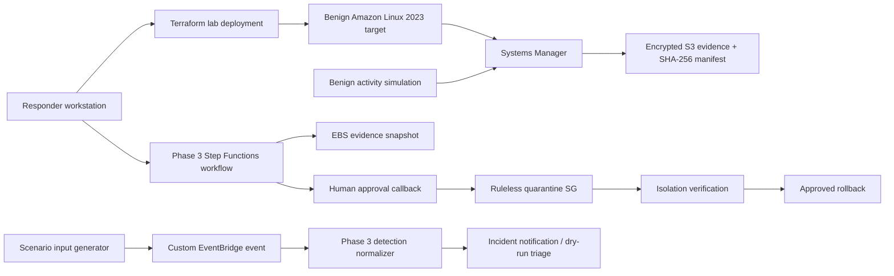

# Phase 4 Practice Lab 1 — EC2 Compromise Investigation and Isolation

This is the first scenario-specific practice lab in **Phase 4 — Deployable Practice Labs**. It turns the EC2 compromise and automated-isolation runbooks into a repeatable, authorized exercise that uses the Phase 3 response platform rather than production resources.

> [!WARNING]
> Deploy this lab only in a dedicated AWS lab account or explicitly authorized sandbox. The simulation is benign, but the live containment path changes EC2 network controls and creates evidence snapshots. Review every Terraform plan and every Step Functions approval request before proceeding.

## Learning objectives

By completing the exercise you should be able to explain and demonstrate how to:

1. establish a trustworthy AWS account and Region context before response;
2. deploy an EC2 target with no inbound administration ports;
3. confirm Systems Manager management status before relying on SSM evidence collection;
4. generate a harmless suspicious-activity marker and a deterministic lab finding;
5. trace the finding through EventBridge and the Phase 3 detection normalizer;
6. collect read-only host evidence before network isolation;
7. preserve storage evidence with EBS snapshots;
8. use Step Functions approval boundaries before live containment;
9. verify security-group quarantine rather than assuming it succeeded;
10. restore the original security-group association using checksummed rollback data; and
11. tear down the lab and identify incident artifacts that intentionally outlive the target.

## Scenario

A responder receives a high-severity simulated finding for an EC2 instance. The instance is still running and reachable through Systems Manager. The responder must preserve evidence, validate context, isolate the instance from the network, verify containment, and later restore the original network state through the approved rollback path.

No malware, exploit, credential theft, persistence, destructive payload, or data exfiltration is used. The suspicious condition is represented by a marker file created through an authorized SSM Run Command.

## Architecture



See [architecture.md](architecture.md) for trust boundaries and component responsibilities.

## Prerequisites

- Dedicated AWS lab account or authorized sandbox.
- AWS CLI authenticated to the intended account and Region.
- Terraform 1.6+.
- Python 3.11+ with the repository development requirements installed.
- Phase 3 platform (`v3.0.0` or later) deployed from `automation/terraform`.
- A confirmed approval-topic subscription or another approved way to receive Step Functions callback requests.
- Permission to create and delete the lab VPC, subnet, route, EC2 instance, IAM role/profile, security group, and EventBridge rule.

Verify context first:

```bash
aws sts get-caller-identity
aws configure get region
terraform -chdir=automation/terraform output
```

## Cost and duration

The lab creates one small EC2 instance, one EBS root volume, and lightweight VPC/IAM/EventBridge resources. Live containment can additionally create EBS snapshots through the Phase 3 response platform. Phase 3 services such as Lambda, Step Functions, CloudWatch Logs, SNS, SQS, DynamoDB, KMS, S3, and optional EventBridge archive usage can also incur charges.

Keep the exercise short-lived. Exact cost depends on Region, runtime, storage, snapshot retention, and telemetry volume. Use the AWS Pricing Calculator or service pricing pages for account-specific estimates.

## 1. Repository validation

From the repository root:

```bash
export PYTHONDONTWRITEBYTECODE=1
python3 -m compileall -q automation labs
python3 -m unittest discover -s automation/tests -p 'test_*.py'
python3 automation/scripts/validate_json.py
python3 automation/scripts/check_action_contracts.py
python3 automation/scripts/validate_state_machines.py
python3 automation/scripts/validate_ssm_documents.py
python3 automation/scripts/validate_event_patterns.py
python3 automation/scripts/check_terraform_security.py
python3 automation/scripts/validate_capstone_lab.py
python3 labs/phase4-ec2-isolation/validation/validate_lab.py
python3 scripts/check_markdown_links.py
```

Validate both Terraform roots:

```bash
terraform -chdir=automation/terraform fmt -check -recursive
terraform -chdir=automation/terraform init -backend=false
terraform -chdir=automation/terraform validate

terraform -chdir=labs/phase4-ec2-isolation/terraform fmt -check -recursive
terraform -chdir=labs/phase4-ec2-isolation/terraform init -backend=false
terraform -chdir=labs/phase4-ec2-isolation/terraform validate
```

## 2. Confirm the Phase 3 platform

This lab intentionally reuses the response platform rather than duplicating it. Keep detection routing conservative:

```hcl
detection_default_route = "notify_only"
deployment_environment  = "lab"
```

Record the required outputs:

```bash
terraform -chdir=automation/terraform output state_machine_arn
terraform -chdir=automation/terraform output detection_normalizer_function_name
terraform -chdir=automation/terraform output ssm_evidence_node_policy_arn
```

## 3. Deploy the EC2 target

Copy the example variables:

```bash
cp labs/phase4-ec2-isolation/terraform/terraform.tfvars.example \
   labs/phase4-ec2-isolation/terraform/terraform.tfvars
```

Pass the Phase 3 integration outputs explicitly:

```bash
export TF_VAR_detection_normalizer_function_name="$(terraform -chdir=automation/terraform output -raw detection_normalizer_function_name)"
export TF_VAR_ssm_evidence_node_policy_arn="$(terraform -chdir=automation/terraform output -raw ssm_evidence_node_policy_arn)"
```

Then:

```bash
terraform -chdir=labs/phase4-ec2-isolation/terraform init
terraform -chdir=labs/phase4-ec2-isolation/terraform plan -out=tfplan
terraform -chdir=labs/phase4-ec2-isolation/terraform apply tfplan
```

Capture context:

```bash
export LAB_INSTANCE_ID="$(terraform -chdir=labs/phase4-ec2-isolation/terraform output -raw instance_id)"
export AWS_ACCOUNT_ID="$(aws sts get-caller-identity --query Account --output text)"
export AWS_REGION="${AWS_REGION:-$(aws configure get region)}"
```

Run the read-only target verifier:

```bash
python3 labs/phase4-ec2-isolation/scripts/verify_target.py \
  --instance-id "$LAB_INSTANCE_ID" \
  --region "$AWS_REGION"
```

Do not continue until Systems Manager reports the target `Online`.

## 4. Generate the benign suspicious condition

Create the marker through SSM:

```bash
python3 labs/phase4-ec2-isolation/scripts/simulate_suspicious_activity.py \
  --instance-id "$LAB_INSTANCE_ID" \
  --region "$AWS_REGION"
```

The command creates only `/var/tmp/aws-ir-practice/simulated-suspicious-activity.txt` and returns the SSM Command ID. It does not install software, create persistence, access credentials, contact external destinations, or delete data.

## 5. Prepare deterministic scenario inputs

```bash
python3 labs/phase4-ec2-isolation/scripts/prepare_scenario.py \
  --instance-id "$LAB_INSTANCE_ID" \
  --account-id "$AWS_ACCOUNT_ID" \
  --region "$AWS_REGION" \
  --requested-by "YOUR_RESPONDER_ID"
```

Generated files are written beneath `labs/phase4-ec2-isolation/generated/` and ignored by Git.

## 6. Inject the simulated finding

```bash
python3 labs/phase4-ec2-isolation/scripts/inject_detection.py \
  --detail-file labs/phase4-ec2-isolation/generated/event-detail.json \
  --region "$AWS_REGION"
```

Expected result:

- EventBridge accepts one custom `aws-ir.lab` / `Simulated Security Finding` event.
- The lab rule invokes the existing Phase 3 normalizer.
- The normalizer produces the same deterministic incident ID created by `prepare_scenario.py`.
- With the recommended `notify_only` route, no live containment starts automatically.

## 7. Collect host evidence before isolation

```bash
INCIDENT_ID="$(cat labs/phase4-ec2-isolation/generated/incident-id.txt)"

bash automation/scripts/start_ssm_investigation.sh \
  linux "$LAB_INSTANCE_ID" "$INCIDENT_ID"
```

After the Automation execution completes, retrieve the manifest URI and verify it with:

```bash
python3 automation/scripts/verify_evidence_manifest.py \
  s3://YOUR_EVIDENCE_BUCKET/incidents/...
```

The SSM collection includes recent metadata beneath `/var/tmp`, so the marker should be represented in the evidence output without collecting arbitrary file contents.

## 8. Start approved containment

Review the generated live input:

```bash
cat labs/phase4-ec2-isolation/generated/containment-live.json
```

Start the Phase 3 state machine:

```bash
STATE_MACHINE_ARN="$(terraform -chdir=automation/terraform output -raw state_machine_arn)"

bash automation/scripts/start_orchestration.sh \
  "$STATE_MACHINE_ARN" \
  labs/phase4-ec2-isolation/generated/containment-live.json
```

The workflow preserves EBS evidence and waits for human approval before changing security-group associations.

## 9. Approve and verify isolation

Respond to the callback only after reviewing the incident context and target identifiers:

```bash
bash automation/scripts/respond_to_approval.sh APPROVE
```

When the execution succeeds:

```bash
python3 labs/phase4-ec2-isolation/scripts/verify_isolation.py \
  --instance-id "$LAB_INSTANCE_ID" \
  --incident-id "$INCIDENT_ID" \
  --region "$AWS_REGION"
```

Expected result: every attached ENI uses only the ruleless incident-specific quarantine security group.

## 10. Rollback and recovery

Build rollback input from the completed containment execution:

```bash
python3 labs/phase3-capstone/scripts/extract_rollback_input.py \
  --execution-arn 'PASTE_CONTAINMENT_EXECUTION_ARN' \
  --output labs/phase4-ec2-isolation/generated/rollback-live.json \
  --requested-by "YOUR_RESPONDER_ID"
```

Review the checksummed rollback manifest, start the rollback through `start_orchestration.sh`, and approve the restoration callback only after confirming the original security-group IDs.

After rollback, rerun `verify_target.py` and confirm the original lab security group is attached again.

## 11. Teardown

Destroy the scenario target:

```bash
terraform -chdir=labs/phase4-ec2-isolation/terraform destroy
```

Then separately review Phase 3 evidence artifacts before deciding whether they should be retained or deleted:

- EBS evidence snapshots;
- S3 evidence and object versions;
- CloudWatch logs;
- KMS keys scheduled for deletion;
- Step Functions execution history and DynamoDB correlation records.

Do not delete incident evidence solely because the lab target was destroyed.

## Expected results and review

Use [expected-results/README.md](expected-results/README.md) as the exercise checklist and [interview-notes.md](interview-notes.md) to practice explaining the architecture and incident decisions.

## Troubleshooting

See [troubleshooting.md](troubleshooting.md).

## Runbook mapping

- [Scenario 1 — EC2 instance compromise](../../docs/01-ec2-instance-compromise.md)
- [Scenario 2 — Automated EC2 isolation](../../docs/02-automated-ec2-isolation.md)
- [Scenario 14 — Systems Manager investigation](../../docs/14-systems-manager-investigation.md)
- [Scenario 19 — EBS snapshot and forensic preservation](../../docs/19-ebs-snapshot-forensic-preservation.md)
- [Scenario 20 — Step Functions incident orchestration](../../docs/20-step-functions-incident-orchestration.md)

## AWS references

- [Find AMIs with SSM Agent preinstalled](https://docs.aws.amazon.com/systems-manager/latest/userguide/ami-preinstalled-agent.html)
- [Configure IMDS for new instances](https://docs.aws.amazon.com/AWSEC2/latest/UserGuide/configuring-IMDS-new-instances.html)
- [Amazon EventBridge PutEvents](https://docs.aws.amazon.com/eventbridge/latest/APIReference/API_PutEvents.html)
- [Amazon EBS snapshots](https://docs.aws.amazon.com/ebs/latest/userguide/ebs-snapshots.html)
