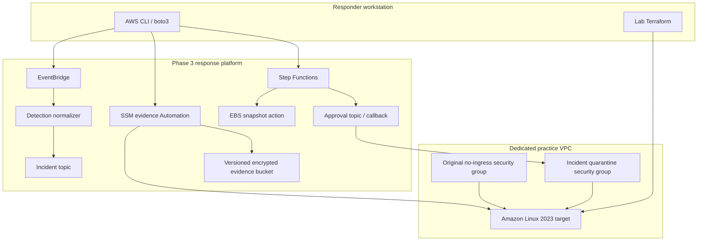

# Architecture and Trust Boundaries

The lab separates the **practice target** from the **Phase 3 response platform** so the same investigation and containment controls can be exercised repeatedly without duplicating the automation stack.

## Boundaries

### Practice target boundary

The EC2 instance is disposable and intentionally contains only benign simulation artifacts. It has:

- no inbound security-group rules;
- outbound TCP/443 for Systems Manager and AWS APIs;
- IMDSv2 required;
- an encrypted gp3 root volume; and
- an instance role limited to Systems Manager core permissions plus the Phase 3 evidence-write policy supplied explicitly to the lab.

A public IPv4 address is used only to keep the first practice lab simple and cost-conscious. The security group has no inbound rules, so the address does not create an SSH/RDP administration path. A later lab can replace internet egress with VPC endpoints.

### Detection boundary

The custom EventBridge event uses the already-supported Phase 3 contract:

- `source`: `aws-ir.lab`
- `detail-type`: `Simulated Security Finding`

The normalizer remains conservative. The recommended Phase 3 route is `notify_only`; detection does not directly authorize live containment.

### Evidence boundary

Systems Manager collection is read-only by design. Evidence is uploaded to the Phase 3 S3 evidence bucket and protected by the platform KMS key. The integrity finalizer creates SHA-256 metadata after collection.

### Containment boundary

The responder explicitly starts the Step Functions containment workflow with `dry_run: false`. The workflow still pauses at the approval callback before replacing security-group associations.

### Recovery boundary

Rollback is not inferred from current configuration. It is built from the completed containment execution and its checksummed rollback manifest. The responder reviews and separately approves restoration.
